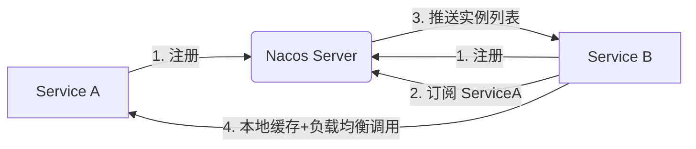
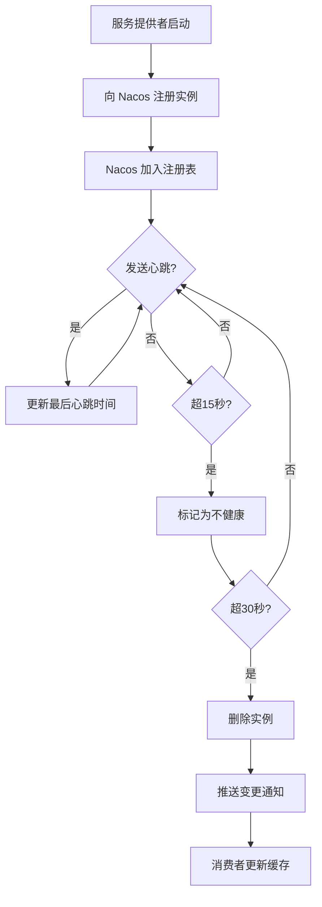

## 微服务

**微服务** 把一个大型单体应用按照业务领域拆分成多个"单一职责"的小服务，每个服务独立开发、独立部署、独立扩缩容。

优点：

* 微服务架构中，修改"服务1"不会影响"服务2"，团队可以并行开发。且在分布式系统中，某个服务的故障不会导致整个系统雪崩。
* 外部调用方不需要知道后端有多少个微服务，只需要一个统一入口。同时在入口处进行身份认证、权限校验、限流等安全操作。
* 将所有服务的配置集中存储，支持多环境隔离、灰度发布，且大部分配置修改后可实时生效，无需重启服务。


**客户端层**：Web、移动端、第三方系统都只与 API 网关交互，不直接访问内部服务。

**网关层（API Gateway）**：统一入口，负责路由分发、身份认证、限流熔断和负载均衡，是整个系统对外的"门面"。

**服务层**：每个微服务围绕单一业务职责构建（用户、商品、订单、支付、通知）。服务间既有同步调用（如订单调用支付），也有异步通信（通过消息队列）。

**消息层（事件总线）**：Kafka/RabbitMQ 实现服务间异步解耦。订单创建后发布事件，通知服务订阅并发送短信/邮件，两者互不依赖。

**数据层**：每个服务拥有独立数据库（Database per Service 模式），技术栈可自由选择。高频读取数据通过 Redis 缓存加速。

**基础设施层**：服务注册中心负责服务发现，链路追踪（Jaeger）记录跨服务调用，Prometheus + Grafana 做监控，配置中心统一管理配置，Kubernetes 负责容器编排与弹性伸缩。

## Spring Cloud

Java中常用的微服务框架是Spring Cloud（基于SpringBoot）。

| 功能领域            | 推荐组件                           | 核心作用                                       | 替代/对标 (旧版Netflix)      |
| ------------------- | ---------------------------------- | ---------------------------------------------- | ---------------------------- |
| 注册中心 & 配置中心 | Nacos                              | 服务发现、健康检查、动态配置管理、命名空间隔离 | Eureka + Spring Cloud Config |
| 流量防护 & 熔断降级 | Sentinel                           | 限流、熔断、系统自适应保护、热点参数限流       | Hystrix / Resilience4j       |
| API 网关            | Spring Cloud Gateway               | 路由转发、鉴权过滤、限流整合、灰度发布         | Zuul                         |
| 服务调用 & 负载均衡 | OpenFeign + LoadBalancer           | 声明式 HTTP 客户端、客户端侧负载均衡           | Ribbon + Feign               |
| 分布式事务          | Seata                              | AT/TCC/Saga/XA 模式，保证跨服务数据一致性      | 无 (自研或MQ最终一致)        |
| 消息驱动            | RocketMQ                           | 异步解耦、削峰填谷、分布式事务消息             | RabbitMQ / Kafka             |
| RPC 通信            | Dubbo                              | 高性能二进制协议通信，适合内部高频调用         | gRPC / Feign                 |
| 链路追踪 & 可观测   | Micrometer + SkyWalking/Prometheus | 全链路追踪、指标监控、日志聚合                 | Sleuth + Zipkin              |
| 分布式任务调度      | SchedulerX / XXL-JOB               | 定时任务管理、分片广播、失败重试               | Spring Task                  |
| 在线诊断            | Arthas                             | 生产环境代码热更新、性能瓶颈分析、类加载排查   | JProfiler / BTrace           |


**必选核心四件套**：`Nacos` + `Sentinel` + `Gateway` + `OpenFeign`

其他插件按需加入：

* 有跨库写操作 → 加 **Seata**
* 有高并发异步场景 → 加 **RocketMQ**
* 内部服务调用频繁且对性能敏感 → 用 **Dubbo** 替代 OpenFeign
* 需要定时任务 → 加 **XXL-JOB**（轻量）或 **SchedulerX**（云原生）
* 可观测层，链路追踪 & 告警 → 加 **SkyWalking / Prometheus**


### 服务注册中心（Nacos）

服务启动后要主动向系统注册自身，让系统中其他服务能够发现自己，自己也可以调用其他服务。（每个服务的地址是不能写死的，方便新增或卸载服务）

目前常用的服务注册框架是 Nacos，微服务启动时向 Nacos 注册自己的元数据（IP、端口、权重、健康状态等），调用方通过服务名获取实例列表并进行负载均衡。

> Nacos（Dynamic Naming and Configuration Service）是阿里巴巴开源的一个用于动态服务发现、配置管理和服务管理平台。在 Spring Cloud Alibaba 生态中，它取代了 Eureka + Config + Bus 的组合，成为**注册中心**与**配置中心**的“二合一”核心组件。
>
> | 特性       | Nacos                     | Eureka     | Consul              | Apollo            |
> | ---------- | ------------------------- | ---------- | ------------------- | ----------------- |
> | 注册中心   | ✅                         | ✅          | ✅                   | ❌                 |
> | 配置中心   | ✅                         | ❌          | ✅ (弱)              | ✅                 |
> | 健康检查   | TCP/HTTP/MySQL/自定义     | 客户端心跳 | TCP/HTTP/gRPC/TTL   | 客户端心跳        |
> | 动态推送   | ✅ (gRPC/长轮询)           | ❌ (轮询)   | ✅ (全量)            | ✅ (长轮询)        |
> | 多环境隔离 | Namespace+Group           | ❌          | Datacenter          | Cluster+Namespace |
> | 社区活跃度 | ✅ 活跃                    | ⚠️ 停更     | ✅ 活跃              | ✅ 活跃            |
> | 适用场景   | Spring Cloud Alibaba 首选 | 老项目维护 | 多语言/Service Mesh | 纯配置中心需求    |



- 客户端启动后通过 OpenAPI 向 Server 注册。
- 调用方订阅目标服务，Server 维护订阅关系。
- 当实例上下线或健康状态变化时，Server 通过 UDP/gRPC 推送变更到订阅者。
- 客户端本地维护服务缓存，即使 Nacos Server 宕机，短时间内仍可正常调用。



#### 配置

**Nacos Client （Springboot开发项目）**

build.gradle

```groovy
// nacos 服务发现
implementation 'com.alibaba.cloud:spring-cloud-starter-alibaba-nacos-discovery'
// nacos 配置中心
implementation 'com.alibaba.cloud:spring-cloud-starter-alibaba-nacos-config'
```

application.yml

```yaml
server:
  port: 8085

spring:
  application:
    name: service1

  config:
    import: optional:nacos:${spring.application.name}.${spring.cloud.nacos.config.file-extension}?group=${spring.cloud.nacos.config.group}&namespace=

  cloud:
    nacos:
      server-addr: 127.0.0.1:8848
      username: nacos
      password: nacos

      discovery:
        namespace: public
        group: DEFAULT_GROUP

      config:
        namespace: public
        group: DEFAULT_GROUP
        file-extension: yaml
        # 默认 DataId: service1.yaml
        refresh-enabled: true
```

**Nacos Server （本质是一个Spring Boot Web 应用）**

功能：

* HTTP API
* 配置中心
* 注册中心

* 控制台

为了方便，使用Docker启动Nacos Server

创建 docker-nacos.yml （测试使用）

```yaml
services:
    nacos:
        image: nacos/nacos-server:v3.2.2
        container_name: nacos
        environment:
            MODE: standalone
            NACOS_AUTH_TOKEN: "SecretKey012345678901234567890123456789012345678901234567890123456789"
            NACOS_AUTH_IDENTITY_KEY: "serverIdentity"
            NACOS_AUTH_IDENTITY_VALUE: "security"
        ports:
            - "8848:8848" # HTTP API
            - "9848:9848" # gRPC client → server (服务注册、心跳)
            - "9849:9849" # gRPC server → client (配置/服务推送)
            - "8080:8080" # Web 控制台
```

启动：`docker compose -f docker-nacos up`

docker-compose.yml （生产使用）

```yaml
services:
  mysql:
    image: mysql:10
    container_name: nacos-mysql
    environment:
      MYSQL_ROOT_PASSWORD: 123456
      MYSQL_DATABASE: nacos_config
    ports:
      - "3306:3306"

  nacos:
    image: nacos/nacos-server:v3.2.2
    container_name: nacos
    environment:
      MODE: standalone
      NACOS_AUTH_TOKEN: 'SecretKey012345678901234567890123456789012345678901234567890123456789'
      NACOS_AUTH_IDENTITY_KEY: "serverIdentity"
      NACOS_AUTH_IDENTITY_VALUE: "security"
    ports:
      - "8848:8848"
      - "8080:8080"
      - "9848:9848" # 客户端 gRPC（可选，但推荐）
  	  - "9849:9849" # 集群通信（单机模式不需要）
    volumes:
     # 配置文件（需提前创建）
      - ./conf/application.properties:/home/nacos/conf/application.properties 
      - ./logs:/home/nacos/logs
      - ./data:/home/nacos/data
    depends_on:
      - mysql
```

> Docker Compose 命令
>
> - 启动：`docker compose -f xxx.yml up -d`
> - 停止：`docker compose -f xxx.yml down`
> - 查看：`docker compose -f xxx.yml ps`
> - 重启：`docker compose -f xxx.yml restart`

Nacos端口

| 端口 | 作用                                                         |
| ---- | ------------------------------------------------------------ |
| 8848 | HTTP API （**如配置管理、服务注册等 OpenAPI**）              |
| 8080 | Web控制台                                                    |
| 9848 | 客户端 gRPC（用于 Nacos 客户端与服务端之间的 **高性能 gRPC 连接**） |
| 9849 | 集群通信（用于 Nacos 集群节点之间的 **内部通信**，单机模式（standalone）下通常不使用） |

nacos-discovery提供了服务发现功能，可以将自身服务注册到nacos server,也可以获取已经注册的服务。

nacos-config提供配置文件，注册的服务可以从nacos server中动态获取最新的配置文件。

#### Spring Cloud Alibaba Nacos Discovery

核心功能：

| 功能         | 说明                                   |
| ------------ | -------------------------------------- |
| **服务注册** | 服务启动时自动将 IP + 端口注册到 Nacos |
| **服务发现** | 调用方通过服务名查询可用实例列表       |
| **健康检查** | Nacos 定期心跳检测，自动剔除下线实例   |

客户端部分配置，具体配置查询官网

```groovy
spring:
  application:
    name: service1          # 注册到 Nacos 的服务名（重要）

  cloud:
    nacos:
      # 公共配置（config 和 discovery 共用）
      server-addr: 127.0.0.1:8848
      username: nacos
      password: nacos

      discovery:
        # ---- 基础配置 ----
        server-addr: 127.0.0.1:8848   # 可单独指定，覆盖上面的公共配置
        namespace:                     # 命名空间 ID，public 留空
        group: DEFAULT_GROUP           # 分组

        # ---- 实例配置 ----
        ip: 192.168.1.100             # 指定注册的 IP（多网卡时使用）
        port: 8085                    # 默认取 server.port
        weight: 1                     # 负载均衡权重，越大被调用概率越高

        # ---- 实例类型 ----
        ephemeral: true               # true=临时实例(默认)  false=永久实例
        
        # ---- 元数据（自定义标签） ----
        metadata:
          version: v1
          zone: shanghai

        # ---- 心跳配置 ----
        heart-beat-interval: 5000     # 心跳发送间隔（ms），默认 5000
        heart-beat-timeout: 15000     # 心跳超时时间（ms），默认 15000
        
        # ---- 其他 ----
        enabled: true                 # 是否开启注册，false 则不注册
        register-enabled: true        # 是否注册自身（false=只订阅不注册）
```

注：namespace和group用于多环境隔离：

* Namespace（命名空间）→ 隔离环境，如 dev 命名空间ID: xxx-dev。
* Group（分组）→ 隔离业务模块，如 ORDER_GROUP。

#### Spring Cloud Alibaba Nacos Config

核心功能：

**1. 集中化配置管理** 将应用配置统一存储在 Nacos 服务器，而非分散在各个服务的本地文件中，实现"一处修改，全局生效"。

**2. 动态刷新（热更新）** 配置修改后，**无需重启应用**即可实时生效。配合 `@RefreshScope` 注解，Bean 会自动重新加载新配置，或者通过`@ConfigurationProperties` 只更新具体属性。

**3. 多环境配置隔离** 通过 `namespace` + `group` + `Data ID` 三级隔离，轻松管理 dev / test / prod 等不同环境的配置。

**4. 配置版本管理与回滚** Nacos 保存历史版本，支持一键回滚到任意历史配置。

客户端部分配置，具体配置查询官网

```yaml
server:
  port: 8085
      
spring:
  application:
    name: user-service          # 服务名，也是 Nacos 中 Data ID 的前缀

  cloud:
    nacos:
      # ============ 配置中心 (Config) ============
      config:
        server-addr: 127.0.0.1:8848   # Nacos 服务器地址
        namespace: public                 # 命名空间 ID（对应环境隔离）
        group: DEFAULT_GROUP           # 分组，默认 DEFAULT_GROUP
        file-extension: yaml           # 配置文件格式：yaml 或 properties
        refresh-enabled: true
        
        # 共享配置（多服务复用的公共配置）
        shared-configs:
          - data-id: common.yaml
            group: DEFAULT_GROUP
            refresh: true              # 是否支持动态刷新
        
        # 扩展配置（优先级高于 shared-configs）
        extension-configs:
          - data-id: datasource.yaml
            group: DEFAULT_GROUP
            refresh: true

      # ============ 注册中心 (Discovery) ============
      discovery:
        server-addr: 127.0.0.1:8848
        namespace: dev
        group: DEFAULT_GROUP

  # 激活环境（影响 Data ID 拼接规则）
  profiles:
    active: dev
```

客户端配置需要动态修改，需要使用`@ConfigurationProperties` 或 `@RefreshScope`

```java
//  @RefreshScope 配置动态更新示例
@RestController
@RefreshScope  // 👈 关键：添加此注解，使该 Bean 支持配置动态刷新
public class TestController {

    @Value("${app.user.name}")
    private String name;

    @RequestMapping("/username")
    public String getName() {
        return name;
    }
}
```

```java
// @ConfigurationProperties 配置动态更新示例
// UserProperties.java
@Component
@ConfigurationProperties(prefix = "app.user")
@Data
public class UserProperties {
    private String name;  // 自动绑定 app.user.name，天然支持动态刷新，无需 @RefreshScope
}
// TestController.java
@RestController
public class TestController {
    @Autowired
    private UserProperties userProperties;

    @RequestMapping("/username")
    public String getName() {
        return userProperties.getName();
    }
}
```

#### Spring Cloud Alibaba Nacos AI Registry

Nacos AI Registry 是 Spring AI Alibaba 提供的 AI 资产注册中心，用于统一管理企业内部的 Skill、Agent、Prompt 等 AI 资源。开发者可以将 AI 资产发布到 Nacos Registry 中，实现版本管理、注册发现、下载分发和变更订阅。应用运行时可以从 Nacos 获取这些 AI 资产，并动态组装到 Spring AI Agent、ChatClient 或 MCP 工具链中，实现 AI 能力的集中治理与热更新。它本身不负责执行 Agent 或调用大模型，而是充当 AI 资产仓库和注册中心的角色。

* 通过Nacos控制台上传，下载 AI 资产
* 应用服务可在代码中获取Nacos server发布的 AI 资产

```groovy
dependencies {
    // Spring AI Alibaba Nacos Skill Registry Starter
    implementation 'com.alibaba.cloud.ai:spring-ai-alibaba-starter-nacos-skill-registry'
}
```

```yaml
spring:
  ai:
    nacos:
      skill:
        server-addr: 127.0.0.1:8848
        namespace: public
        group: DEFAULT_GROUP
        # 可选：如果 Nacos 开启了鉴权
        username: nacos
        password: nacos
```

```java
// 配置类
@Configuration
public class NacosSkillConfig {

    @Bean
    public SkillMaintainerService skillMaintainerService(NacosSkillRegistryProperties properties) {
        AiMaintainerService aiService = AiMaintainerFactory.createAiMaintainerService(properties);
        return aiService.skill();
    }
}

// 业务类
@Service
public class OrderAgentService {

    @Resource
    private SkillMaintainerService skillService;

    private volatile Skill currentSkill;

    @PostConstruct
    public void init() {

        currentSkill = skillService.load("order-query");

        skillService.subscribe("order-query", event -> {
            currentSkill = skillService.load("order-query");
        });
    }

    public void handleOrderQuery(String userId) {

        Skill skill = currentSkill;

        // agentExecutor.execute(skill, Map.of("userId", userId));
    }
}
```

| 资源类型   | 作用                           | 类比理解   |
| :--------- | :----------------------------- | :--------- |
| **MCP**    | 模型上下文协议，标准化工具接入 | API 网关   |
| **Agent**  | AI 智能体，承载任务与工作流    | 微服务实例 |
| **Prompt** | 驱动 Agent 的指令模板          | 配置文件   |
| **Skill**  | 可复用的能力包，封装具体动作   | 公共组件   |

### 网关（Spring Cloud Gateway + Sentinel）

#### 架构图

网关架构图：


请求处理流程


所有的用户请求会先经过网关路由规则，将请求URI请求分配到不同的服务上；在划分后发送前，请求还会通过Sentinel过滤规则，对不同的请求进行限流等控制；之后才将请求发送到对应的服务。

#### 配置

依赖管理`build.gradle`

```groovy
plugins {
    id 'java'
    id 'org.springframework.boot'
}

dependencies {
    // cloud gateway using webflux
    implementation 'org.springframework.cloud:spring-cloud-starter-gateway-server-webflux'
    // sentinel
    implementation 'com.alibaba.cloud:spring-cloud-starter-alibaba-sentinel'
    // sentinel for gateway
    implementation 'com.alibaba.cloud:spring-cloud-alibaba-sentinel-gateway'
    // sentinel 从 nacos 获取配置
    implementation 'com.alibaba.csp:sentinel-datasource-nacos'
    // nacos 配置
    implementation 'com.alibaba.cloud:spring-cloud-starter-alibaba-nacos-config'
    // nacos 发现
    implementation 'com.alibaba.cloud:spring-cloud-starter-alibaba-nacos-discovery'
    // 负载均衡
    implementation 'org.springframework.cloud:spring-cloud-starter-loadbalancer'
    // actuator 监控
    implementation 'org.springframework.boot:spring-boot-starter-actuator'
    // sba client
    implementation 'de.codecentric:spring-boot-admin-starter-client'
    testImplementation 'org.springframework.boot:spring-boot-starter-test'
    testImplementation 'io.projectreactor:reactor-test'
    testRuntimeOnly 'org.junit.platform:junit-platform-launcher'
}

tasks.named('test') {
    useJUnitPlatform()
}
```

项目配置`application.yaml`

```yaml
server:
  port: 8070

#logging:
#  level:
#    com.alibaba.csp.sentinel.datasource: DEBUG
#    com.alibaba.cloud.sentinel.datasource: DEBUG

# 监控
management:
  endpoints:
    web:
      exposure:
        # 暴露所有端点给 SBA（推荐），或至少包含 gateway,health,env,info,metrics
        include: "*"
  endpoint:
    gateway:
      enabled: true
    health:
      show-details: always       # 显示详细健康信息
      probes:
        enabled: true            # K8s 探针支持（可选）
  server:
    port: 8071                   # 管理端口独立
    address: 127.0.0.1           # 仅本地访问管理端口（安全）
  info:
    env:
      enabled: true              # 允许通过 /info 查看环境变量

# gateway项目配置
spring:
  application:
    name: gateway

  # 从 Nacos server 导入 gateway 路由规则
  config:
    import:
      - nacos:gateway-service.yaml?group=GATEWAY_GROUP  # gateway 路由配置（指定命名空间和组）

  cloud:
    nacos:
      server-addr: 127.0.0.1:8848
      username: nacos
      password: nacos

      discovery:
        namespace: public
        group: DEFAULT_GROUP

      config:
        namespace: public
        group: GATEWAY_GROUP
        file-extension: yaml
        # 默认 DataId: 项目名.yaml
        refresh-enabled: true
        enabled: true

    sentinel:
      # 开启 sentinel dashboard
      transport:
        dashboard: 127.0.0.1:8858
        port: 0
      # 从 nacos server 导入 Sentinel 规则
      datasource:
        flow:
          nacos:
            server-addr: 127.0.0.1:8848
            namespace: public
            group-id: SENTINEL_GROUP
            data-id: gateway-flow-rules.json
            data-type: json
            rule-type: gw-flow
      eager: true
```

这段配置的网关路由规则和sentinel配置都是从Nacos Server中获取，可以动态更新（不需重启网关服务），故在Nacos控制台中添加对应的配置：

访问 Nacos Server 地址 http://localhost:8080/next/#/configurationManagement

添加配置文件 new config：

**网关路由配置**

* Data ID: `gateway-service.yaml`
* Group: `GATEWAY_GROUP`
* Format: YAML

```yaml
spring:
  cloud:
    gateway:
      server:
        webflux:
          routes: 
            - id: service1
              uri: lb://service1
              predicates:
                - Path=/api/service1/**
              filters:
                - StripPrefix=1
            - id: service2
              uri: lb://service2
              predicates:
                - Path=/api/service2/**
              filters:
                - StripPrefix=1
            - id: baidu-search
              uri: https://www.baidu.com
              predicates:
                - Path=/baidu/**
              filters:
                - RewritePath=/baidu/(?<keyword>.*), /s?wd=${keyword}
```

**Sentinel 限流规则配置**

* Data ID: `gateway-flow-rules.json`
* Group: `SENTINEL_GROUP`
* Format: JSON

```json
[
  {
    "resource": "user-service",
    "resourceMode": 0,
    "count": 5,
    "intervalSec": 1,
    "controlBehavior": 0,
    "burst": 0,
    "maxQueueingTimeoutMs": 0
  },
  {
    "resource": "order-service",
    "resourceMode": 0,
    "count": 3,
    "intervalSec": 1,
    "controlBehavior": 0,
    "burst": 0,
    "maxQueueingTimeoutMs": 0
  },
  {
    "resource": "baidu-search",
    "resourceMode": 0,
    "count": 10,
    "intervalSec": 1,
    "controlBehavior": 0,
    "burst": 0,
    "maxQueueingTimeoutMs": 0
  }
]
```

注：Sentinel 限流规则中的 resource 与 网关路由中的routes.id 对应。

上面的项目配置`application.yaml`中还引入了Sentinel Dashboard控制台管理页面(8858)，需要在8858端口启动Sentinel Dashboard服务。可以下载Sentinel Dashboard的Jar包启动，也可以通过docker启动服务，本文采用docker compose启动：创建docker-sentinel.yaml文件

```yaml
services:
	sentinel-dashboard:
        image: bladex/sentinel-dashboard:1.8.9
        container_name: sentinel-dashboard
        ports:
            - "8858:8858" 
        restart: unless-stopped
```

启动服务 `docker compose -f docker-sentinel.yaml up`，启动后可观察到sentinel-dashboard服务在port=8858监听。

为了方便，可以将Nacos Server 与 Sentinel Dashboard放到同一个yaml文件中，如创建docker-gateway.yaml文件，通过`docker compose -f docker-gateway.yaml up`启动两个服务。

```yaml
services:
    nacos:
        image: nacos/nacos-server:v3.2.2
        container_name: nacos
        environment:
            MODE: standalone
            NACOS_AUTH_TOKEN: "SecretKey012345678901234567890123456789012345678901234567890123456789"
            NACOS_AUTH_IDENTITY_KEY: "serverIdentity"
            NACOS_AUTH_IDENTITY_VALUE: "security"
        ports:
            - "8848:8848" # HTTP API
            - "9848:9848" # gRPC client → server (服务注册、心跳)
            - "9849:9849" # gRPC server → client (配置/服务推送)
            - "8080:8080" # Web 控制台

    sentinel-dashboard:
        image: bladex/sentinel-dashboard:1.8.9
        container_name: sentinel-dashboard
        ports:
            - "8858:8858" 
        restart: unless-stopped
```

Gateway项目启动后，访问 http://localhost:8071/actuator/gateway/routes 可以看到具体的路由规则

```
[{"predicate":"(RouteDefinitionRouteLocator$$Lambda/0x000000004377ddf8 && Paths: [/api/user/**], match trailing slash: true)","route_id":"user-service","filters":["[[StripPrefix parts = 1], order = 1]"],"uri":"lb://user-service","order":0},{"predicate":"(RouteDefinitionRouteLocator$$Lambda/0x000000004377ddf8 && Paths: [/api/order/**], match trailing slash: true)","route_id":"order-service","filters":["[[StripPrefix parts = 1], order = 1]"],"uri":"lb://order-service","order":0},{"predicate":"(RouteDefinitionRouteLocator$$Lambda/0x000000004377ddf8 && Paths: [/baidu/**], match trailing slash: true)","route_id":"baidu-search","filters":["[[RewritePath /baidu/(?<keyword>.*) = '/s?wd=${keyword}'], order = 1]"],"uri":"https://www.baidu.com:443","order":0}]
Explain
```

### 业务服务（Service）

业务服务是整个为服务的核心，是执行业务逻辑的具体实现。业务服务除了实现自身逻辑外，还会向nacos server中注册自身，从nacos server中获取配置，通过nacos和loadbalancer访问注册到nacos中其他服务提供的API。

本文用一个工程例子演示上面的功能

#### 配置

依赖管理 build.gradle

```groovy
plugins {
    id 'java'
    id 'org.springframework.boot'
}

description = 'user-service'

dependencies {
    implementation 'org.springframework.boot:spring-boot-starter-webmvc'
    // nacos 服务发现
    implementation 'com.alibaba.cloud:spring-cloud-starter-alibaba-nacos-discovery'
    // nacos 配置中心
    implementation 'com.alibaba.cloud:spring-cloud-starter-alibaba-nacos-config'
    // openfeign 远程调用
    implementation 'org.springframework.cloud:spring-cloud-starter-openfeign'
    // 负载均衡
    implementation 'org.springframework.cloud:spring-cloud-starter-loadbalancer'
    // lombok
    compileOnly 'org.projectlombok:lombok:1.18.46'
    annotationProcessor 'org.projectlombok:lombok:1.18.46'
    testImplementation 'org.springframework.boot:spring-boot-starter-webmvc-test'
    testRuntimeOnly 'org.junit.platform:junit-platform-launcher'
}

tasks.named('test') {
    useJUnitPlatform()
}

```

`com.alibaba.cloud:spring-cloud-starter-alibaba-nacos-discovery` 用于向Nacos注册自身。

`com.alibaba.cloud:spring-cloud-starter-alibaba-nacos-config` 用于从Nacos读取配置文件。

项目配置 application.yaml

```yaml
server:
  port: 8085

spring:
  application:
    name: service1

  config:
    import: optional:nacos:${spring.application.name}.${spring.cloud.nacos.config.file-extension}?group=${spring.cloud.nacos.config.group}&namespace=

  cloud:
    nacos:
      server-addr: 127.0.0.1:8848
      username: nacos
      password: nacos

      discovery:
        namespace: public
        group: DEFAULT_GROUP

      config:
        namespace: public
        group: DEFAULT_GROUP
        file-extension: yaml
        refresh-enabled: true
        enabled: true
```

**从Nacos中获取配置**

编写具体的Controller接口API testController.java

```java
@RestController
@RequestMapping("/service1")
@RefreshScope // 支持配置热更新
public class testController {

    Service1Config service1Config;

    testController(Service1Config service1Config) {
        this.service1Config = service1Config;
    }

    @Value("${service1.name}")
    private String name;


    @RequestMapping("/name1")
    public String test() {
        return "name from value: " + name;
    }

    @RequestMapping("/name2")
    public String test2() {
        return "name from ConfigurationProperties : " + service1Config.getName();
    }
}

```

编写配置类

```java
@Component
@ConfigurationProperties(prefix = "service1")
@Data
public class Service1Config {
    private String name;
}
```

两种方式 @RefreshScope + @Value 或者 @ConfigurationProperties(prefix = "service1")，前者是通过刷新整个Bean重新导入配置，后者是只更新某个具体的属性（效率更高）。

向Nacos Server中添加配置文件 service1.yaml

* DataID: service1.yaml
* Group: DEFAULT_GROUP
* Namespace: public

```yaml
service1:
  name:
    "trump"
```

启动 service1服务后，访问 http://localhost:8085/service1/name1 或 http://localhost:8085/service1/name1 可获取Nacos中的配置，实时修改Nacos中的配置，service1中也立刻感知。

**调用其他服务的API**

首先构建另一个服务service2

依赖 build.gradle

```groovy
plugins {
    id 'java'
    id 'org.springframework.boot'
}

description = 'service2'

dependencies {
    implementation 'org.springframework.boot:spring-boot-starter-webmvc'
    // nacos 服务发现
    implementation 'com.alibaba.cloud:spring-cloud-starter-alibaba-nacos-discovery'
    testImplementation 'org.springframework.boot:spring-boot-starter-webmvc-test'
    testRuntimeOnly 'org.junit.platform:junit-platform-launcher'
}

tasks.named('test') {
    useJUnitPlatform()
}

```

配置 application.yaml

```yaml
server:
  port: 8086
spring:
  application:
    name: service2

  cloud:
    nacos:
      server-addr: 127.0.0.1:8848
      username: nacos
      password: nacos

      discovery:
        group: DEFAULT_GROUP
        namespace: public
```

提供一个Controller服务接口

```java
@RestController
@RequestMapping("service2")
public class APIController {
    @RequestMapping("/age")
    public String age() {
        return "service2 age";
    }
}
```

在 service1 中通过 openfeign 调用 service2 的 /service2/age 服务

首先启动类上添加 `@EnableFeignClients`

```java
@EnableFeignClients
@SpringBootApplication
public class Service1Application {

    public static void main(String[] args) {
        SpringApplication.run(Service1Application.class, args);
    }

}
```

在service1中创建 调用service2 API的接口

```java
@FeignClient(name = "service2", path = "/service2")
public interface Service2ClientService {
    @GetMapping("/age")
    String age();
}
```

在具体的服务中导入Service2ClientService调用age()方法 即实现了对service2中API的调用。

```java
@RestController
@RequestMapping("/service1")
@RefreshScope // 支持配置热更新
public class testController {

    Service1Config service1Config;
    Service2ClientService service2ClientService;

    testController(Service1Config service1Config, Service2ClientService service2ClientService) {
        this.service1Config = service1Config;
        this.service2ClientService = service2ClientService;
    }

    @Value("${service1.name}")
    private String name;


    @RequestMapping("/name1")
    public String test() {
        return "name from value: " + name;
    }

    @RequestMapping("/name2")
    public String test2() {
        return "name from ConfigurationProperties : " + service1Config.getName();
    }

    @RequestMapping("/agefromservice2")
    public String age() {
        return "age from service2: " + service2ClientService.age();
    }
}
```

其中 @RequestMapping("/agefromservice2") 提供了对service2 API的调用，启动service1和service2后，访问service1的 /agefromservice2 即http://localhost:8085/service1/agefromservice2，其中`service2ClientService.age()`返回service2的service2 age，最终返回结果为age from service2: service2 age。

### 消息队列（RocketMQ）

在 Spring Cloud Alibaba 生态中，消息队列的**首选且官方深度集成**的框架是 **Apache RocketMQ**。

> 消息队列（Message Queue）是一种在分布式系统中用于**异步通信**和**解耦组件**的重要中间件技术。
>
> 消息队列功能：
>
> * 系统解耦：消息队列允许生产者（发送消息的系统）和消费者（处理消息的系统）之间**不直接依赖**。
> * 异步处理：生产者将消息发送到队列后可以立即返回，无需等待消费者处理完成。
> * 流量削峰：在高并发场景下，消息队列可以作为缓冲区，平滑突发流量。
> * 可靠传递：大多数消息队列支持持久化、确认机制、重试等特性，确保消息不会丢失。
> * 顺序保证：某些消息队列（如 Kafka、RocketMQ）支持按分区或队列保证消息的顺序性。
>
> 消息队列框架：
>
> - **RabbitMQ**：功能丰富，支持多种协议，适合中小规模系统。
> - **Kafka**：高吞吐、分布式，常用于日志收集和流处理。
> - **RocketMQ**：阿里开源，强调顺序消息和事务消息。
> - **ActiveMQ / Pulsar / Redis Streams** 等。
>
> | 对比维度 | RocketMQ                                         | RabbitMQ                                                     |
> | :------- | :----------------------------------------------- | :----------------------------------------------------------- |
> | 设计定位 | 分布式消息中间件（面向海量业务消息）             | AMQP 协议实现（面向灵活路由与解耦）                          |
> | 通信协议 | 自定义 Remoting + gRPC (5.x)                     | AMQP 0-9-1 / MQTT / STOMP                                    |
> | 存储模型 | CommitLog 顺序写 + ConsumeQueue 索引（类 Kafka） | 内存优先 + 磁盘持久化（Erlang Mnesia/ETS）                   |
> | 消息路由 | Topic → Queue（固定分区，无复杂路由）            | Exchange → Binding → Queue（支持 Direct/Fanout/Topic/Headers 四种路由） |
> | 事务消息 | ✅ 原生半消息机制                                 | ❌ 不支持（需本地消息表补偿）                                 |
> | 延迟消息 | ✅ 原生支持（18个级别 / 5.x 精确到秒）            | ⚠️ TTL + DLX 模拟或插件                                       |
> | 消息回溯 | ✅ 按时间戳/Offset 重新消费                       | ❌ 消费确认后即删除                                           |
> | 吞吐量   | 十万级 TPS（SSD 顺序写）                         | 万级 TPS（内存交换，受 Erlang GC 影响）                      |
> | 语言生态 | Java 为主，多语言通过 Proxy/gRPC 支持            | 全语言原生支持（AMQP 是开放标准）                            |
> | 集群模式 | Master-Slave / Controller 自动主备               | 镜像队列 / Quorum Queue (Raft)                               |
> | 最佳场景 | 电商交易、金融支付、订单流转、事件溯源           | 微服务异步解耦、复杂路由、IoT、中小规模系统                  |


## 状态监听（Spring Boot Admin Server）

项目需要引入 actuator 和 spring boot admin client，并启动Spring Boot Admin Server服务端。虽然Spring Boot Admin Server有封装好的docker服务，但版本有些落后，所以使用新的Springboot引入依赖（本文版本为Spring Boot Admin Server / Client 4.0.4）后直接启动。

### **Spring Boot Admin Server服务端**

创建Springboot项目，并引入依赖

```groovy
plugins {
    id 'java'
    id 'org.springframework.boot' version '4.0.6'
    id 'io.spring.dependency-management' version '1.1.7'
}

group = 'top.chc'
version = '0.0.1-SNAPSHOT'
description = 'sba'

java {
    toolchain {
        languageVersion = JavaLanguageVersion.of(25)
    }
}

repositories {
    mavenCentral()
}

ext {
    set('springBootAdminVersion', "4.0.4")
}

dependencies {
    implementation 'org.springframework.boot:spring-boot-starter-webmvc'
    // 引入 spring boot admin server
    implementation 'de.codecentric:spring-boot-admin-starter-server'
    testImplementation 'org.springframework.boot:spring-boot-starter-webmvc-test'
    testRuntimeOnly 'org.junit.platform:junit-platform-launcher'
}

dependencyManagement {
    imports {
        mavenBom "de.codecentric:spring-boot-admin-dependencies:${springBootAdminVersion}"
    }
}

tasks.named('test') {
    useJUnitPlatform()
}
```

配置文件

```yaml
server:
  port: 8060

spring:
  application:
    name: sba
```

启动类

```java
@SpringBootApplication
// 开启 spring boot admin server 服务
@EnableAdminServer
public class SbaApplication {

    public static void main(String[] args) {
        SpringApplication.run(SbaApplication.class, args);
    }

}
```

为了方便后续启动，将该服务端项目打包成Jar然后放入docker compose中启动

首先将Springboot项目打包成可执行的Jar包

```bash
./gradlew bootJar
```

生成的可执行的Jar包在`build/libs/sba-0.0.1-SNAPSHOT.jar`

配置dockerfile文件，创建sba.dockerfile

```dockerfile
# 使用支持 Java 17 的镜像
FROM eclipse-temurin:25-jre

WORKDIR /app

# 复制构建好的 JAR（将打包后的/sba-0.0.1-SNAPSHOT.jar放入当前目录）
COPY ./sba-*.jar app.jar

EXPOSE 8060

ENTRYPOINT ["java", "-jar", "app.jar"]
```

编写docker compose的yaml文件

```yaml
services:
    spring-boot-admin:
        # 构建当前目录下的sba.dockerfile
        build:
            context: .
            dockerfile: sba.dockerfile
        container_name: sba-server
        ports:
            - "8060:8060"
        environment:
            - SERVER_PORT=8060
        # 允许容器访问宿主机器端口
        extra_hosts:
            - "host.docker.internal:host-gateway"
        restart: unless-stopped
```

为了同时启动多个架构服务，将其放入到一个yaml文件中，创建docker-cloud-server.yaml

```yaml
# docker-cloud-server.yaml
services:
    nacos:
        image: nacos/nacos-server:v3.2.2
        container_name: nacos
        environment:
            MODE: standalone
            NACOS_AUTH_TOKEN: "SecretKey012345678901234567890123456789012345678901234567890123456789"
            NACOS_AUTH_IDENTITY_KEY: "serverIdentity"
            NACOS_AUTH_IDENTITY_VALUE: "security"
        ports:
            - "8848:8848" # HTTP API
            - "9848:9848" # gRPC client → server (服务注册、心跳)
            - "9849:9849" # gRPC server → client (配置/服务推送)
            - "8080:8080" # Web 控制台

    sentinel-dashboard:
        image: bladex/sentinel-dashboard:1.8.9
        container_name: sentinel-dashboard
        ports:
            - "8858:8858"
        restart: unless-stopped

    spring-boot-admin:
        build:
            context: .
            dockerfile: sba.dockerfile
        container_name: sba-server
        ports:
            - "8060:8060"
        environment:
            - SERVER_PORT=8060
        # 允许容器访问宿主机器端口
        extra_hosts:
            - "host.docker.internal:host-gateway"
        restart: unless-stopped
```

启动所有服务，`docker compose -f docker-cloud-server.yaml up`

目前宿主机器端口的使用

| 端口 port | 服务                          |
| --------- | ----------------------------- |
| 8070      | gateway 服务端口              |
| 8071      | actuator 监听端口             |
| 8060      | Spring Boot Admin Server 端口 |
| 8858      | Sentinel Dashboard 端口       |
| 8848      | Nacos Server 服务端口         |

### **Spring Boot Admin Server客户端**

gateway服务(客户端)的依赖添加

```yaml
implementation 'de.codecentric:spring-boot-admin-starter-client'
```

gateway服务(客户端)的配置为（开发环境）

```yaml
server:
  port: 8070

#logging:
#  level:
#    com.alibaba.csp.sentinel.datasource: DEBUG
#    com.alibaba.cloud.sentinel.datasource: DEBUG

# 监控
management:
  endpoints:
    web:
      exposure:
        # 暴露所有端点给 SBA（推荐），或至少包含 gateway,health,env,info,metrics
        include: "*"
  endpoint:
    gateway:
      enabled: true
    health:
      show-details: always       # 显示详细健康信息
      probes:
        enabled: true            # K8s 探针支持（可选）
  server:
    port: 8071                   # 管理端口独立
    address: 0.0.0.0           # 仅本地访问管理端口（安全）
  info:
    env:
      enabled: true              # 允许通过 /info 查看环境变量

# gateway 项目配置
spring:
  application:
    name: gateway

  # 配置 Spring Boot Admin
  boot:
    admin:
      client:
        url: http://127.0.0.1:8060   # Spring Boot Admin Server dashboard 地址
        instance:
          service-base-url: http://host.docker.internal:8070  # 业务端口地址
          management-base-url: http://host.docker.internal:8071 # 管理端口地址（SBA用此拉取数据）

  # 从 Nacos server 导入 gateway 路由规则
  config:
    import:
      - nacos:gateway-service.yaml?group=GATEWAY_GROUP  # gateway 路由配置（指定命名空间和组）

  cloud:
    nacos:
      server-addr: 127.0.0.1:8848
      username: nacos
      password: nacos

      discovery:
        namespace: public
        group: DEFAULT_GROUP

      config:
        namespace: public
        group: GATEWAY_GROUP
        file-extension: yaml
        # 默认 DataId: 项目名.yaml
        refresh-enabled: true
        enabled: true

    sentinel:
      # 开启 sentinel dashboard
      transport:
        dashboard: 127.0.0.1:8858
        port: 0
      # 从 nacos server 导入 Sentinel 规则
      datasource:
        flow:
          nacos:
            server-addr: 127.0.0.1:8848
            namespace: public
            group-id: SENTINEL_GROUP
            data-id: gateway-flow-rules.json
            data-type: json
            rule-type: gw-flow
      eager: true
```

重点是

```yaml
# 配置 Spring Boot Admin
boot:
admin:
  client:
    url: http://127.0.0.1:8060   # Spring Boot Admin Server dashboard 地址
    instance:
      service-base-url: http://host.docker.internal:8070  # 业务端口地址
      management-base-url: http://host.docker.internal:8071 # 管理端口地址（SBA用此拉取数据）
```

1. **`url: http://127.0.0.1:8060`** 
   - Client 在宿主机，`127.0.0.1` 就是宿主机自己
   - Docker 映射了 `8060:8060`，所以访问宿主机的 8060 端口就能到达 Server 容器
2. **`service-base-url: http://host.docker.internal:8070`** 
   - Server 在容器内，需要通过这个地址访问宿主机的 Client
   - `host.docker.internal` 在 **Server 容器内**会解析到宿主机
   - 这样 Server 就能通过 `宿主机:8070` 访问到 Client
3. **`management-base-url: http://host.docker.internal:8071`** 
   - 同理，Server 通过这个地址访问 Client 的 Actuator 端点

注：以上都是针对开发环境，到生产环境需要配置为具体的ip地址即可。

