> Spring Boot 最核心的能力之一就是 **自动配置（Auto Configuration）**。
>
> 目标：**约定大于配置（Convention Over Configuration）**，开发者只需要引入依赖并提供少量配置，Spring Boot 自动帮你创建 Bean。

比如SpringBoot项目引入了

```groovy
dependencies {
    implementation 'org.springframework.boot:spring-boot-starter-webmvc'
}
```

就可以直接使用spring webmvc而不需要任何配置，像Tomcat、DispatcherServlet都已经创建好了。

```java
@RestController
public class HelloController {

    @GetMapping("/hello")
    public String hello() {
        return "hello";
    }
}
```

## 引入自动配置

SpringBoot的自动配置是在启动类的`@SpringBootApplication`注解中引入的。

```java
@SpringBootApplication
public class LearnApplication {

    public static void main(String[] args) {
        SpringApplication.run(LearnApplication.class, args);
    }

}
```

```java
@Target(ElementType.TYPE)
@Retention(RetentionPolicy.RUNTIME)
@Documented
@Inherited
@SpringBootConfiguration
@EnableAutoConfiguration
@ComponentScan(excludeFilters = { @Filter(type = FilterType.CUSTOM, classes = TypeExcludeFilter.class),
		@Filter(type = FilterType.CUSTOM, classes = AutoConfigurationExcludeFilter.class) })
public @interface SpringBootApplication {}
```

`@SpringBootApplication`中包含`@EnableAutoConfiguration`会开启自动配置。

```java
@Target(ElementType.TYPE)
@Retention(RetentionPolicy.RUNTIME)
@Documented
@Inherited
@AutoConfigurationPackage
@Import(AutoConfigurationImportSelector.class)
public @interface EnableAutoConfiguration {}
```

`@EnableAutoConfiguration`中包含`@Import(AutoConfigurationImportSelector.class)`会启动自动配置流程。`AutoConfigurationImportSelector`是完成自动配置的核心类，具体流程为

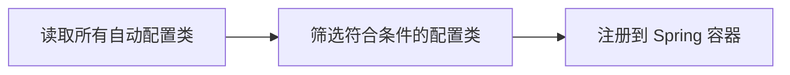

## 执行自动配置

SpringBoot项目启动入口为`SpringApplication.run()`方法。在run()方法中会创建 **ApplicationContext** 然后执行其refresh()方法。

分析源码，refresh()方法最终调用的是`AbstractApplicationContext.refresh()`，方法中包含`invokeBeanFactoryPostProcessors(beanFactory);` 该方法的作用是*执行所有 BeanFactoryPostProcessor 和 BeanDefinitionRegistryPostProcessor。*


下面重点分析`invokeBeanFactoryPostProcessors(beanFactory);`中执行`ConfigurationClassPostProcessor`的过程。`ConfigurationClassPostProcessor`会扫描并执行配置文件中的`@Import`注解，`AutoConfigurationImportSelector`会被找到并执行。

```java
// AbstractApplicationContext.java
protected void invokeBeanFactoryPostProcessors(ConfigurableListableBeanFactory beanFactory) {
    PostProcessorRegistrationDelegate.invokeBeanFactoryPostProcessors(beanFactory, getBeanFactoryPostProcessors());
// ...
}
```

### 获取 BeanFactoryPostProcessor

#### 手动添加的BeanFactoryPostProcessor

`invokeBeanFactoryPostProcessors(beanFactory);`中调用了`PostProcessorRegistrationDelegate.invokeBeanFactoryPostProcessors(beanFactory, getBeanFactoryPostProcessors());`，其中`getBeanFactoryPostProcessors()`获取的是**程序员通过编程方式手动添加到 `ApplicationContext` 中的 `BeanFactoryPostProcessor` 实例**，而不是从 BeanDefinition 中解析出来的。即通过`context.addBeanFactoryPostProcessor(...)` **以编程方式直接注册的对象实例**。*通过`addBeanFactoryPostProcessor()`添加的BeanFactoryPostProcessor被存储到了`AbstractApplicationContext`的beanFactoryPostProcessors属性中。*

```java
// AbstractApplicationContext.java
public List<BeanFactoryPostProcessor> getBeanFactoryPostProcessors() {
    return this.beanFactoryPostProcessors;
}
```

#### 容器添加的BeanFactoryPostProcessor

在`PostProcessorRegistrationDelegate.invokeBeanFactoryPostProcessors(beanFactory, getBeanFactoryPostProcessors());`中还有

```java
String[] postProcessorNames =
beanFactory.getBeanNamesForType(BeanDefinitionRegistryPostProcessor.class, true, false);

String[] postProcessorNames =
beanFactory.getBeanNamesForType(BeanFactoryPostProcessor.class, true, false);
```

通过ConfigurableListableBeanFactory（是BeanFactory，注意：ApplicationContext也是BeanFactory）获取**容器内的 BeanDefinition**，是SpringBoot框架通过 **组件扫描** / **XML** / `@Bean` 等方法加入框架的，如`ConfigurationClassPostProcessor`, `PropertySourcesPlaceholderConfigurer` 等。

分析源码，AnnotationConfigServletWebServerApplicationContext（**ApplicationContext**）的构造函数：

```java
// AnnotationConfigServletWebServerApplicationContext.java
public AnnotationConfigServletWebServerApplicationContext() {
    // 向ApplicationContext中注入BeanDefinition
    this.reader = new AnnotatedBeanDefinitionReader(this);
    this.scanner = new ClassPathBeanDefinitionScanner(this);
}
```

在`this.reader = new AnnotatedBeanDefinitionReader(this);`中的`AnnotationConfigUtils.registerAnnotationConfigProcessors(this.registry);`会向beanFactory中添加一些必要的PostProcessor，其中包含添加的`ConfigurationClassPostProcessor`会对`@Import`等注解解析。

`new AnnotatedBeanDefinitionReader(this);`是通过`AnnotationConfigUtils.registerAnnotationConfigProcessors(this.registry);`添加PostProcessor的，经过源码分析，其通过`registry.registerBeanDefinition(beanName, definition);`向SpringContext中添加BeanDefinition。

```java
// AnnotationConfigUtils.java
public static Set<BeanDefinitionHolder> registerAnnotationConfigProcessors(
        BeanDefinitionRegistry registry, @Nullable Object source) {
    // ...
    if (!registry.containsBeanDefinition(CONFIGURATION_ANNOTATION_PROCESSOR_BEAN_NAME)) {
        RootBeanDefinition def = new RootBeanDefinition(ConfigurationClassPostProcessor.class);
        def.setSource(source);
        beanDefs.add(registerPostProcessor(registry, def, CONFIGURATION_ANNOTATION_PROCESSOR_BEAN_NAME));
    }
    // ...
}

private static BeanDefinitionHolder registerPostProcessor(
        BeanDefinitionRegistry registry, RootBeanDefinition definition, String beanName)
{
    definition.setRole(BeanDefinition.ROLE_INFRASTRUCTURE);
    registry.registerBeanDefinition(beanName, definition);
    return new BeanDefinitionHolder(definition, beanName);
}
```

将ConfigurationClassPostProcessor.class封装到RootBeanDefinition中，再添加到SpringContext中（其 `registerBeanDefinition` 方法直接委托给了SpringContext内部的 `DefaultListableBeanFactory`）。*通过 `registerAnnotationConfigProcessors()` 注册的 `ConfigurationClassPostProcessor` 等处理器，其 `BeanDefinition` 被存入了底层 `BeanFactory` 的 **`beanDefinitionMap`** 中。*


| 处理器 Bean 名称 (beanName)                | 对应的实现类                             | 主要功能                                                    |
| :----------------------------------------- | :--------------------------------------- | :---------------------------------------------------------- |
| `internalConfigurationAnnotationProcessor` | `ConfigurationClassPostProcessor`        | 处理 `@Configuration` 类，是解析配置类、扫描Bean的核心。    |
| `internalAutowiredAnnotationProcessor`     | `AutowiredAnnotationBeanPostProcessor`   | 处理 `@Autowired`、`@Value` 等依赖注入注解。                |
| `internalCommonAnnotationProcessor`        | `CommonAnnotationBeanPostProcessor`      | 处理 JSR-250 规范注解，如 `@PostConstruct`、`@PreDestroy`。 |
| `internalEventListenerProcessor`           | `EventListenerMethodProcessor`           | 处理 `@EventListener` 注解，用于Spring事件监听。            |
| `internalPersistenceAnnotationProcessor`   | `PersistenceAnnotationBeanPostProcessor` | 处理 JPA 相关的注解（需条件激活）。                         |


两者的区别：

- **`beanFactoryPostProcessors` 列表（手动注册）**：存放的是**已经实例化的对象**。这些 BFPP 可能在容器启动极早期就被添加，此时 BeanFactory 可能还未准备好进行完整的 Bean 创建流程，所以需要绕过 BeanDefinition 机制直接使用。
- **`beanDefinitionMap`（自动注册）**：存放的是 **BeanDefinition（元数据）**。像 `ConfigurationClassPostProcessor` 这样的基础设施处理器，它们本身也需要参与完整的 Bean 生命周期（比如可能需要注入依赖、应用 AOP 等），所以以标准的 BeanDefinition 形式注册，由容器统一管理实例化和销毁。


### 执行 BeanFactoryPostProcessor

`invokeBeanFactoryPostProcessors(beanFactory);`中的`PostProcessorRegistrationDelegate.invokeBeanFactoryPostProcessors(beanFactory, getBeanFactoryPostProcessors());` 首先获取了程序员主动添加的 BFPP,然后又获取了以BeanDefinition 形式注册的BFPP。

依次获取并执行 `BeanDefinitionRegistryPostProcessor(PriorityOrdered)` -> `BeanDefinitionRegistryPostProcessor(Ordered)` -> `BeanDefinitionRegistryPostProcessors`

获取BeanDefinitionRegistryPostProcessor代码：

```java
// PostProcessorRegistrationDelegate.java
public static void invokeBeanFactoryPostProcessors(
        ConfigurableListableBeanFactory beanFactory, List<BeanFactoryPostProcessor> beanFactoryPostProcessors) {
    // ...
    String[] postProcessorNames = beanFactory.getBeanNamesForType(BeanDefinitionRegistryPostProcessor.class, true, false);
}
```

执行BeanDefinitionRegistryPostProcessor的`postProcessBeanDefinitionRegistry()`方法代码：

```java
// PostProcessorRegistrationDelegate.java
public static void invokeBeanFactoryPostProcessors(
        ConfigurableListableBeanFactory beanFactory, List<BeanFactoryPostProcessor> beanFactoryPostProcessors) {
    // ...
    invokeBeanDefinitionRegistryPostProcessors(currentRegistryProcessors, registry, beanFactory.getApplicationStartup());
}

private static void invokeBeanDefinitionRegistryPostProcessors(
        Collection<? extends BeanDefinitionRegistryPostProcessor> postProcessors, BeanDefinitionRegistry registry, ApplicationStartup applicationStartup) {

    for (BeanDefinitionRegistryPostProcessor postProcessor : postProcessors) {
        StartupStep postProcessBeanDefRegistry = applicationStartup.start("spring.context.beandef-registry.post-process")
                .tag("postProcessor", postProcessor::toString);
        postProcessor.postProcessBeanDefinitionRegistry(registry);
        postProcessBeanDefRegistry.end();
    }
}
```

核心在于执行`postProcessor.postProcessBeanDefinitionRegistry(registry);`，执行所有BeanDefinitionRegistryPostProcessor的`postProcessBeanDefinitionRegistry()`方法后会再去执行所有BeanDefinitionRegistryPostProcessor的`postProcessBeanFactory()`方法。

```java
// PostProcessorRegistrationDelegate.java
public static void invokeBeanFactoryPostProcessors(
        ConfigurableListableBeanFactory beanFactory, List<BeanFactoryPostProcessor> beanFactoryPostProcessors) {
    // ...
    // Now, invoke the postProcessBeanFactory callback of all processors handled so far.
    invokeBeanFactoryPostProcessors(registryProcessors, beanFactory);
    invokeBeanFactoryPostProcessors(regularPostProcessors, beanFactory);
}

private static void invokeBeanFactoryPostProcessors(
        Collection<? extends BeanFactoryPostProcessor> postProcessors, ConfigurableListableBeanFactory beanFactory) {

    for (BeanFactoryPostProcessor postProcessor : postProcessors) {
        StartupStep postProcessBeanFactory = beanFactory.getApplicationStartup().start("spring.context.bean-factory.post-process")
                .tag("postProcessor", postProcessor::toString);
        postProcessor.postProcessBeanFactory(beanFactory);
        postProcessBeanFactory.end();
    }
}
```

PostProcessorRegistrationDelegate执行完BeanDefinitionRegistryPostProcessor的`postProcessBeanDefinitionRegistry()`方法和`postProcessBeanFactory()`方法后，还会依次执行BeanFactoryPostProcessor的`postProcessBeanFactory()`方法。此处就不追述了。

`ConfigurationClassPostProcessor`实现了`BeanDefinitionRegistryPostProcessor`和`PriorityOrdered`。按照优先级排序`ConfigurationClassPostProcessor`的`postProcessBeanDefinitionRegistry()`方法会最先被执行。

*（注：ConfigurationClassPostProcessor在ApplicationContext创建时就以BeanDefinition形式添加到了beanFactory中）*

```java
// ConfigurationClassPostProcessor.java
public class ConfigurationClassPostProcessor implements BeanDefinitionRegistryPostProcessor,
BeanRegistrationAotProcessor, BeanFactoryInitializationAotProcessor, PriorityOrdered,
ResourceLoaderAware, ApplicationStartupAware, BeanClassLoaderAware, EnvironmentAware {}
```

#### postProcessBeanDefinitionRegistry方法

`ConfigurationClassPostProcessor.postProcessBeanDefinitionRegistry()`方法的主要作用是：**扫描并解析所有的 `@Configuration` 配置类，将其中定义的 Bean（如 `@Bean`, `@ComponentScan`, `@Import`, `@PropertySource` 等）注册到 BeanDefinitionRegistry 中。**

```java
// ConfigurationClassPostProcessor.java
@Override
public void postProcessBeanDefinitionRegistry(BeanDefinitionRegistry registry) {
    int registryId = System.identityHashCode(registry);
    if (this.registriesPostProcessed.contains(registryId)) {
        throw new IllegalStateException(
                "postProcessBeanDefinitionRegistry already called on this post-processor against " + registry);
    }
    if (this.factoriesPostProcessed.contains(registryId)) {
        throw new IllegalStateException(
                "postProcessBeanFactory already called on this post-processor against " + registry);
    }
    this.registriesPostProcessed.add(registryId);
	// 具体执行
    processConfigBeanDefinitions(registry);
}
```

```java
// ConfigurationClassPostProcessor.java
public void processConfigBeanDefinitions(BeanDefinitionRegistry registry) {
    List<BeanDefinitionHolder> configCandidates = new ArrayList<>();
    String[] candidateNames = registry.getBeanDefinitionNames();
	// 1. 遍历当前 Registry 中所有已注册的 BeanDefinition，找出哪些是配置类。
    for (String beanName : candidateNames) {
        BeanDefinition beanDef = registry.getBeanDefinition(beanName);
        // 1.1 如果 beanDef 已经标记了 CONFIGURATION_CLASS_ATTRIBUTE，说明之前处理过
        if (beanDef.getAttribute(ConfigurationClassUtils.CONFIGURATION_CLASS_ATTRIBUTE) != null) {
            if (logger.isDebugEnabled()) {
                logger.debug("Bean definition has already been processed as a configuration class: " + beanDef);
            }
        }
        // 1.2 检查类上是否有 @Configuration @Component @ComponentScan @Import @ImportResource 或者类中是否有 @Bean 方法。
        else if (ConfigurationClassUtils.checkConfigurationClassCandidate(beanDef, this.metadataReaderFactory)) {
            configCandidates.add(new BeanDefinitionHolder(beanDef, beanName));
        }
    }

    // Return immediately if no @Configuration classes were found
    // 如果没有配置类直接返回
    if (configCandidates.isEmpty()) {
        return;
    }

    // Sort by previously determined @Order value, if applicable
    // 2. 根据 @Order 注解或 Ordered 接口对候选配置类进行排序
    configCandidates.sort((bd1, bd2) -> {
        int i1 = ConfigurationClassUtils.getOrder(bd1.getBeanDefinition());
        int i2 = ConfigurationClassUtils.getOrder(bd2.getBeanDefinition());
        return Integer.compare(i1, i2);
    });

    // Detect any custom bean name generation strategy supplied through the enclosing application context
    // 3. 确定后续通过 @Import 或 @ComponentScan 引入的新 Bean 如何命名。
    SingletonBeanRegistry singletonRegistry = null;
    if (registry instanceof SingletonBeanRegistry sbr) {
        singletonRegistry = sbr;
        BeanNameGenerator configurationGenerator = (BeanNameGenerator) singletonRegistry.getSingleton(
                AnnotationConfigUtils.CONFIGURATION_BEAN_NAME_GENERATOR);
        if (configurationGenerator != null) {
            if (this.localBeanNameGeneratorSet) {
                if (configurationGenerator instanceof ConfigurationBeanNameGenerator &
                        configurationGenerator != this.importBeanNameGenerator) {
                    throw new IllegalStateException("Context-level ConfigurationBeanNameGenerator [" +
                            configurationGenerator + "] must not be overridden with processor-level generator [" +
                            this.importBeanNameGenerator + "]");
                }
            }
            else {
                this.componentScanBeanNameGenerator = configurationGenerator;
                this.importBeanNameGenerator = configurationGenerator;
            }
        }
    }

    if (this.environment == null) {
        this.environment = new StandardEnvironment();
    }

    // Parse each @Configuration class
    // 4. 初始化 ConfigurationClassParser。这是一个专门用于解析配置类的工具类，它会处理注解、递归查找等复杂逻辑。
    ConfigurationClassParser parser = new ConfigurationClassParser(
            this.metadataReaderFactory, this.problemReporter, this.environment,
            this.resourceLoader, this.componentScanBeanNameGenerator, registry);

    Set<BeanDefinitionHolder> candidates = new LinkedHashSet<>(configCandidates);
    Set<ConfigurationClass> alreadyParsed = CollectionUtils.newHashSet(configCandidates.size());
    // 5. 递归解析配置类
    do {
        StartupStep processConfig = this.applicationStartup.start("spring.context.config-classes.parse");
        // 5.1 解析所有的BeanDefinitionHolder（核心处理逻辑）
        parser.parse(candidates);
        parser.validate();
        // 5.2 获取解析出来的 ConfigurationClass 对象集合（模型对象）
        Set<ConfigurationClass> configClasses = new LinkedHashSet<>(parser.getConfigurationClasses());
        // 5.3 移除已经处理过的
        configClasses.removeAll(alreadyParsed);

        // Read the model and create bean definitions based on its content
        // 5.4 获取读取模型
        if (this.reader == null) {
            this.reader = new ConfigurationClassBeanDefinitionReader(
                    registry, this.sourceExtractor, this.resourceLoader, this.environment,
                    this.importBeanNameGenerator, parser.getImportRegistry());
        }
        // 5.5 将新获取 ConfigurationClass 的注册为 BeanDefinition
        // 将5.1解析出来的模型对象（ConfigurationClass）真正转换为容器中的 BeanDefinition 并注册到 BeanDefinitionRegistry
        this.reader.loadBeanDefinitions(configClasses);
        for (ConfigurationClass configClass : configClasses) {
            this.beanRegistrars.addAll(configClass.getBeanRegistrars());
        }
        // 5.6 标记为已解析
        alreadyParsed.addAll(configClasses);
        processConfig.tag("classCount", () -> String.valueOf(configClasses.size())).end();
        
		// 5.7 检查是否有新加入的 BeanDefinition，并将新加入的BD放入candidates
        candidates.clear();
        if (registry.getBeanDefinitionCount() > candidateNames.length) {
            // 5.7.1 读取当前所有BD的名字
            String[] newCandidateNames = registry.getBeanDefinitionNames();
            // 5.7.2 存储上一轮所有BD的名字
            Set<String> oldCandidateNames = Set.of(candidateNames);
            // 5.7.3 记录已经处理过的BD的名字
            Set<String> alreadyParsedClasses = CollectionUtils.newHashSet(alreadyParsed.size());
            for (ConfigurationClass configurationClass : alreadyParsed) {
                alreadyParsedClasses.add(configurationClass.getMetadata().getClassName());
            }
            // 5.7.3 遍历当前所有BD的名字
            for (String candidateName : newCandidateNames) {
                // BD在上一轮中不存在
                if (!oldCandidateNames.contains(candidateName)) {
                    BeanDefinition bd = registry.getBeanDefinition(candidateName);
                    // 如果新注册的 Bean 也是一个配置类，且未被解析过，加入candidates进入下一轮循环
                    if (ConfigurationClassUtils.checkConfigurationClassCandidate(bd, this.metadataReaderFactory) &&
                            !alreadyParsedClasses.contains(bd.getBeanClassName())) {
                        candidates.add(new BeanDefinitionHolder(bd, candidateName));
                    }
                }
            }
            // 更新下一轮开始时 BD 名字列表
            candidateNames = newCandidateNames;
        }
    }
    while (!candidates.isEmpty());

    // Register the ImportRegistry as a bean in order to support ImportAware @Configuration classes
    // 6. 注册 ImportRegistry 支持 ImportAware 接口回调
    if (singletonRegistry != null && !singletonRegistry.containsSingleton(IMPORT_REGISTRY_BEAN_NAME)) {
        singletonRegistry.registerSingleton(IMPORT_REGISTRY_BEAN_NAME, parser.getImportRegistry());
    }

    // Store the PropertySourceDescriptors to contribute them Ahead-of-time if necessary
    // 7. 保存属性源描述符 供 AOT（Ahead-of-Time）编译使用
    this.propertySourceDescriptors = parser.getPropertySourceDescriptors();

    // 8. 清理元数据缓存 释放内存
    if (this.metadataReaderFactory instanceof CachingMetadataReaderFactory cachingMetadataReaderFactory) {
        // Clear cache in externally provided MetadataReaderFactory; this is a no-op
        // for a shared cache since it'll be cleared by the ApplicationContext.
        cachingMetadataReaderFactory.clearCache();
    }
}
```

```mermaid
flowchart TD
    Start([processConfigBeanDefinitions 开始]) --> Scan[遍历 Registry 中所有 BeanDefinition]
    Scan --> Check{"是否为配置类候选者?"}
    Check -- "是 (@Configuration/@Component/<br/>@ComponentScan/@Import/@Bean)" --> AddCandidate[加入 configCandidates]
    Check -- 否 --> NextBD[下一个 BD]
    NextBD --> Scan
    AddCandidate --> HasMore{还有未检查的 BD?}
    HasMore -- 是 --> Scan
    HasMore -- 否 --> EmptyCheck{configCandidates 为空?}

    EmptyCheck -- 是 --> End([直接返回])
    EmptyCheck -- 否 --> Sort["按 @Order / Ordered 排序"]
    Sort --> InitParser["初始化 ConfigurationClassParser<br/>(Environment, BeanNameGenerator等)"]

    InitParser --> LoopStart{{Do-While 循环开始}}

    LoopStart --> Parse["parser.parse: 深度解析配置类<br/>• @PropertySource<br/>• @ComponentScan<br/>• @Import / ImportSelector<br/>• @ImportResource<br/>• @Bean 方法<br/>• 嵌套配置类"]
    Parse --> Validate["parser.validate: 校验配置合法性"]
    Validate --> GetModel["获取 ConfigurationClass 模型集合<br/>移除已处理的"]

    GetModel --> LoadBD["reader.loadBeanDefinitions:<br/>将模型转为 BeanDefinition 并注册到 Registry"]
    LoadBD --> MarkParsed[标记为 alreadyParsed]

    MarkParsed --> NewBDCheck{Registry 中 BD 数量增加?}
    NewBDCheck -- 否 --> LoopCondition{candidates 非空?}
    NewBDCheck -- 是 --> DiffBD["对比新旧 BD 名称列表<br/>找出新增的配置类候选者"]
    DiffBD --> AddNewCandidates[将新候选者加入 candidates]
    AddNewCandidates --> LoopCondition

    LoopCondition -- 是 --> LoopStart
    LoopCondition -- 否 --> Finalize["收尾工作:<br/>• 注册 ImportRegistry<br/>• 保存 PropertySourceDescriptors<br/>• 清理 MetadataReader 缓存"]

    Finalize --> End2([方法结束])

    style Start fill:#e1f5fe,stroke:#0288d1
    style End fill:#e1f5fe,stroke:#0288d1
    style End2 fill:#e1f5fe,stroke:#0288d1
    style Parse fill:#fff3e0,stroke:#f57c00
    style LoadBD fill:#e8f5e9,stroke:#388e3c
    style LoopStart fill:#fce4ec,stroke:#c62828
    style LoopCondition fill:#fce4ec,stroke:#c62828
```

##### 1.2 检查是否是配置类

```java
ConfigurationClassUtils.checkConfigurationClassCandidate(beanDef, this.metadataReaderFactory)
```

作用：判断一个 BeanDefinition 是否是一个“配置类候选者”，并为其打上标记（Full 或 Lite），以便`ConfigurationClassPostProcessor` 后续进行解析。

通过 `checkConfigurationClassCandidate` 检查类元数据。只要满足以下任一条件即为“配置类候选者”：

- 类上有 `@Configuration`
- 类上有 `@Component`、`@ComponentScan`、`@Import`、`@ImportResource`
- 类中包含 `@Bean` 方法

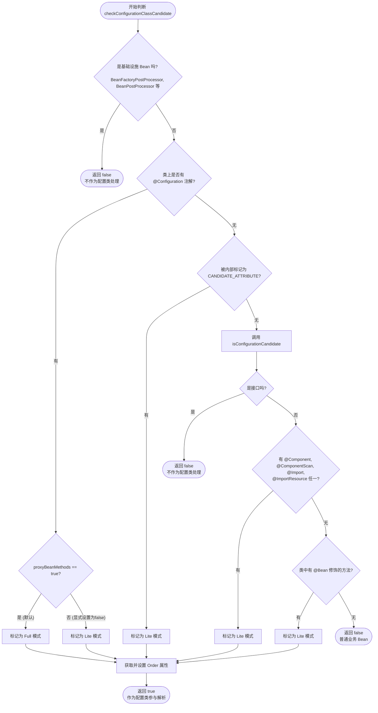


#####  5.1 `parser.parse(candidates)`

ConfigurationClassParser解析Bean：

- 处理`@PropertySource` （加载属性文件到 Environment）。

* 处理 `@ComponentScan`（扫描包路径，将扫描到的类注册为 BeanDefinition）。

- 处理 `@Import`（导入普通类、ImportSelector 或 ImportBeanDefinitionRegistrar）*Spring Boot 自动装配（`@EnableAutoConfiguration`）的核心入口*。
- 处理 `@ImportResource`（导入 XML 配置文件）。
- 处理类中的 `@Bean` 方法。
- 处理接口中的 `@Bean` 默认方法。
- 处理父类。

最终填充 `parser` 内部的 `configurationClasses` 集合（以上都是将Bean记录在 `ConfigurationClass` 模型中，注意：此时还没有真正注册 BeanDefinition，只是记录了Bean的元数据）。


第一轮处理时，`candidates`中包含项目启动类（因为其已经被添加到BeanDefintion中），而启动类的注解`@SpringBootApplication`中包含`@Import(AutoConfigurationImportSelector.class)`所以parse(candidates)会执行`AutoConfigurationImportSelector.class`的`selectImports()`方法（实际是直接执行了其`selectImports()`中的`getAutoConfigurationEntry()`方法）。

```java
// ConfigurationClassParser.java
// configCandidates 是一个候选配置类的集合。对于 Spring Boot 应用，这里面最开始通常包含一个元素：启动类（被 @SpringBootApplication 注解修饰的类）。
public void parse(Set<BeanDefinitionHolder> configCandidates) {
    // 1. 遍历所有候选者。(BeanDefinitionHolder 是对 BeanDefinition 和 beanName 的封装)
    for (BeanDefinitionHolder holder : configCandidates) {
        BeanDefinition bd = holder.getBeanDefinition();
        try {
            // 2. 准备创建 ConfigurationClass 对象。这个对象是 Spring 内部对配置类的抽象，它不包含具体的业务逻辑，只包含元数据（如注解信息、被 @Bean 修饰的方法、资源位置等）
            ConfigurationClass configClass;
            // 3. Spring 支持多种方式定义 Bean，因此需要根据 BeanDefinition 的具体类型进行不同的解析
            // 3.1 注解形式的 BeanDefinition
            if (bd instanceof AnnotatedBeanDefinition annotatedBeanDef) {
                // 调用重载的 parse 方法，创建 ConfigurationClass 对象并进行初步处理。
                configClass = parse(annotatedBeanDef, holder.getBeanName());
            }
            // 3.2 具备 Class 对象的 BeanDefinition
            //  Bean 定义已经加载了具体的 Class 对象，如<bean class="com.example.Config">
            else if (bd instanceof AbstractBeanDefinition abstractBeanDef && abstractBeanDef.hasBeanClass()) {
                configClass = parse(abstractBeanDef.getBeanClass(), holder.getBeanName());
            }
            // 3.3 只知道类名字符串，还没有加载 Class 对象的情况
            else {
                configClass = parse(bd.getBeanClassName(), holder.getBeanName());
            }

            // Downgrade to lite (no enhancement) in case of no instance-level @Bean methods.
            // 4. 降级处理
            // 类不是抽象的，类中没有非静态的 @Bean 方法，当前被标记为 CONFIGURATION_CLASS_FULL
            // 一个类加了 @Configuration，但里面所有的 @Bean 方法都是 static 的，那么它根本不需要 CGLIB 代理！因为静态方法不属于实例，无法被拦截增强，Spring 会将其属性 降级为 LITE 而不是 FULL
            if (!configClass.getMetadata().isAbstract() && !configClass.hasNonStaticBeanMethods() &&
                    ConfigurationClassUtils.CONFIGURATION_CLASS_FULL.equals(
                            bd.getAttribute(ConfigurationClassUtils.CONFIGURATION_CLASS_ATTRIBUTE))) {
                bd.setAttribute(ConfigurationClassUtils.CONFIGURATION_CLASS_ATTRIBUTE,
                        ConfigurationClassUtils.CONFIGURATION_CLASS_LITE);
            }
        }
        catch (BeanDefinitionStoreException ex) {
            throw ex;
        }
        catch (Throwable ex) {
            throw new BeanDefinitionStoreException(
                    "Failed to parse configuration class [" + bd.getBeanClassName() + "]", ex);
        }
    }
    // 5. 所有传入的配置类（如启动类、以及通过 @ComponentScan 扫描到的普通配置类）都已经被解析完毕之后，执行所有实现了 DeferredImportSelector 接口的逻辑。
    // 比如 AutoConfigurationImportSelector 实现了 DeferredImportSelector 接口，前面在parse时只是将DeferredImportSelector 接口的类放到了 this.deferredImportSelectorHandler.handle(configClass, deferredImportSelector)，此处会被执行process()。
    this.deferredImportSelectorHandler.process();
}

private ConfigurationClass parse(AnnotatedBeanDefinition beanDef, String beanName) {
    ConfigurationClass configClass = new ConfigurationClass(
            beanDef.getMetadata(), beanName, (beanDef instanceof ScannedGenericBeanDefinition));
    processConfigurationClass(configClass, DEFAULT_EXCLUSION_FILTER);
    return configClass;
}
```

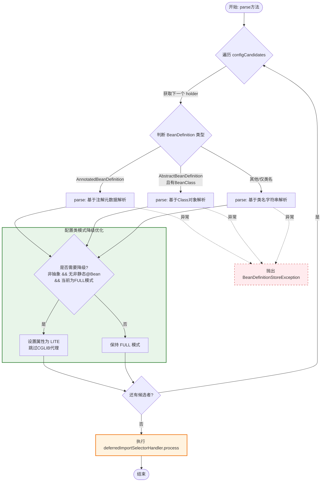

**Spring 为了兼容不同的 Bean 定义来源，设计了三种解析路径：**

- **注解驱动 (`AnnotatedBeanDefinition`)**: 最常见于 Spring Boot。直接读取 ASM 字节码元数据，无需加载 Class 对象，性能最高。
- **已加载 Class (`AbstractBeanDefinition` + `hasBeanClass`)**: 传统 XML 配置或编程式注册，Class 已在内存中。
- **仅类名字符串**: 懒加载场景或某些特殊工厂生成的定义，需要先通过类名反射加载 Class。


**关键优化：Full vs Lite 模式降级**

- **FULL 模式**: 类被标记为 `@Configuration`，Spring 默认会创建 CGLIB 代理，以确保 `@Bean` 方法之间的调用遵循单例语义（即拦截方法调用）。
- **LITE 模式**: 普通 `@Component` 类的行为，不创建代理，`@Bean` 方法间调用就是普通 Java 方法调用。

**降级条件**: 如果一个类虽然标记了 `@Configuration` (FULL)，但它**没有非静态的 `@Bean` 方法**（全是 static 或者根本没有），那么 CGLIB 代理就毫无意义。Spring 在此处将其**降级为 LITE**，避免不必要的代理创建开销，提升启动速度和减少内存占用。


**延迟导入处理 (`DeferredImportSelector`)**

在循环结束后统一执行 `this.deferredImportSelectorHandler.process()`。

Spring Boot 的自动配置（`AutoConfigurationImportSelector`）实现了此接口。将它们推迟到所有用户自定义配置类解析完之后执行，可以保证**用户配置优先于自动配置**，且能收集完整的排除规则（Exclusions）后再进行批量导入。

核心处理方法`processConfigurationClass()`

```java
// ConfigurationClassParser.java
protected void processConfigurationClass(ConfigurationClass configClass, Predicate<String> filter) {
    // 1. 在解析任何配置类之前，先评估 @Conditional 注解（如 @ConditionalOnClass, @ConditionalOnProperty, @ConditionalOnMissingBean 等）。
    if (this.conditionEvaluator.shouldSkip(configClass.getMetadata(), ConfigurationPhase.PARSE_CONFIGURATION)) {
        return;
    }
    // 2. 当同一个配置类被多次发现时（例如既被 @Import 又被组件扫描发现）
    // 用户手动编写的 @Configuration 或显式 @Import 总是优先于自动扫描发现的类。这保证了用户对自动配置拥有最终控制权。
    ConfigurationClass existingClass = this.configurationClasses.get(configClass);
    if (existingClass != null) {
        // 2.1 同一个类被多个配置 Import，合并导入来源
        if (configClass.isImported()) {
            if (existingClass.isImported()) {
                existingClass.mergeImportedBy(configClass);
            }
            // Otherwise ignore new imported config class; existing non-imported class overrides it.
            // 2.2 扫描先发现了，新的 Import 被忽略
            return;
        }
        // 2.3 移除旧的 Scanned，保留 Import （显式导入 > 隐式扫描）
        else if (configClass.isScanned()) {
            if (existingClass.isImported()) {
                String beanName = configClass.getBeanName();
                if (StringUtils.hasLength(beanName) && this.registry.containsBeanDefinition(beanName)) {
                    this.registry.removeBeanDefinition(beanName);
                }
            }
            // An implicitly scanned bean definition should not override an explicit import.
            // 2.4 
            return;
        }
        // 2.5 移除旧的，用新的替换 （用户手动注册的 BeanDefinition 拥有最高优先级）
        else {
            // Explicit bean definition found, probably replacing an import.
            // Let's remove the old one and go with the new one.
            this.configurationClasses.remove(configClass);
            removeKnownSuperclass(configClass.getMetadata().getClassName(), false);
        }
    }

    // Recursively process the configuration class and its superclass hierarchy.
    // 3. 继承链递归解析
    SourceClass sourceClass = null;
    try {
        // 3.1 SourceClass类：Spring 对 ASM AnnotationMetadata 的封装，支持统一的注解读取接口（兼容 Class 对象和字节码两种来源）。
        sourceClass = asSourceClass(configClass, filter);
        // 3.2 确保配置类的整个继承链都被处理
        // doProcessConfigurationClass 每次处理完当前类后，会返回其父类的 SourceClass。当到达 Object 或遇到已被处理过的父类时返回 null，终止循环。
        // @ComponentScan、@Import、@Bean 等注解可以声明在父类上，子类配置类应继承这些行为。
        do {
            // 3.3 依次处理 
            // @Component
            // @PropertySource — 属性文件加载
            // @ComponentScan — 触发递归组件扫描
            // @Import / @ImportResource — 导入其他配置/XML
            // @Bean 方法 — 注册 BeanDefinition
            // 接口默认方法中的 @Bean
            sourceClass = doProcessConfigurationClass(configClass, sourceClass, filter);
        }
        while (sourceClass != null);
    }
    catch (IOException ex) {
        throw new BeanDefinitionStoreException(
                "I/O failure while processing configuration class [" + sourceClass + "]", ex);
    }
    // 4. 将成功解析的配置类放入 configurationClasses Map 中
    // 后续会被 ConfigurationClassPostProcessor 用来生成最终的 BeanDefinition
    this.configurationClasses.put(configClass, configClass);
}

```

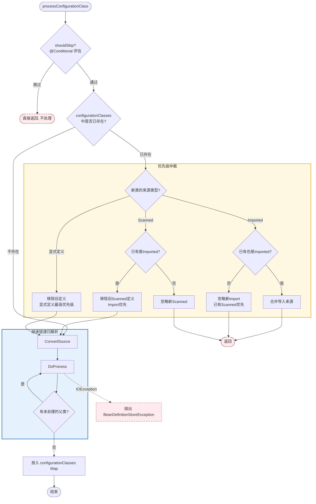


注解`@Component`,`@PropertySource`,`@ComponentScan`,`@Import`,`@ImportResource`,`@Bean`的具体处理方法

`doProcessConfigurationClass()`方法作用：**解析一个配置类，找出其中所有的 Bean 定义（通过@ComponentScan、@Bean、@Import 等方式），并返回所有的Bean的元数据（SourceClass）**

```java
// ConfigurationClassParser.java
protected final @Nullable SourceClass doProcessConfigurationClass(
        ConfigurationClass configClass, SourceClass sourceClass, Predicate<String> filter)
        throws IOException {
    // 1. 仅当前配置类本身标注了 @Component（包括 @Configuration @Service 等派生注解）时才处理。纯 @Import 导入的配置类不在此列。
    if (configClass.getMetadata().isAnnotated(Component.class.getName())) {
        // Recursively process any member (nested) classes first
        processMemberClasses(configClass, sourceClass, filter);
    }

    // Process any @PropertySource annotations
    // 2. 将 @PropertySource 声明的属性文件加载到 Environment 中
    // 属性源在 @ComponentScan 和 @Bean 之前加载，确保后续解析中能正确读取 ${placeholder} 占位符
    for (AnnotationAttributes propertySource : AnnotationConfigUtils.attributesForRepeatable(
            sourceClass.getMetadata(), org.springframework.context.annotation.PropertySource.class,
            PropertySources.class, true)) {
        if (this.propertySourceRegistry != null) {
            this.propertySourceRegistry.processPropertySource(propertySource);
        }
        else {
            logger.info("Ignoring @PropertySource annotation on [" + sourceClass.getMetadata().getClassName() +
                    "]. Reason: Environment must implement ConfigurableEnvironment");
        }
    }

    // Search for locally declared @ComponentScan annotations first.
    // 3. 首先 只查找直接声明的 @ComponentScan
    Set<AnnotationAttributes> componentScans = AnnotationConfigUtils.attributesForRepeatable(
            sourceClass.getMetadata(), ComponentScan.class, ComponentScans.class,
            MergedAnnotation::isDirectlyPresent);

    // Fall back to searching for @ComponentScan meta-annotations (which indirectly
    // includes locally declared composed annotations).
    // 4. 如果没有直接声明，再查找元注解中的 @ComponentScan
    // 直接声明优先于组合注解。例如 @SpringBootApplication 是一个包含 @ComponentScan 的组合注解，但如果用户在同一类上又显式写了 @ComponentScan，则只使用显式声明的那个，避免双重扫描。
    if (componentScans.isEmpty()) {
        componentScans = AnnotationConfigUtils.attributesForRepeatable(sourceClass.getMetadata(),
                ComponentScan.class, ComponentScans.class, MergedAnnotation::isMetaPresent);
    }

    if (!componentScans.isEmpty()) {
        // 5. 条件冲突检查
        List<Condition> registerBeanConditions = collectRegisterBeanConditions(configClass);
        if (!registerBeanConditions.isEmpty()) {
            throw new ApplicationContextException(
                    "Component scan for configuration class [%s] could not be used with conditions in REGISTER_BEAN phase: %s"
                            .formatted(configClass.getMetadata().getClassName(), registerBeanConditions));
        }
        // 6. 扫描到的 Bean 如果是配置类候选者，立即递归调用 parse() 进入新一轮的 processConfigurationClass → doProcessConfigurationClass 循环。
        for (AnnotationAttributes componentScan : componentScans) {
            // The config class is annotated with @ComponentScan -> perform the scan immediately
            Set<BeanDefinitionHolder> scannedBeanDefinitions =
                    this.componentScanParser.parse(componentScan, sourceClass.getMetadata().getClassName());
            // Check the set of scanned definitions for any further config classes and parse recursively if needed
            for (BeanDefinitionHolder holder : scannedBeanDefinitions) {
                BeanDefinition bdCand = holder.getBeanDefinition().getOriginatingBeanDefinition();
                if (bdCand == null) {
                    bdCand = holder.getBeanDefinition();
                }
                if (ConfigurationClassUtils.checkConfigurationClassCandidate(bdCand, this.metadataReaderFactory)) {
                    // 6.1 递归入口
                    parse(bdCand.getBeanClassName(), holder.getBeanName());
                }
            }
        }
    }

    // Process any @Import annotations
    // 7. 处理 @Import（自动配置的核心入口）
    // Spring Boot 的 @EnableAutoConfiguration 就是通过 @Import(AutoConfigurationImportSelector.class) 触发的。Selector 返回的所有自动配置类名，最终都会回到 processConfigurationClass 被逐一处理。
    processImports(configClass, sourceClass, getImports(sourceClass), filter, true);

    // Process any @ImportResource annotations
    // 8. 记录 XML 配置文件路径和对应的 Reader 类 (主要为 兼容传统 XML 配置)
    // 解析并处理配置类上的 @ImportResource 注解，将引入的 XML 配置文件路径和对应的解析器暂存起来，以便后续真正加载 Bean 定义
    // 8.1 从当前正在解析的配置类（sourceClass）中读取 @ImportResource 注解的属性
    AnnotationAttributes importResource =
            AnnotationConfigUtils.attributesFor(sourceClass.getMetadata(), ImportResource.class);
    // 8.2 如果存在该注解，提取两个核心属性
    if (importResource != null) {
         // 8.2.1 locations：XML 配置文件的路径数组。例如 @ImportResource("classpath:beans.xml") 中的 "classpath:beans.xml"。
        String[] resources = importResource.getStringArray("locations");
        // 8.2.2 reader：用于解析该 XML 文件的读取器类。@ImportResource 注解默认使用 XmlBeanDefinitionReader，也允许用户自定义解析器
        Class<? extends BeanDefinitionReader> readerClass = importResource.getClass("reader");
        // 遍历每一个 XML 文件路径
        for (String resource : resources) {
            // 8.2.3 resolveRequiredPlaceholders 允许在路径中使用 Spring 的占位符
            // 如 @ImportResource("classpath:${config.filename}.xml")会结合当前环境（Environment）中的属性，将 ${config.filename} 替换为实际的值
            String resolvedResource = this.environment.resolveRequiredPlaceholders(resource);
            // 8.2.4 将解析后的 XML 路径和对应的 Reader 类记录到当前的 ConfigurationClass 对象中
            // Spring 并没有真正去解析 XML 文件并生成 BeanDefinition，仅仅是把“需要解析这个 XML”这件事作为一个待办事项记录下来
            configClass.addImportedResource(resolvedResource, readerClass);
        }
    }

    // Process individual @Bean methods
    // 9. 解析当前配置类中所有标注了 @Bean 注解的方法，并将它们记录下来，为后续真正创建 Bean 实例做准备
    // 9.1 扫描当前配置类（sourceClass），找出里面所有被 @Bean 注解修饰的方法，并将它们的方法信息提取为 MethodMetadata（方法元数据）集合
    // MethodMetadata 不包含方法的实际逻辑代码，它只包含了方法的“描述信息”，比如方法名、返回类型、参数列表、以及方法上的其他注解信息
    Set<MethodMetadata> beanMethods = retrieveBeanMethodMetadata(sourceClass);
    // 9.2 遍历找到的所有 @Bean 方法，并做特殊情况的过滤
    for (MethodMetadata methodMetadata : beanMethods) {
        // 如果发现一个方法被标记了 kotlin.jvm.JvmStatic，不是真正的 static 方法，应该使用外部的静态代理方法来注册 Bean
        if (methodMetadata.isAnnotated("kotlin.jvm.JvmStatic") && !methodMetadata.isStatic()) {
            continue;
        }
        // 9.3 将合法的 @Bean 方法封装成 BeanMethod 对象，并添加到当前 ConfigurationClass 对象的待办列表中。
        // 不会产生真正的 Bean 实例，仅仅是把“这个方法以后要用来生产一个 Bean”这件事记录下来
        configClass.addBeanMethod(new BeanMethod(methodMetadata, configClass));
    }

    // Process default methods on interfaces
    // 10. 处理当前配置类所实现的接口中的默认方法，特别是扫描那些标注了 @Bean 注解的默认方法，并将它们也作为合法的 Bean 定义记录下来。
    processInterfaces(configClass, sourceClass);

    // Process superclass, if any
    // 11. 处理当前配置类的父类，如果父类也是合法的配置类，则向上递归解析父类中的 Spring 注解（如父类中的 @Bean 方法等）
    // 11.1 判断当前正在解析的类是否有父类
    if (sourceClass.getMetadata().hasSuperClass()) {
        // 11.2 获取父类的全限定类名
        String superclass = sourceClass.getMetadata().getSuperClassName();
        // 11.3 过滤 JDK 原生类 (父类的类名以 "java" 开头，直接忽略，不再向上解析)
        if (superclass != null && !superclass.startsWith("java")) {
            // 11.4 利用 knownSuperclasses 集合来做记录和判断，确保任何一个父类在整个解析生命周期中只会被完整解析一次
            boolean superclassKnown = this.knownSuperclasses.containsKey(superclass);
            this.knownSuperclasses.add(superclass, configClass);
            if (!superclassKnown) {
                // Superclass found, return its annotation metadata and recurse
                // 11.5 外层方法拿到这个父类对象后，会再次调用 doProcessConfigurationClass 方法，从而实现对父类的递归解析
                return sourceClass.getSuperClass();
            }
        }
    }

    // No superclass -> processing is complete
    // 12. 没有父类就结束了
    return null;
}
```

```
doProcessConfigurationClass 执行顺序（不可交换）:
━━━━━━━━━━━━━━━━━━━━━━━━━━━━━━━━━━━━━━━━━━━
① Member Classes      ← 内部类优先
② @PropertySource     ← 属性先加载，供后续使用
③ @ComponentScan      ← 立即扫描 + 递归解析新配置类
④ @Import             ← 导入其他配置/Selector/Registrar
⑤ @ImportResource     ← 记录 XML（延迟解析）
⑥ @Bean Methods       ← 收集 Bean 方法元数据
⑦ Interface Defaults  ← 接口默认 @Bean 方法
⑧ Superclass          ← 返回父类 or null 终止
━━━━━━━━━━━━━━━━━━━━━━━━━━━━━━━━━━━━━━━━━━━
```

```mermaid
flowchart TD
    Start([开始: doProcessConfigurationClass]) --> CheckComponent

    %% 1. 处理内部类
    CheckComponent{类上是否有 @Component}
    CheckComponent -- 是 --> ProcessMember[递归处理内部类\nprocessMemberClasses]
    CheckComponent -- 否 --> ProcessPropertySource
    ProcessMember --> ProcessPropertySource

    %% 2. 处理 @PropertySource
    ProcessPropertySource[加载 @PropertySource\n属性文件到 Environment] --> FindComponentScan

    %% 3 & 4. 查找 @ComponentScan
    FindComponentScan[查找 @ComponentScan 注解] --> CheckDirect{是否有直接声明?}
    CheckDirect -- 是 --> GetScan[获取直接声明的注解属性]
    CheckDirect -- 否 --> CheckMeta{元注解中是否存在?}
    CheckMeta -- 是 --> GetScan[获取元注解中的属性]
    CheckMeta -- 否 --> ProcessImport
    GetScan --> HasScan

    %% 5 & 6. 执行扫描
    HasScan{是否找到 @ComponentScan ?}
    HasScan -- 否 --> ProcessImport
    HasScan -- 是 --> CheckConditions[检查 Conditions 冲突\nREGISTER_BEAN phase]
    CheckConditions --> ExecuteScan[执行扫描\ncomponentScanParser.parse]
    ExecuteScan --> LoopScan[遍历扫描到的 BeanDefinition]
    
    LoopScan --> IsConfigCandidate{是否为配置类候选?}
    IsConfigCandidate -- 是 --> RecursiveParse[调用 parse\n递归解析新配置类]
    IsConfigCandidate -- 否 --> NextBean[继续下一个]
    
    RecursiveParse --> NextBean
    NextBean --> LoopScan
    
    LoopScan -- 遍历结束 --> ProcessImport

    %% 7. 处理 @Import
    ProcessImport[处理 @Import\nprocessImports] --> HandleImportTypes
    HandleImportTypes{处理类型}
    HandleImportTypes -- ImportSelector --> SelectClass[选择类并递归解析]
    HandleImportTypes -- ImportRegistrar --> RegisterDef[注册 BeanDefinition]
    HandleImportTypes -- 普通类 --> RegisterClass[注册为普通 Bean]
    
    SelectClass --> ProcessImportResource
    RegisterDef --> ProcessImportResource
    RegisterClass --> ProcessImportResource

    %% 8. 处理 @ImportResource
    ProcessImportResource[处理 @ImportResource\n记录 XML 路径] --> ProcessBeanMethods

    %% 9. 处理 @Bean 方法
    ProcessBeanMethods[处理 @Bean 方法\nretrieveBeanMethodMetadata] --> ProcessInterfaces

    %% 10. 处理接口默认方法
    ProcessInterfaces[处理接口默认方法\nprocessInterfaces] --> CheckSuperClass

    %% 11. 处理父类 (循环控制点)
    CheckSuperClass{有父类且非 java.* ?}
    CheckSuperClass -- 否 --> ReturnNull
    CheckSuperClass -- 是 --> IsKnownSuper{父类是否已知?}
    
    IsKnownSuper -- 是 (已处理) --> ReturnNull
    IsKnownSuper -- 否 (新父类) --> RecordSuper[记录父类到 knownSuperclasses]
    RecordSuper --> ReturnSuper([返回父类 SourceClass\n触发外层 while 循环继续])

    ReturnNull([返回 null\n结束当前类解析]) --> End

    %% 样式调整
    style Start fill:#e1f5fe
    style ReturnSuper fill:#fff9c4
    style ReturnNull fill:#ffccbc
    style RecursiveParse fill:#e8f5e9
    style ProcessImport fill:#f3e5f5

```

######  处理内部类中的@Component

**`processMemberClasses()`专门用于处理配置类（带有 `@Component` 修饰的子类）中的内部类（成员类）**。

1. **发现**：找出当前类里面哪些内部类也带有 `@Component` 相关注解。
2. **路由**：把这些符合条件内部类，重新丢回给 `processConfigurationClass` 方法去处理。（一个内部类被判定为带有 `@Component`（或者 `@Configuration`），**它的待遇就应该和最外部的类完全一样**。）

所以本方法内部并没有直接处理带@Component的类，

```java
// ConfigurationClassParser.java
private void processMemberClasses(ConfigurationClass configClass, SourceClass sourceClass,
        Predicate<String> filter) throws IOException {
    // 1. 通过反射获取当前类（sourceClass，带有 @Component 修饰的内部子类）的所有内部类（嵌套类）。
    Collection<SourceClass> memberClasses = sourceClass.getMemberClasses();
    // 如果没有内部类，直接结束方法。
    if (!memberClasses.isEmpty()) {
        // 2. 筛选出带有 @Component 等注解的内部类
        List<SourceClass> candidates = new ArrayList<>(memberClasses.size());
        for (SourceClass memberClass : memberClasses) {
            // 这个工具方法会读取内部类的元数据（注解信息）。它判断的标准是：该内部类是否被 @Component（或其元注解，如 @Configuration @Service 等）、@ComponentScan @Import @ImportResource 等注解修饰。
            if (ConfigurationClassUtils.isConfigurationCandidate(memberClass.getMetadata()) &&
                    !memberClass.getMetadata().getClassName().equals(configClass.getMetadata().getClassName())) {
                candidates.add(memberClass);
            }
        }
        // 3. 对符合条件的内部类进行排序。如果内部类上加了 @Order 注解或实现了 Ordered 接口，Spring 会按照优先级顺序来处理它们，保证加载顺序。
        OrderComparator.sort(candidates);
        for (SourceClass candidate : candidates) {
            // 循环依赖检测 如果在解析内部类时，发现又回到了之前正在解析的类，就会抛出 CircularImportProblem（循环引入错误） 如在内部类互相 @Import 或作为成员类嵌套引用时
            if (this.importStack.contains(configClass)) {
                this.problemReporter.error(new CircularImportProblem(configClass, this.importStack));
            }
            else {
                // 处理前将当前配置类压入栈，处理后在 finally 块中弹出
                this.importStack.push(configClass);
                try {
                    // 当确认这个内部类也是一个 @Component，Spring 就会把它当做一个全新的配置类，重新走一遍完整的解析流程。这意味着这个内部类内部的 @Bean 方法、它自己的内部类等，都会被继续解析和注册到 Spring 容器中。
                    processConfigurationClass(candidate.asConfigClass(configClass), filter);
                }
                finally {
                    this.importStack.pop();
                }
            }
        }
    }
}
```

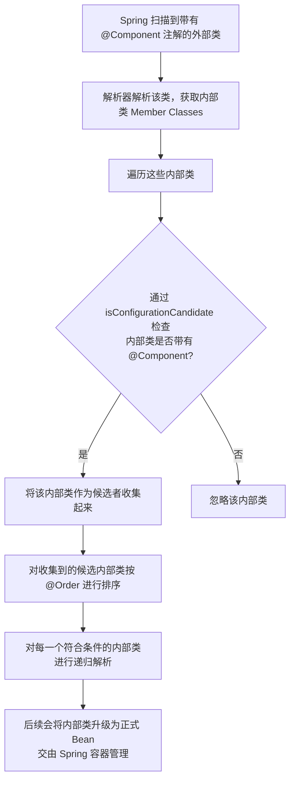


###### 处理@PropertySource

@PropertySource("")是Springboot提供的用于读取**特定化、模块化、遗留性**的配置文件，比如`@PropertySource("classpath:db/pool-config.properties")`会读取classpath:db/pool-config.properties文件并加入到Enviroment中。

系统的配置文件application.yml是由**`ConfigDataEnvironmentPostProcessor`**处理并加入到Enviroment中的。

```java
// PropertySourceRegistry.java
void processPropertySource(AnnotationAttributes propertySource) throws IOException {
    // 1. 提取 name 
    String name = propertySource.getString("name");
    if (!StringUtils.hasLength(name)) {
        name = null;
    }
    // 2. 提取 encoding
    String encoding = propertySource.getString("encoding");
    if (!StringUtils.hasLength(encoding)) {
        encoding = null;
    }
    // 3. 提取并校验 locations (文件路径)
    // @PropertySource 必须指定至少一个配置文件路径（通常是 classpath:xxx.properties）
    String[] locations = propertySource.getStringArray("value");
    Assert.isTrue(locations.length > 0, "At least one @PropertySource(value) location is required");
    // 4. 提取 ignoreResourceNotFound (找不到文件时的策略)
    // 默认情况下是 false。如果文件找不到，Spring 启动会报错。如果设为 true，找不到文件时 Spring 会静默跳过（或仅打印警告）
    boolean ignoreResourceNotFound = propertySource.getBoolean("ignoreResourceNotFound");
	// 5. 提取 factory (自定义属性源工厂)
    // @PropertySource 允许传入自定义的 PropertySourceFactory 来解析非标准的配置文件（比如自定义的 JSON 格式）。如果用户没有指定，它默认是 PropertySourceFactory.class
    Class<? extends PropertySourceFactory> factoryClass = propertySource.getClass("factory");
    Class<? extends PropertySourceFactory> factoryClassToUse =
            (factoryClass != PropertySourceFactory.class ? factoryClass : null);
    // 6. 封装描述符并委托执行
    // 将解析出的所有参数封装成一个 PropertySourceDescriptor（描述符对象）
    PropertySourceDescriptor descriptor = new PropertySourceDescriptor(Arrays.asList(locations),
            ignoreResourceNotFound, name, factoryClassToUse, encoding);
    // 7. 真正的文件读取和加载逻辑
    this.propertySourceProcessor.processPropertySource(descriptor);
    // 8. 将这个描述符加入 this.descriptors 集合中，用于后续的记录、追踪或生命周期管理。
    this.descriptors.add(descriptor);
}
```

真正的核心动作发生在 `this.propertySourceProcessor.processPropertySource(descriptor)` 内部

```java
// PropertySourceProcessor.java
public void processPropertySource(PropertySourceDescriptor descriptor) throws IOException {
    // 1. 参数准备与工厂实例化
    // 从描述符中解包出上一阶段提取的参数。
    String name = descriptor.name();
    String encoding = descriptor.encoding();
    List<String> locations = descriptor.locations();
    Assert.isTrue(locations.size() > 0, "At least one @PropertySource(value) location is required");
    boolean ignoreResourceNotFound = descriptor.ignoreResourceNotFound();
    // 如果用户在 @PropertySource 中指定了自定义的 factory，则通过反射实例化它；如果没有，则使用 Spring 默认的 defaultPropertySourceFactory 
    PropertySourceFactory factory = (descriptor.propertySourceFactory() != null ?
            instantiateClass(descriptor.propertySourceFactory()) : defaultPropertySourceFactory);
	// 2. 遍历每一个配置文件路径
    for (String location : locations) {
        try {
            // 2.1 location 中可能包含动态参数，例如 classpath:config/${spring.profiles.active}.properties。Spring 在这里会先从当前环境中已有的属性去解析这个 ${...} 占位符，将其变成真实的路径
            String resolvedLocation = this.environment.resolveRequiredPlaceholders(location);
            // 2.2 Ant 风格路径模式:负责将解析后的路径字符串转换为 Resource 对象
            for (Resource resource : this.resourcePatternResolver.getResources(resolvedLocation)) {
                // 2.3 如果配置了 encoding，Spring 会将 Resource 包装成 EncodedResource，确保以正确的字符集读取文件，防止中文乱码。
                // 调用 addPropertySource(...) 解析 PropertySource 添加到 Spring 的 Environment 中
                // 至此，配置文件中的键值对就可以被 @Value 或 @ConfigurationProperties 访问
                addPropertySource(factory.createPropertySource(name, new EncodedResource(resource, encoding)));
            }
        }
        catch (RuntimeException | IOException ex) {
            // Placeholders not resolvable or resource not found when trying to open it
            if (ignoreResourceNotFound && (ex instanceof PlaceholderResolutionException || isIgnorableException(ex) ||
                    isIgnorableException(ex.getCause()))) {
                if (logger.isInfoEnabled()) {
                    logger.info("Properties location [" + location + "] not resolvable: " + ex.getMessage());
                }
            }
            else {
                throw ex;
            }
        }
    }
}
```

###### 处理@ComponentScan

```java
// ConfigurationClassParser.java

// Search for locally declared @ComponentScan annotations first.
// 3. 首先 只查找直接声明的 @ComponentScan
Set<AnnotationAttributes> componentScans = AnnotationConfigUtils.attributesForRepeatable(
        sourceClass.getMetadata(), ComponentScan.class, ComponentScans.class,
        MergedAnnotation::isDirectlyPresent);

// Fall back to searching for @ComponentScan meta-annotations (which indirectly
// includes locally declared composed annotations).
// 4. 如果没有直接声明，再查找元注解中的 @ComponentScan
// 直接声明优先于组合注解。例如 @SpringBootApplication 是一个包含 @ComponentScan 的组合注解，但如果用户在同一类上又显式写了 @ComponentScan，则只使用显式声明的那个，避免双重扫描。
if (componentScans.isEmpty()) {
    componentScans = AnnotationConfigUtils.attributesForRepeatable(sourceClass.getMetadata(),
            ComponentScan.class, ComponentScans.class, MergedAnnotation::isMetaPresent);
}

if (!componentScans.isEmpty()) {
    // 5. 条件冲突检查
    List<Condition> registerBeanConditions = collectRegisterBeanConditions(configClass);
    if (!registerBeanConditions.isEmpty()) {
        throw new ApplicationContextException(
                "Component scan for configuration class [%s] could not be used with conditions in REGISTER_BEAN phase: %s"
                        .formatted(configClass.getMetadata().getClassName(), registerBeanConditions));
    }
    // 6. 扫描到的 Bean 如果是配置类候选者，立即递归调用 parse() 进入新一轮的 processConfigurationClass → doProcessConfigurationClass 循环。
    for (AnnotationAttributes componentScan : componentScans) {
        // The config class is annotated with @ComponentScan -> perform the scan immediately
        // 根据 @ComponentScan 中配置的 basePackages includeFilters excludeFilters 等属性，构造一个 ClassPathBeanDefinitionScanner 扫描 指定路径或默认路径Classpath 下读取符合条件的 .class 文件（通常使用 ASM 技术读取字节码，避免加载类到内存），并将其封装成 BeanDefinition
        Set<BeanDefinitionHolder> scannedBeanDefinitions =
                this.componentScanParser.parse(componentScan, sourceClass.getMetadata().getClassName());
        // Check the set of scanned definitions for any further config classes and parse recursively if needed
        for (BeanDefinitionHolder holder : scannedBeanDefinitions) {
            BeanDefinition bdCand = holder.getBeanDefinition().getOriginatingBeanDefinition();
            if (bdCand == null) {
                bdCand = holder.getBeanDefinition();
            }
            // 检查扫描到的 Bean 是否也是一个配置类候选者
            // 比如扫描到了 ServiceConfig (也是一个 @Configuration 且带有 @ComponentScan("com.other"))，Spring 必须再次调用 parse 方法去处理 ServiceConfig
            if (ConfigurationClassUtils.checkConfigurationClassCandidate(bdCand, this.metadataReaderFactory)) {
                // 6.1 递归解析
                parse(bdCand.getBeanClassName(), holder.getBeanName());
            }
        }
    }
}
```

**优先查找直接声明**，如果没有再**回退查找元注解**：Spring 首先检查当前配置类上是否**直接**写了 `@ComponentScan` 或 `@ComponentScans`。这是为了支持“覆盖”机制。如果类上没有直接写，Spring 会去检查该类上的注解是否包含了 `@ComponentScan`。

使用`this.componentScanParser`解析`@ComponentScan`路径下的class文件，并将其封装为BeanDefinitionHolder。

最后检测所有添加的BeanDefinitionHolder中是否含有新的包含`@Configuration`和`@ComponentScan`的BeanDefinition，如果有就对该BeanDefinition也执行一次parse解析操作（递归实现）。

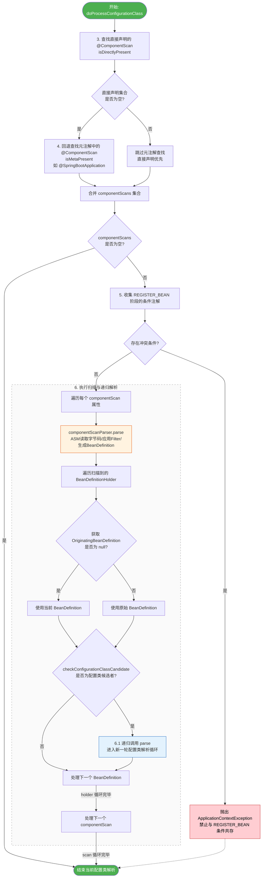

###### 处理@Import

````java
// ConfigurationClassParser.java

// Process any @Import annotations
// 7. 处理 @Import（自动配置的核心入口）
// Spring Boot 的 @EnableAutoConfiguration 就是通过 @Import(AutoConfigurationImportSelector.class) 触发的。Selector 返回的所有自动配置类名，最终都会回到 processConfigurationClass 被逐一处理。
processImports(configClass, sourceClass, getImports(sourceClass), filter, true);
````

`getImports(sourceClass)`获取含有`@Import`注解的sourceClass。

`processImports()`方法处理传入类中带有的`@Import`注解。SpringBoot的`@SpringBootApplication`

注解中自动配置`@Import(AutoConfigurationImportSelector.class)`便是在这里被执行的。

```java
// ConfigurationClassParser.java
private void processImports(ConfigurationClass configClass, SourceClass currentSourceClass,
        Collection<SourceClass> importCandidates, Predicate<String> filter, boolean checkForCircularImports) {
    // 1.判断 候选import是否为空
    if (importCandidates.isEmpty()) {
        return;
    }
    // 2.判断 是否存在循环导入
    // 防止 A 导入 B，B 又导入 A 这样的死循环
    if (checkForCircularImports && isChainedImportOnStack(configClass)) {
        this.problemReporter.error(new CircularImportProblem(configClass, this.importStack));
    }
    else {
        // 3.importStack栈中保存了当前正在处理的配置类链条。如果当前类已经在栈中，说明发生了循环导入，Spring 会报错终止启动。
        this.importStack.push(configClass);
        try {
            // 4.循环处理每一个被 @Import 导入的类
            for (SourceClass candidate : importCandidates) {
                // 4.2 处理 ImportSelector 接口
                // Spring Boot 的自动配置选择器 AutoConfigurationImportSelector 就实现了此接口
                if (candidate.isAssignable(ImportSelector.class)) {
                    // Candidate class is an ImportSelector -> delegate to it to determine imports
                    // 4.2.1 实例化 Selector
                    Class<?> candidateClass = candidate.loadClass();
                    ImportSelector selector = ParserStrategyUtils.instantiateClass(candidateClass, ImportSelector.class,
                            this.environment, this.resourceLoader, this.registry);
                    // 4.2.2 处理排除过滤器
                    Predicate<String> selectorFilter = selector.getExclusionFilter();
                    if (selectorFilter != null) {
                        filter = filter.or(selectorFilter);
                    }
                    // 4.2.3 判断Selector是否为延迟导入
                    if (selector instanceof DeferredImportSelector deferredImportSelector) {
                        // AutoConfigurationImportSelector 在此处被存储
                        this.deferredImportSelectorHandler.handle(configClass, deferredImportSelector);
                    }
                    // 4.2.3 Selector立即导入处理
                    else {
                         // 调用 selectImports 获取需要导入的类的全限定名
                        String[] importClassNames = selector.selectImports(currentSourceClass.getMetadata());
                        // 将类名转换为 SourceClass 对象
                        Collection<SourceClass> importSourceClasses = asSourceClasses(importClassNames, filter);
                        // 【递归调用】再次解析这些导入的类
                        processImports(configClass, currentSourceClass, importSourceClasses, filter, false);
                    }
                }
                // 4.3 处理 BeanRegistrar
                else if (candidate.isAssignable(BeanRegistrar.class)) {
                    // 4.3.1 实例化 Registrar
                    Class<?> candidateClass = candidate.loadClass();
                    BeanRegistrar registrar = (BeanRegistrar) BeanUtils.instantiateClass(candidateClass);
                    AnnotationMetadata metadata = currentSourceClass.getMetadata();
                    if (registrar instanceof ImportAware importAware) {
                        importAware.setImportMetadata(metadata);
                    }
                    // 4.3. 将 Registrar 保存到当前的 configClass 中
                    configClass.addBeanRegistrar(metadata.getClassName(), registrar);
                }
                // 4.4 处理 ImportBeanDefinitionRegistrar
                else if (candidate.isAssignable(ImportBeanDefinitionRegistrar.class)) {
                    // Candidate class is an ImportBeanDefinitionRegistrar ->
                    // delegate to it to register additional bean definitions
                    // 4.4.1 实例化 ImportBeanDefinitionRegistrar
                    Class<?> candidateClass = candidate.loadClass();
                    ImportBeanDefinitionRegistrar registrar =
                            ParserStrategyUtils.instantiateClass(candidateClass, ImportBeanDefinitionRegistrar.class,
                                    this.environment, this.resourceLoader, this.registry);
                    // 4.4.2  将 Registrar 保存到当前的 configClass 中
                    configClass.addImportBeanDefinitionRegistrar(registrar, currentSourceClass.getMetadata());
                }
                // 4.5 处理 普通的配置类 @Configuration
                else {
                    // Candidate class not an ImportSelector or ImportBeanDefinitionRegistrar ->
                    // process it as an @Configuration class
                    // 4.5.1 记录导入关系
                    this.importStack.registerImport(
                            currentSourceClass.getMetadata(), candidate.getMetadata().getClassName());
                    // 4.5.2 将其作为配置类进行递归解析
                    processConfigurationClass(candidate.asConfigClass(configClass), filter);
                }
            }
        }
        catch (BeanDefinitionStoreException ex) {
            throw ex;
        }
        catch (Throwable ex) {
            throw new BeanDefinitionStoreException(
                    "Failed to process import candidates for configuration class [" +
                    configClass.getMetadata().getClassName() + "]: " + ex.getMessage(), ex);
        }
        finally {
            // 5. 处理完成后 从栈中取出
            this.importStack.pop();
        }
    }
}
```

`processImports()`方法接受一组 `importCandidates`（即 `@Import` 注解中指定的类），然后对每个候选类进行类型判断。


**4.2.3 DeferredImportSelector (延迟导入)**

如果实现了 `DeferredImportSelector`，会被放入 `deferredImportSelectorHandler` 中，等到所有的配置类都基本处理完毕后（在 `processDeferredImportSelectors` 方法中）再统一处理。

`AutoConfigurationImportSelector` 是一个 **延迟导入** 的 `ImportSelector`。

对于**普通 ImportSelector**：立即调用 `selectImports()` 方法拿到类名数组，然后**递归调用** `processImports`。


**4.3 4.4 处理Registrar**

允许开发者手动向容器注册 BeanDefinition，而不是通过 `@Bean` 方法或组件扫描。

此处**并没有**立即调用 `registerBeanDefinitions` 方法。Spring 只是把这个 Registrar 对象保存到了 `ConfigurationClass` 对象的 `importBeanDefinitionRegistrars` map 中，这些BeanDefinition会在后续阶段被统一回调执行。

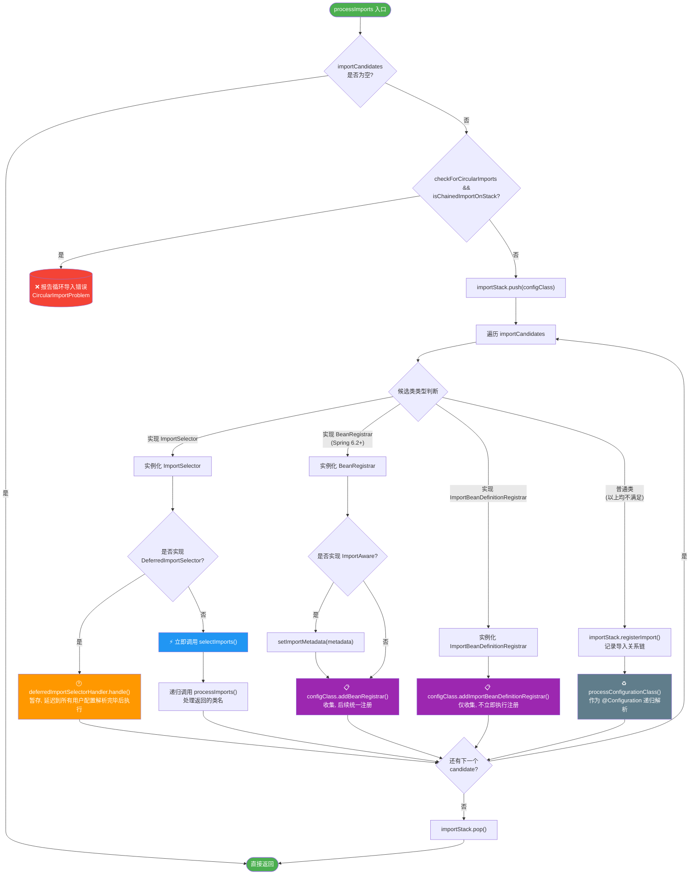

每种Import的注册时机

| 类型                            | 当前阶段行为                                      | BeanDefinition 注册时机                                 |
| ------------------------------- | ------------------------------------------------- | ------------------------------------------------------- |
| 普通 `ImportSelector`           | 立即调用 `selectImports()` + 递归解析             | 立即（在 `processImports` 递归中完成）                  |
| `DeferredImportSelector`        | 存入 `deferredImportSelectorHandler`              | 延迟（所有配置类解析完后统一处理）                      |
| `BeanRegistrar`                 | 存入 `configClass.beanRegistrars`                 | 延迟（`BeanDefinitionReader.loadBeanDefinitions` 阶段） |
| `ImportBeanDefinitionRegistrar` | 存入 `configClass.importBeanDefinitionRegistrars` | 延迟（`BeanDefinitionReader.loadBeanDefinitions` 阶段） |
| 普通 `@Configuration` 类        | 递归调用 `processConfigurationClass()`            | 立即（解析过程中扫描并注册）                            |

###### 处理当前配置类所实现的接口中的默认方法

在 Java 8 之前，接口中只能有抽象方法。但从 Java 8 开始，允许在接口中使用 `default` 关键字定义带有具体实现的方法。Spring 允许开发者在接口的 `default` 方法上使用 `@Bean` 注解。

```java
public interface CommonBeans {
    @Bean
    default MyService myService() {
        return new MyServiceImpl();
    }
}

@Configuration
public class AppConfig implements CommonBeans {
    // AppConfig 中不需要写任何代码，通过实现接口就自动拥有了 myService 这个 Bean 定义
}
```

```java
// ConfigurationClassParser.java
private void processInterfaces(ConfigurationClass configClass, SourceClass sourceClass) throws IOException {
    // 10.1 获取当前配置类（sourceClass）直接实现的所有接口，并进行遍历
    for (SourceClass ifc : sourceClass.getInterfaces()) {
        // 10.2 扫描当前这个接口（ifc）中所有标注了 @Bean 的方法，提取出它们的元数据集合
        Set<MethodMetadata> beanMethods = retrieveBeanMethodMetadata(ifc);
        // 10.3 遍历找到的 @Bean 方法 
        for (MethodMetadata methodMetadata : beanMethods) {
            // 只有接口中的默认方法（带有具体实现的方法）才会被封装成 BeanMethod 并记录到 configClass 中
            if (!methodMetadata.isAbstract()) {
                // A default method or other concrete method on a Java interface...
                configClass.addBeanMethod(new BeanMethod(methodMetadata, configClass));
            }
        }
        // 10.4 递归向上追溯父接口
        processInterfaces(configClass, ifc);
    }
}
```

###### 执行延迟处理的DeferredImportSelector

等所有传入的配置类（如启动类、以及通过 `@ComponentScan` 扫描到的普通配置类）都已经被解析完毕之后，执行所有实现了 `DeferredImportSelector` （延迟实现）接口的process()。`AutoConfigurationImportSelector`的`selectImports()`方法在此处被执行。

**放在最后是为了优先保证用户手动配置的配置类，只有扫描完用户的所有配置后，才能决定是否自动配置。**

```java
// ConfigurationClassParser.java
public void parse(Set<BeanDefinitionHolder> configCandidates) {
    // ....
    this.deferredImportSelectorHandler.process();
}
```

```java
// ConfigurationClassParser.java / DeferredImportSelectorHandler
private class DeferredImportSelectorHandler {

    private @Nullable List<DeferredImportSelectorHolder> deferredImportSelectors = new ArrayList<>();

    // 1. 向 deferredImportSelectors 添加需要处理的 ImportSelector
    // 在处理@Import时的processImports()方法会记录需要延迟处理的ImportSelector
    // AutoConfigurationImportSelector 类被记录
    void handle(ConfigurationClass configClass, DeferredImportSelector importSelector) {
        // 1.1 封装成 DeferredImportSelectorHolder
        DeferredImportSelectorHolder holder = new DeferredImportSelectorHolder(configClass, importSelector);
        // 1.2 默认情况下 deferredImportSelectors 是 ArrayList 不进入此 if
        // 此分支不是为了处理“之前存储”的 Selector，而是专门为了处理“在 process() 执行期间新产生的” Selector
        if (this.deferredImportSelectors == null) {
            DeferredImportSelectorGroupingHandler handler = new DeferredImportSelectorGroupingHandler();
            // 1.2.1 注册
            handler.register(holder);
            // 1.2.2 执行
            handler.processGroupImports();
        }
        // 1.3 将传入的 DeferredImportSelectorHolder 存入到 this.deferredImportSelectors
        // AutoConfigurationImportSelector 存在这里
        else {
            this.deferredImportSelectors.add(holder);
        }
    }
    //  2. 执行 deferredImportSelectors 中的 ImportSelector
    // AutoConfigurationImportSelector 会被按照分组注册到 DeferredImportSelectorGroupingHandler 并通过其内部类 AutoConfigurationGroup 执行 getAutoConfigurationEntry() 方法
    void process() {
        // 2.1 获取已经添加的 DeferredImportSelectorHolder
        List<DeferredImportSelectorHolder> deferredImports = this.deferredImportSelectors;
        this.deferredImportSelectors = null;
        try {
            // 2.2 判断 DeferredImportSelectorHolder 列表是否为空
            if (deferredImports != null) {
                // 2.3 创建 DeferredImportSelectorGroupingHandler 处理分组
                DeferredImportSelectorGroupingHandler handler = new DeferredImportSelectorGroupingHandler();
                // 2.4 对 DeferredImportSelectorHolder 进行排序
                deferredImports.sort(DEFERRED_IMPORT_COMPARATOR);
                // 2.5 将 DeferredImportSelectorHolder 按照类型分组注册到 DeferredImportSelectorGroupingHandler 中的 groupings
                deferredImports.forEach(handler::register);
                // 2.6 按照分组由 DeferredImportSelectorGroupingHandler 执行 DeferredImportSelector 的 .selectImports() 或 指定的方法
                handler.processGroupImports();
            }
        }
        finally {
            this.deferredImportSelectors = new ArrayList<>();
        }
    }
}
```

`DeferredImportSelectorGroupingHandler`中包含`Map<Object, DeferredImportSelectorGrouping> groupings`和`Map<AnnotationMetadata, ConfigurationClass> configurationClasses`，前者用于按照不同类型分组存储DeferredImportSelectorGrouping，其中key(`Object`)是分组的类型，比如自动配置类`AutoConfigurationImportSelector.java`的分组类型为`AutoConfigurationGroup`，在`DeferredImportSelectorGroupingHandler.register()`中判断并添加。

```java
// ConfigurationClassParser.java / DeferredImportSelectorGroupingHandler
private class DeferredImportSelectorGroupingHandler {

    private final Map<Object, DeferredImportSelectorGrouping> groupings = new LinkedHashMap<>();

    private final Map<AnnotationMetadata, ConfigurationClass> configurationClasses = new HashMap<>();
	
    // 1. 注册
    void register(DeferredImportSelectorHolder deferredImport) {
        // 1.1 获取 import 的分组类型
        // AutoConfigurationImportSelector 的分组类型为其内部类 AutoConfigurationGroup
        Class<? extends Group> group = deferredImport.getImportSelector().getImportGroup();
        // 1.2 将键值对[AutoConfigurationGroup:DeferredImportSelectorGrouping(AutoConfigurationImportSelector)]存入 this.groupings
        DeferredImportSelectorGrouping grouping = this.groupings.computeIfAbsent(
                (group != null ? group : deferredImport),
                key -> new DeferredImportSelectorGrouping(createGroup(group)));
        // DeferredImportSelectorGrouping 中存入当前importselector
        grouping.add(deferredImport);
        // 1.3 同时将触发该选择器的配置类元数据记录下来
        this.configurationClasses.put(deferredImport.getConfigurationClass().getMetadata(),
                deferredImport.getConfigurationClass());
    }

	// 2. 执行
    void processGroupImports() {
        // 2.1 遍历存入的 Map<Object, DeferredImportSelectorGrouping> groupings
        for (DeferredImportSelectorGrouping grouping : this.groupings.values()) {
            // 2.2 获取当前DeferredImportSelectorGrouping的过滤器
            // @ConditionalOnClass @ConditionalOnMissingBean @ConditionalOnProperty 等自动配置条件的评估逻辑
            Predicate<String> filter = grouping.getCandidateFilter();
            // 2.3 执行当前DeferredImportSelectorGrouping的getImports()方法
            // 并 forEach() 处理返回的 AutoConfigurationEntry
            grouping.getImports().forEach(entry -> {
                ConfigurationClass configurationClass = this.configurationClasses.get(entry.getMetadata());
                Assert.state(configurationClass != null, "ConfigurationClass must not be null");
                try {
                    // 2.4 递归处理导入的配置类
                    // 递归调用 ConfigurationClassParser.processImports()方法
                    // 对目标配置类上 @Bean @Import @ComponentScan 等注解的处理
                    processImports(configurationClass, asSourceClass(configurationClass, filter),
                            Collections.singleton(asSourceClass(entry.getImportClassName(), filter)),
                            filter, false);
                }
                catch (BeanDefinitionStoreException ex) {
                    throw ex;
                }
                catch (Throwable ex) {
                    throw new BeanDefinitionStoreException(
                            "Failed to process import candidates for configuration class [" +
                                    configurationClass.getMetadata().getClassName() + "]", ex);
                }
            });
        }
    }
}
```

```java
// ConfigurationClassParser.java / DeferredImportSelectorGrouping		
Iterable<Group.Entry> getImports() {
    for (DeferredImportSelectorHolder deferredImport : this.deferredImports) {
        // 执行 DeferredImportSelector.Group 的 process() 方法
        // 对于 AutoConfigurationImportSelector.java 是 AutoConfigurationGroup 的 process() 方法
        this.group.process(deferredImport.getConfigurationClass().getMetadata(),
                deferredImport.getImportSelector());
    }
    return this.group.selectImports();
}
```

`grouping.getImports()` 会调用 `DeferredImportSelectorGroup` 实现的 `process()`，其中会调用 `selector.selectImports(metadata)` 方法。但`AutoConfigurationImportSelector.java`的`selectImports()`方法并不是由DefaultDeferredImportSelectorGroup执行的。在前面提到的 `handler::register` 阶段，Spring 发现它有自定义的 Group，就不会使用 `DefaultDeferredImportSelectorGroup`，而是使用 `AutoConfigurationImportSelector` 的内部类 `AutoConfigurationGroup`。

```java
// ConfigurationClassParser.java
// 默认 DeferredImportSelectorGroup
private static class DefaultDeferredImportSelectorGroup implements Group {

    private final List<Entry> imports = new ArrayList<>();

    @Override
    public void process(AnnotationMetadata metadata, DeferredImportSelector selector) {
        // 执行 DeferredImportSelector 的 selectImports 方法
        for (String importClassName : selector.selectImports(metadata)) {
            this.imports.add(new Entry(metadata, importClassName));
        }
    }

    @Override
    public Iterable<Entry> selectImports() {
        return this.imports;
    }
}
```

```java
// AutoConfigurationImportSelector.java / AutoConfigurationGroup.process()
// AutoConfigurationImportSelector 指定的 AutoConfigurationGroup
@Override
public void process(AnnotationMetadata annotationMetadata, DeferredImportSelector deferredImportSelector) {
    // 1. 类型检查 只接受 AutoConfigurationImportSelector 类型的选择器
    // 如果有其他自定义的 DeferredImportSelector 错误地指定了 AutoConfigurationGroup 作为其 Group，这里会直接抛出异常，防止误用
    Assert.state(deferredImportSelector instanceof AutoConfigurationImportSelector,
            () -> String.format("Only %s implementations are supported, got %s",
                    AutoConfigurationImportSelector.class.getSimpleName(),
                    deferredImportSelector.getClass().getName()));
    AutoConfigurationImportSelector autoConfigurationImportSelector = (AutoConfigurationImportSelector) deferredImportSelector;
    // 2. 获取并校验替换规则
    // Spring Boot 3.x 引入的机制（对应 META-INF/spring/org.springframework.boot.autoconfigure.AutoConfiguration.replacements 文件），用于将一个旧的自动配置类全限定名映射到一个新的全限定名
    AutoConfigurationReplacements autoConfigurationReplacements = autoConfigurationImportSelector
        .getAutoConfigurationReplacements();
    Assert.state(
            this.autoConfigurationReplacements == null
                    || this.autoConfigurationReplacements.equals(autoConfigurationReplacements),
            "Auto-configuration replacements must be the same for each call to process");
    this.autoConfigurationReplacements = autoConfigurationReplacements;
    // 3. 获取自动配置条目（核心收集逻辑）
    // 调用的是 getAutoConfigurationEntry，而不是 selectImports
    // selectImports 方法内部其实也就是调用了 getAutoConfigurationEntry
    AutoConfigurationEntry autoConfigurationEntry = autoConfigurationImportSelector
        .getAutoConfigurationEntry(annotationMetadata);
    // 4. 将完整的 Entry 加入列表（保留每次调用的独立上下文）
    this.autoConfigurationEntries.add(autoConfigurationEntry);
    // 5. 将每个配置类名 -> 触发它的注解元数据 建立映射
    for (String importClassName : autoConfigurationEntry.getConfigurations()) {
        this.entries.putIfAbsent(importClassName, annotationMetadata);
    }
}
```

```java
protected static class AutoConfigurationEntry {
    // 最终候选配置类列表
    private final List<String> configurations;
    // 被排除的配置类
    private final Set<String> exclusions;
}
```

| 方法                          | 返回值                   | 包含信息                           | 用途                                 |
| ----------------------------- | ------------------------ | ---------------------------------- | ------------------------------------ |
| `selectImports()`             | `String[]`               | 仅配置类全限定名数组               | 传统 `ImportSelector` 接口，信息量少 |
| `getAutoConfigurationEntry()` | `AutoConfigurationEntry` | 配置类列表 + 排除列表 + 原始元数据 | Group 内部使用，保留完整上下文       |

因为 `AutoConfigurationImportSelector` 使用了自定义的 `AutoConfigurationGroup`，`DefaultDeferredImportSelectorGroup` 被绕过了，所以 `selectImports` 这个方法在自动装配流程中**并没有被直接调用**，而是被 `getAutoConfigurationEntry()` 替代了。在`AutoConfigurationImportSelector.getAutoConfigurationEntry()`中返回路径中自动配置类。

`AutoConfigurationImportSelector.getAutoConfigurationEntry()`返回的是`AutoConfigurationEntry`。


**关键点**：`getAutoConfigurationEntry()` 内部已经完成了以下工作（`AutoConfigurationImportSelector`自动配置类）：

1. 从 `META-INF/spring/org.springframework.boot.autoconfigure.AutoConfiguration.imports` 读取所有候选类
2. 应用 Replacements 替换旧类名
3. 移除用户通过 `exclude/excludeName` 显式排除的类
4. 去重

##### 5.7 检查是否有新加入的 BeanDefinition

对比上一轮中处理的BeanDefinition，将新添加的BeanDefinition且同为配置类的BeanDefinition加入到下一轮中。

此步骤中会将`@SpringBootApplication`中的`@Import(AutoConfigurationImportSelector.class)`导入BeanDefinitioin

#### postProcessBeanFactory方法

执行所有 BeanFactoryPostProcessor 的 postProcessBeanFactory() 方法

```java
@Override
public void postProcessBeanFactory(ConfigurableListableBeanFactory beanFactory) {
    int factoryId = System.identityHashCode(beanFactory);
    if (this.factoriesPostProcessed.contains(factoryId)) {
        throw new IllegalStateException(
                "postProcessBeanFactory already called on this post-processor against " + beanFactory);
    }
    this.factoriesPostProcessed.add(factoryId);
    if (!this.registriesPostProcessed.contains(factoryId)) {
        // BeanDefinitionRegistryPostProcessor hook apparently not supported...
        // Simply call processConfigurationClasses lazily at this point then.
        processConfigBeanDefinitions((BeanDefinitionRegistry) beanFactory);
    }

    enhanceConfigurationClasses(beanFactory);
    beanFactory.addBeanPostProcessor(new ImportAwareBeanPostProcessor(beanFactory));
}
```

SpringBoot自动配置流程

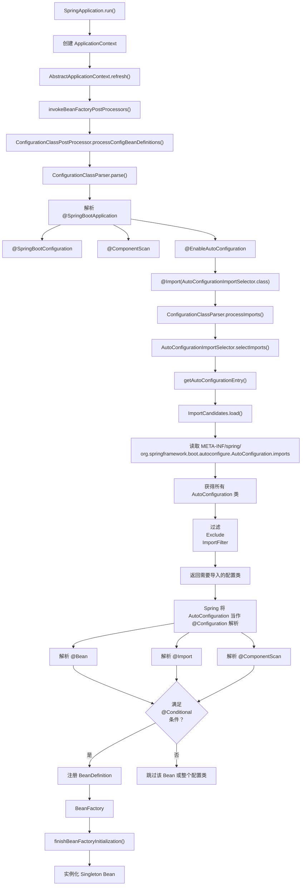

## AutoConfigurationImportSelector的执行

经过上文分析，AutoConfigurationImportSelector的`getAutoConfigurationEntry()`方法是在`ConfigurationClassParser.doProcessConfigurationClass()`中的`ConfigurationClassParser.processImports()`被执行的。

`getAutoConfigurationEntry()`方法的主要作用：**确定当前应用上下文中最终需要导入哪些自动配置类**。

````java
// AutoConfigurationImportSelector.java
protected AutoConfigurationEntry getAutoConfigurationEntry(AnnotationMetadata annotationMetadata) {
    // 1. 如果用户显式关闭了自动配置，直接返回空结果，后续所有步骤跳过
    if (!isEnabled(annotationMetadata)) {
        return EMPTY_ENTRY;
    }
    // 2. 从 @EnableAutoConfiguration 注解中提取属性，主要是 exclude 和 excludeName（手动声明要排除的配置类）
    AnnotationAttributes attributes = getAttributes(annotationMetadata);
    // 3. 加载候选配置类（核心步骤）
    // Spring Boot 2.x: 读取 META-INF/spring.factories 文件中 EnableAutoConfiguration key 对应的所有值
    // Spring Boot 3.x / 4.x: 优先读取 META-INF/spring/org.springframework.boot.autoconfigure.AutoConfiguration.imports 文件（新机制），同时兼容旧的 spring.factories
    // 拿到的是全量候选列表
    List<String> configurations = getCandidateConfigurations(annotationMetadata, attributes);
    // 4. 去除重复项
    configurations = removeDuplicates(configurations);
    // 5. 收集排除项
    // @EnableAutoConfiguration(exclude=...) 注解属性
    // @EnableAutoConfiguration(excludeName=...) 注解属性
    // 配置文件中的 spring.autoconfigure.exclude 属性
    Set<String> exclusions = getExclusions(annotationMetadata, attributes);
    // 6. 确保被排除的类确实存在于候选列表中，如果用户排除了一个根本不存在的自动配置类，会抛出异常
    checkExcludedClasses(configurations, exclusions);
    // 7. 从候选列表中剔除所有排除项
    configurations.removeAll(exclusions);
    // 8. 使用 AutoConfigurationImportFilter 对剩余候选类进行条件匹配进行过滤
    // 默认过滤器是 OnClassCondition OnBeanCondition、OnWebApplicationCondition 等 @Conditional 注解的组合
    // 过滤器还支持通过 spring.factories 扩展自定义的 AutoConfigurationImportFilter
    configurations = getConfigurationClassFilter().filter(configurations);
    // 9. 发布 AutoConfigurationImportEvent 事件
    // 通知所有 AutoConfigurationImportListener 监听器
    fireAutoConfigurationImportEvents(configurations, exclusions);
    // 10. 将最终生效的配置类列表和排除列表封装为不可变对象返回
    return new AutoConfigurationEntry(configurations, exclusions);
}
````

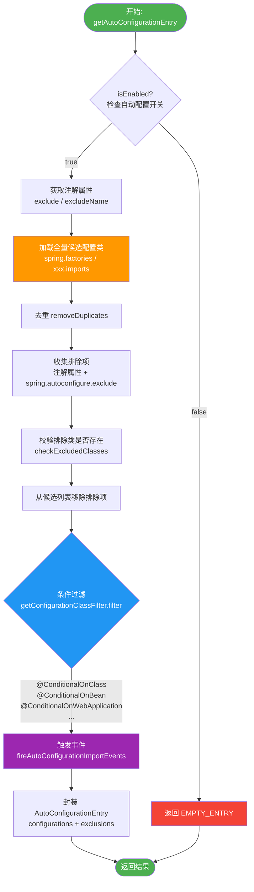


