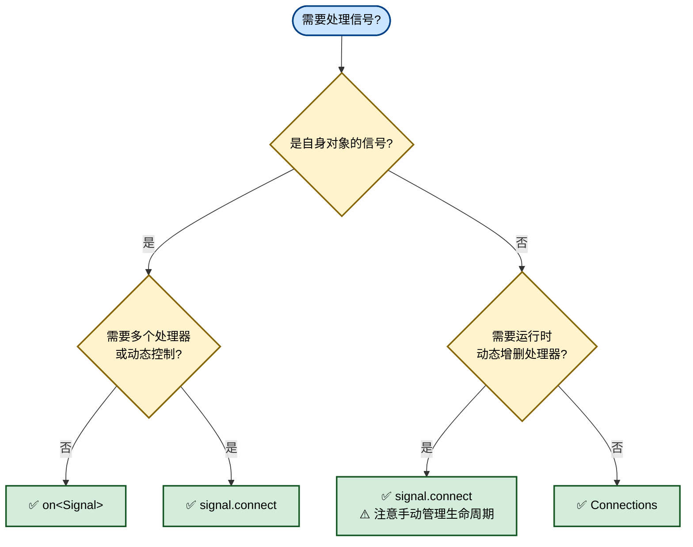
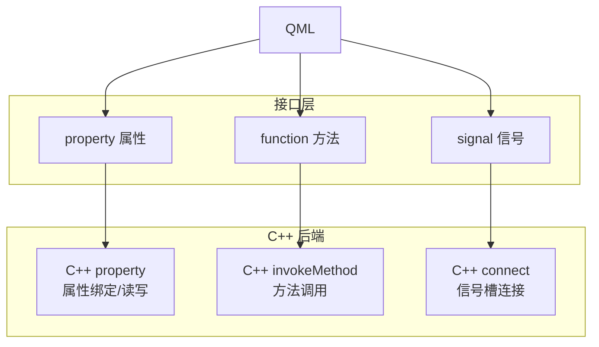

> 前端主流框架从命令式UI（Imperative UI）向声明式UI（Declarative UI）发展，QT也从QT Widget向QT Quick发展。QT Quick使用C++实现后端，QML实现前端。软件工程从 **“控制流驱动”** 走向 **“数据流驱动”** 。
>
> |              | 命令式 UI (Imperative)                                       | 声明式 UI (Declarative)                                      |
> | ------------ | ------------------------------------------------------------ | ------------------------------------------------------------ |
> | 核心思维     | How：告诉计算机“怎么做”                                      | What：告诉计算机“界面应该是什么样”                           |
> | UI 更新方式  | 手动修改 DOM/Widget 属性（如 `setText()`, `setVisible()`）   | 修改数据状态，UI 框架**自动根据状态重新渲染/更新**           |
> | 状态管理     | 状态分散在 UI 控件、全局变量、回调函数中，难以追踪           | 状态是单一事实来源（Single Source of Truth），UI 仅是状态的映射 |
> | 代码耦合度   | 高。UI 结构、样式、逻辑往往交织在一起                        | 低。UI 描述与业务逻辑分离，通过绑定或响应式机制连接          |
> | 可预测性     | 随时间推移，状态流转复杂，易出现“UI 与实际数据不一致”的 Bug  | 确定性高。给定相同的状态，永远产生相同的 UI 输出             |
> | 典型代表     | Qt Widgets, WinForms, Android View (XML+Java), jQuery        | Qt Quick (QML), Flutter, SwiftUI, React/Vue, Jetpack Compose |
> | Qt 中的体现  | `QPushButton *btn = new QPushButton; btn->setText("Click");` | `Button { text: "Click" }` (文本可绑定变量，变量变则文本变)  |
> | 动画处理     | 需手动创建定时器或动画对象，逐帧计算属性值                   | 仅需声明目标状态和过渡行为（Transition/Behavior），引擎自动插值 |
> | 性能优化策略 | 开发者手动控制重绘区域、避免无效刷新                         | 框架内置 Diff 算法或脏标记（Dirty Flag）系统，自动最小化更新 |

QML 是声明式的，擅长 UI 描述与动画；C++ 是命令式的，擅长复杂算法、硬件交互与数据处理。Qt Quick 架构核心是两者的交互。

创建QT Quick application（本文以vscode为例）


```
.
├── builds
├── CMakeLists.txt
├── main.cpp
└── Main.qml
```

CMakeLists.txt

```cmake
cmake_minimum_required(VERSION 3.16)

project(interative VERSION 0.1 LANGUAGES CXX)

set(CMAKE_CXX_STANDARD_REQUIRED ON)

find_package(Qt6 6.8 REQUIRED COMPONENTS Quick)

qt_standard_project_setup(REQUIRES 6.8)

qt_add_executable(appinterative
    main.cpp
)

qt_add_qml_module(appinterative
    URI interative
    VERSION 1.0
    QML_FILES
        Main.qml
)

set_target_properties(appinterative PROPERTIES
    MACOSX_BUNDLE_BUNDLE_VERSION ${PROJECT_VERSION}
    MACOSX_BUNDLE_SHORT_VERSION_STRING ${PROJECT_VERSION_MAJOR}.${PROJECT_VERSION_MINOR}
    MACOSX_BUNDLE TRUE
    WIN32_EXECUTABLE TRUE
)

target_link_libraries(appinterative
    PRIVATE Qt6::Quick
)

include(GNUInstallDirs)
install(TARGETS appinterative
    BUNDLE DESTINATION .
    LIBRARY DESTINATION ${CMAKE_INSTALL_LIBDIR}
    RUNTIME DESTINATION ${CMAKE_INSTALL_BINDIR}
)
```

main.cpp

```cpp
#include <QGuiApplication>
#include <QQmlApplicationEngine>

int main(int argc, char *argv[])
{
    QGuiApplication app(argc, argv);

    QQmlApplicationEngine engine;
    QObject::connect(
        &engine,
        &QQmlApplicationEngine::objectCreationFailed,
        &app,
        []() { QCoreApplication::exit(-1); },
        Qt::QueuedConnection);
    engine.loadFromModule("interative", "Main");

    return app.exec();
}
```

Main.qml

```javascript
import QtQuick
import QtQuick.Controls

ApplicationWindow {
    width: 640
    height: 480
    visible: true
    title: qsTr("Hello World")
}
```

## QT Quick的信号与槽

Qt 的信号槽（Signal & Slot）机制是一种**观察者模式**的实现，用于对象间通信，核心优势是**发送者和接收者完全解耦**，发出信号的对象不需要知道谁在监听，也不关心监听者做了什么。

对于QT Widget，信号与槽定义和调用都在CPP文件中；但对于QT Quick是前后端分离的框架，前端使用QML语言，后端使用CPP。

### QML的信号与槽

目标：**QML中定义信号 和 对应信号的槽函数**

**QML中定义信号**

QML中通过 `signal` 关键字声明信号

```javascript
Item {
    signal clicked()
    signal send(string msg)
}
```

*注：QML 信号参数类型必须是 QML 基本类型（如 `int`、`real`、`string`、`var`、`color` 等）*


**QML中定义槽函数**

QML中有三种方式定义槽函数：

* `on<Signal>` 定义槽函数
* `Component` + `connect` 定义槽函数
* `Connections` + `on<Signal>` 定义槽函数

定义一个QML基础组件

```javascript
// QMLSignal.qml 
import QtQuick

Rectangle {
    id: root
    implicitWidth: 100
    implicitHeight: 40
    color: "lightblue"
    // 定义信号
    signal send(string msg)
    // 定义槽函数
    onSend: msg => console.log("QMLSignal onSend:", msg)
    MouseArea {
        anchors.fill: parent
        // 触发 Rectangle 中定义的信号
        onClicked: root.send("red")
    }
}
```

在Main.qml中使用QMLSignal组件

````javascript
// Main.qml
import QtQuick
import QtQuick.Layouts
import QtQuick.Controls

import interative 1.0

ApplicationWindow {
    width: 640
    height: 480
    visible: true
    title: qsTr("Hello World")

    ColumnLayout {
        id: layout

        QMLSignal {
            id: qmlSignal
            // on<Signal> 定义槽函数
            onSend: msg => {
                console.log("Main.qml onSend:", msg);
            }
            // Component + connect 定义槽函数
            Component.onCompleted: {
                send.connect(msg => console.log("Main.qml Component connect1", msg));
                send.connect(msg => console.log("Main.qml Component connect2", msg));
            }
        }

        // Connections + on<Signal> 定义槽函数
        Connections {
            target: qmlSignal

            function onSend(msg) {
                console.log("Main.qml Connections onSend1:", msg);
            }
        }

        Connections {
            target: qmlSignal

            functon onSend(msg) {
                console.log("Main.qml Connections onSend2:", msg);
            }
        }
    }
}

````

`on<Signal>` **内联信号处理器**

| 特性     | 说明                                            |
| -------- | ----------------------------------------------- |
| 作用域   | 只能处理自身对象发出的信号                      |
| 数量限制 | 同一对象的同一信号只能定义一个 `onXxx` 处理器   |
| 绑定时机 | 组件创建时自动绑定，不可动态增删                |
| 生命周期 | 随对象自动销毁，无需手动断开                    |
| 本质     | 是 QML 引擎的声明式语法糖，底层等价于 `connect` |

```javascript
QMLSignal {
    id: qmlSignal

    // 无参信号
    onTriggered: {
        console.log("triggered");
    }

    // 带参信号
    onSend: (msg) => {
        console.log("received:", msg);
    }
}
```

`signal.connect()` **/** `signal.disconnect()` **动态连接**

| 特性     | 说明                                                         |
| -------- | ------------------------------------------------------------ |
| 作用域   | 可以连接任意可访问对象的函数                                 |
| 数量限制 | 同一信号可 `connect` 任意多次                                |
| 绑定时机 | 运行时动态绑定，可在任何时刻调用                             |
| 生命周期 | 不会自动断开，目标对象销毁后若未 disconnect 会导致崩溃或未定义行为 |
| 本质     | JavaScript 层面的 API 调用                                   |

```javascript
QMLSignal {
    id: qmlSignal
    // on<Signal> 定义槽函数
    onSend: msg => {
        console.log("Main.qml onSend:", msg);
    }
    // Component + connect 定义槽函数
    //（这里没有disconnect，会导致悬空指针或内存泄漏，仅供演示使用）
    Component.onCompleted: {
        send.connect(msg => console.log("Main.qml Component connect1", msg));
        send.connect(msg => console.log("Main.qml Component connect2", msg));
    }
}
```

```javascript
// ❌ 危险：target 销毁后连接仍然存在
Component.onCompleted: {
    someTemporaryObject.valueChanged.connect(updateUI);
}
// someTemporaryObject 被 GC 后，updateUI 仍被持有 → 野指针

// ✅ 安全方案1：在 Component.onDestruction 中断开
Component.onDestruction: {
    someTemporaryObject.valueChanged.disconnect(updateUI);
}

// ✅ 安全方案2：用 Connections 代替（自动管理生命周期）
Connections {
    target: someTemporaryObject
    function onValueChanged() { updateUI(); }
}

// ❌ 陷阱：匿名函数无法 disconnect
send.connect((msg) => console.log(msg));
// 没有引用，永远无法断开！

// ✅ 正确：保存引用以便后续断开
property var _handler: (msg) => console.log(msg)
Component.onCompleted: send.connect(_handler)
Component.onDestruction: send.disconnect(_handler)
```

`Connections` **类型**

| 特性         | 说明                                                         |
| ------------ | ------------------------------------------------------------ |
| 作用域       | 专为监听外部对象信号设计                                     |
| 数量限制     | 可创建多个 `Connections` 实例监听同一 target 的同一信号      |
| 绑定时机     | `target` 赋值时自动连接，`target` 改变或设为 `null` 时自动断开 |
| 生命周期     | ✅ 自动管理：Connections 销毁或 target 变更时自动 disconnect  |
| 条件启用     | 支持 `enabled` 属性临时禁用/启用                             |
| 忽略未知信号 | 支持 `ignoreUnknownSignals: true` 避免 target 类型不确定时报错 |

```javascript
// Qt 6 / Qt 5.15+ 推荐写法
Connections {
    target: qmlSignal

    function onSend(msg) {
        console.log("Connections handler:", msg);
    }

    function onTriggered() {
        console.log("triggered via Connections");
    }
}
```

监听**非自身**对象的信号且自动生命周期管理，避免内存泄漏。

````javascript
// 多个 Connections 监听同一信号  全部触发
Connections {
    target: qmlSignal
    function onSend(msg) { console.log("Handler A:", msg); }
}

Connections {
    target: qmlSignal
    function onSend(msg) { console.log("Handler B:", msg); }
}

// 条件性监听
Connections {
    target: qmlSignal
    enabled: checkBox.checked   // 勾选时才响应
    function onSend(msg) { console.log("conditional:", msg); }
}

// target 可能为空的安全写法
Connections {
    target: nullableObject      // 可以为 null
    ignoreUnknownSignals: true  // target 类型不确定时不报错
    function onDataReady(data) { processData(data); }
}

// 运行时切换 target
Connections {
    target: currentIndex === 0 ? objectA : objectB
    function onUpdate() { refresh(); }
}
````

三种方式对比

| 特性             | `on<Signal>` | `signal.connect()` | `Connections`    |
| ---------------- | ------------ | ------------------ | ---------------- |
| 监听对象         | 仅自身       | 任意               | 任意（外部为主） |
| 同信号多槽       | ❌            | ✅                  | ✅                |
| 动态连接/断开    | ❌            | ✅                  | ❌（声明式）      |
| 自动生命周期管理 | ✅            | ❌                  | ✅                |
| target 可为 null | N/A          | ❌（需手动判断）    | ✅                |
| 条件启用         | ❌            | 手动实现           | ✅ `enabled`      |
| 代码可读性       | ⭐⭐⭐          | ⭐⭐                 | ⭐⭐⭐              |
| 安全性           | ⭐⭐⭐          | ⭐                  | ⭐⭐⭐              |
| 推荐优先级       | 自身信号首选 | 需要动态控制时用   | 外部信号首选     |

决策选择



*注：在 QML 开发中，应该将 `on<Signal>` 和 `Connections` 作为**默认首选**，而将 `signal.connect()` / `disconnect()` 视为**特殊场景下的备选方案**。*

*注：`on<Signal>` 和 `Connections`是声明式槽函数定义，由QML引擎自动管理生命周期，对象销毁时自动断开连接*

*注：` on<Signal>` 和 `signal.connect()` / `disconnect()` 是对QML对象自身信号的处理。`Connections` 是在QML对象外部定义信号的处理。*


此外，QML 内置类型提供了大量可直接连接的信号如clicked,textChanged,triggered等等，用户可自行定义其槽函数如onClicked,onTextChanged,onTriggered。

```javascript
TextInput {
    id: input
    text: "Hello"
    
    // 内置信号 onTextChanged
    onTextChanged: {
        console.log("Text changed to:", text)
    }
}

Timer {
    interval: 1000; running: true; repeat: true
    onTriggered: {
        console.log("Timer tick!")
    }
}

ListView {
    model: myModel
    // 内置信号
    onCurrentIndexChanged: console.log(currentIndex)
    onCountChanged: console.log("Count:", count)
}
```

### CPP中的信号与槽

目标：**在CPP中定义信号和对应信号的槽函数**

1. **信号（signals）不需要也不能在 .cpp 中写函数体**，由 Qt 的 moc（元对象编译器）自动生成实现，只需在合适的位置 `emit` 它。
2. **槽函数（slots）就是普通的成员函数**，在 .cpp 中正常实现即可。

`QObject::connect` 是 Qt **信号与槽（Signal & Slot）机制的核心 API**，当对象 A 发生某个事件（signal）时，自动调用对象 B 的某个函数（slot）。

```cpp
QObject::connect(
    sender,
    signal,
    receiver,
    slot
);

// A 的 signal -> B 的 function
connect(
    &A, // 成员指针
    &A::signal, // 成员函数指针
    &B, // 成员指针
    &B::function // 成员函数指针
);
```

| 参数       | 含义                   |
| ---------- | ---------------------- |
| `sender`   | 谁发出信号             |
| `signal`   | 发出的什么信号         |
| `receiver` | 谁接收                 |
| `slot`     | 接收到以后执行什么函数 |

```cpp
// BackendService.h
#include <QObject>

class BackendService : public QObject
{
    Q_OBJECT
    // Qt6: 需暴露给 QML
    // QML_ELEMENT

public:
    explicit BackendService(QObject *parent = nullptr);

    // 使用 Q_INVOKABLE 暴露给 QML 调用的方法
    // 注意 Q_INVOKABLE 方法必须是 public 的
    Q_INVOKABLE void fetchData();

Q_SIGNALS: //
    // C++ 内部信号，也可被 QML 自动监听
    // 信号不需要实现，也不能实现
    void dataReady(const QString &data);
    void errorOccurred(const QString &errorMsg);

public Q_SLOTS: //
    // 可被 QML 调用，也可被 C++ 内部 connect
    void processData(const QByteArray &rawData);

private Q_SLOTS: //
    // 仅 C++ 内部使用的槽
    void onNetworkReplyFinished();
};
```

```cpp
// BackendService.cpp
#include "BackendService.h"
#include <iostream>

BackendService::BackendService(QObject *parent) : QObject(parent)
{
    // 在构造函数中完成所有 C++ 内部的信号-槽绑定
    // 例子：自身信号 -> 自身公有槽（内部数据流转）
    // 实际项目中通常是 A对象信号 -> B对象槽，这里演示自连接
    // connect(对象A, 对象A的信号, 对象B, 对象B的槽函数)
    // dataReady信号 -> onNetworkReplyFinished槽函数
    connect(this, &BackendService::dataReady, this, &BackendService::onNetworkReplyFinished);
}

void BackendService::fetchData()
{
    std::cout << "fetchData" << std::endl;
}

// 槽函数
void BackendService::processData(const QByteArray &rawData)
{
    std::cout << "processData: " << rawData.toStdString() << std::endl;
    // 触发 dataReady 信号
    Q_EMIT dataReady(rawData);
    // 触发 errorOccurred 信号
    Q_EMIT errorOccurred(rawData);
}

// 槽函数
void BackendService::onNetworkReplyFinished()
{
    std::cout << "onNetworkReplyFinished invoked" << std::endl;
}

```

```cpp
// main.cp
#include <QGuiApplication>
#include <QQmlApplicationEngine>
#include <iostream>
#include "BackendService.h"

int main(int argc, char *argv[])
{
    QGuiApplication app(argc, argv);

    BackendService backendService;
    // 在Main.cpp中 连接 信号 和 槽函数 
    QObject::connect(&backendService, &BackendService::dataReady,
                     [](const QString &data)
                     { std::cout << "Main dataReady" << std::endl; });
    QObject::connect(&backendService, &BackendService::errorOccurred,
                     [](const QString &errorMsg)
                     { std::cout << "Main errorOccurred" << std::endl; });
    // 执行函数 触发信号
    backendService.processData("processData");

    QQmlApplicationEngine engine;
    QObject::connect(
        &engine,
        &QQmlApplicationEngine::objectCreationFailed,
        &app,
        []()
        { QCoreApplication::exit(-1); },
        Qt::QueuedConnection);
    engine.loadFromModule("interative", "Main");

    return app.exec();
}

```

### QML的槽函数接收CPP的信号

目标：**在CPP中定义信号，在QML中定义此信号的槽函数。**

在CPP中定义信号 和 触发信号的函数

````cpp
// SigItem.h
#include <QObject>
class SigItem : public QObject
{
    Q_OBJECT

Q_SIGNALS:
    void dataReady(QString data);

public Q_SLOTS:
    // 触发信号
    void processData()
    {
        QString str = "Receive Data";
        Q_EMIT dataReady(str);
    }
};
````

将 SigItem.h 添加到 `CMakelists.txt`

```cmake
qt_add_qml_module(appinterative
    URI interative
    VERSION 1.0
    SOURCES
        SigItem.h
    QML_FILES
        Main.qml
)
```

在main.cpp将此CPP对象注入到QML中

```cpp
// main.cpp
#include <QGuiApplication>
#include <QQmlApplicationEngine>
#include <QQmlContext>
#include <iostream>
#include <QTimer>

#include "SigItem.h"

int main(int argc, char *argv[])
{
    QGuiApplication app(argc, argv);

    SigItem sigItem;
    QQmlApplicationEngine engine;
    // 将 SigItem 类注册到 QML engine 中 
    engine.rootContext()->setContextProperty("sigItem", &sigItem);

    QObject::connect(
        &engine,
        &QQmlApplicationEngine::objectCreationFailed,
        &app,
        []()
        { QCoreApplication::exit(-1); },
        Qt::QueuedConnection);
    engine.loadFromModule("interative", "Main");

    // 延迟加载，等QML加载完成后执行SigItem::processData()方法
    QTimer::singleShot(0, &sigItem, &SigItem::processData);

    return app.exec();
}
```

此时QML中可以通过sigItem变量获取SigItem对象

比如设置SigItem对象中信号对应的槽函数

```javascript
// Main.qml
Connections {
    // 指向SigItem对象
    target: sigItem

    function onDataReady(data) {
        console.log("Main.qml data ready: ", data);
    }
}
```


### CPP的槽函数接受QML的信号

在QML中定义信号，需要指定QML组件的`objectName` Controller.qml

```javascript
// Controller.qml
import QtQuick

Rectangle {
    id: root
    implicitWidth: 100
    implicitHeight: 40
    color: "red"
    
    // 用于CPP获取该组件
    objectName: "messageItem"
    signal sendMessage(string msg)

    MouseArea {
        id: controllerClicked
        anchors.fill: parent
        // 点击 触发 sendMessage 信号
        onClicked: root.sendMessage("send message")
    }
}
```

在CPP中定义槽函数 ControllerMsg.h

````cpp
// ControllerMsg.h
#include <QObject>
#include <QString>
#include <iostream>

class ControllerMsg : public QObject
{
    Q_OBJECT

public:
    explicit ControllerMsg(QObject *parent = nullptr) : QObject(parent) {}

public Q_SLOTS:
    // 定义 sendMessage 信号的槽函数
    void onSendMessage(const QString &msg)
    {
        std::cout << "onSendMessage " << msg.toStdString() << std::endl;
    }
};
````

CPP获取QML中组件的信号并连接（在启动类main.cpp中获取QML组件并连接信号和槽函数）

````cpp
// main.cpp
#include <QGuiApplication>
#include <QQmlApplicationEngine>
#include <QQmlContext>
#include <iostream>
#include "ControllerMsg.h"

int main(int argc, char *argv[])
{
    QGuiApplication app(argc, argv);
    QQmlApplicationEngine engine;

    QObject::connect(
        &engine,
        &QQmlApplicationEngine::objectCreationFailed,
        &app,
        []()
        { QCoreApplication::exit(-1); },
        Qt::QueuedConnection);
    engine.loadFromModule("interative", "Main");

	// 获取QML的根组件（即上面指定的Main.qml的根组件）
    QObject *root = engine.rootObjects().first();
    // 以根组件为基点，搜索所有子节点中 objectName 为 "messageItem" 的组件
    QObject *target = root->findChild<QObject *>("messageItem");

    std::cout << "target found: "
              << target->objectName().toStdString()
              << std::endl;
    
	// 连接 target(messageItem)的信号sendMessage() 和 ControllerMsg对象的槽函数onSendMessage()
    ControllerMsg controllerMsg;
    bool connected = QObject::connect(target,
                     SIGNAL(sendMessage(QString)),
                     &controllerMsg,
                     SLOT(onSendMessage(QString)));

    std::cout << "connect result: "
              << connected
              << std::endl;

    return app.exec();
}
````

QT工程的CMakeLists.txt

````cmake
qt_add_qml_module(appinterative
    URI interative
    VERSION 1.0
    SOURCES
        ControllerMsg.h
    QML_FILES
        Main.qml
        Controller.qml
)
````


## CPP中注册QML组件对象

QML 对象是由 QML Engine 创建的，C++ 通过`engine.rootObjects()`主动找根节点，在启动类`main.cpp`中

````cpp
QObject *messageItem =
    engine.rootObjects().first()->findChild<QObject *>("messageItem");
````

`engine.rootObjects().first()`会返回根节点的`QObject*`指针，`findChild()`会返回根节点的子节点中对应objectName的`QObject*`指针。

*注：在QML中，每一个`Item`在CPP中都是一个`QObject*`对象。*

获取到QML的`Item`的`QObject*`对象后，可直接读写 QML 属性

````javascript
import QtQuick

Item {
    objectName: "messageItem"
    
    property string message: "Hello"
    property int count: 10
    function sendMessage(msg) {
        console.log("QML:", msg)
        return "received: " + msg
    }  
}
````

获取 修改 Item 中的 property

````cpp
// 获取QML属性
QVariant message = messageItem->property("message");
QVariant count = messageItem->property("count")
std::cout << message.toString() << std::endl;
std::cout << message.toInt() << std::endl;

// 修改QML属性
messageItem->setProperty("message", "Hello C++");
messageItem->setProperty("count", 20);
````

调用 Item 中的 方法

````cpp
QVariant result;

bool ok = QMetaObject::invokeMethod(
    messageItem,
    "sendMessage",
    Q_RETURN_ARG(QVariant, result),
    Q_ARG(QVariant, "Hello QML")
);

std::cout << ok << std::endl;
std::cout << result << std::endl;
````

QML中的属性（property），方法（function），信号（signal）都可以被CPP获取。但开发过程中一般不使用，更推荐在QML中获取CPP对象。



## QML中注册C++对象

有三种方法让 QML 能获取并使用 C++ 对象：

* `setContextProperty()`：把一个已经创建好的 C++ 对象注入 QML

* `qmlRegisterType()` / `QML_ELEMENT`：把 C++ 类注册成 QML 类型，然后由 QML 创建对象

* `qmlRegisterSingletonInstance()`：注册一个全局单例对象


首先创建一个CPP类（后续被注册到QML中）

````cpp
// CircleItem.h
#include <QObject>

class CircleItem : public QObject
{
    Q_OBJECT

public:
    explicit CircleItem(QObject *parent = nullptr);
    Q_INVOKABLE void sendMessage(const QString &msg);

Q_SIGNALS:
    void messageReceived(const QString &msg);
}; 
````

````cpp
// CircleItem.cpp
#include "CircleItem.h"
#include <iostream>

CircleItem::CircleItem(QObject *parent) : QObject(parent)
{
}

void CircleItem::sendMessage(const QString &msg)
{
    std::cout << "sendMessage" << std::endl;
    Q_EMIT messageReceived(msg);
}
````

在CMakeLists.txt中注册上述两个文件，因为是给QML使用的类，注册到qt_add_qml_module的SOURCES。

````cmake
qt_add_qml_module(appinterative
    URI interative
    VERSION 1.0
    SOURCES
        CircleItem.h
        CircleItem.cpp
    QML_FILES
        Main.qml
)
````

### `setContextProperty()`

在main.cpp中将`CircleItem`注册到QML engine中

```cpp
#include <QGuiApplication>
#include <QQmlApplicationEngine>
#include <QQmlContext>
#include <iostream>
#include "CircleItem.h"

int main(int argc, char *argv[])
{
    QGuiApplication app(argc, argv);

    QQmlApplicationEngine engine;
	
    // 在 cpp 中创建 CircleItem 对象
    CircleItem circleItem;
    // 将 cpp 中的 CircleItem 对象 注册到 QML engine 中
    // QML的对象 名字为 circleItem
    engine.rootContext()->setContextProperty("circleItem", &circleItem);

    QObject::connect(
        &engine,
        &QQmlApplicationEngine::objectCreationFailed,
        &app,
        []()
        { QCoreApplication::exit(-1); },
        Qt::QueuedConnection);
    engine.loadFromModule("interative", "Main");

    return app.exec();
}

```

在 QML 中有一个名字叫 `circleItem` 的 QObject，它对应 C++ 中的 ` CircleItem` 对象。

*注：` circleItem` 并不是一个 QML `CircleItem` 对象。QML只能通过`circleItem`变量来获取。*

在QML中通过`Connections`指定target来定义` CircleItem` 对象中`messageReceived`的槽函数`onMessageReceived()`，并触发`circleItem` 对象的信号 `circleItem.sendMessage("finish")`。

```cpp
import QtQuick
import QtQuick.Layouts
import QtQuick.Controls

import interative 1.0

ApplicationWindow {
    width: 640
    height: 480
    visible: true
    title: qsTr("Hello World")

    ColumnLayout {
        id: layout

        Connections {
            target: circleItem
            function onMessageReceived(data) {
                console.log("messageReceived: ", data);
            }
        }
        Component.onCompleted: {
            circleItem.sendMessage("finish");
        }
    }
}

```


### `qmlRegisterType()` / `QML_ELEMENT`

通过`setContextProperty()`是将CPP对象直接以变量名称的方式注入到QML engine中，QML可以通过变量名获取该CPP对象。

`qmlRegisterType()` / `QML_ELEMENT`是把 C++ 类注册成 QML 类型。可以直接在QML文件中像使用Item一样使用该类。

使用 `QML_ELEMENT`：（推荐）

给`CircleItem.h`加入 `QML_ELEMENT`

```cpp
// CircleItem.h
#include <QObject>
#include <qqml.h>

class CircleItem : public QObject
{
    Q_OBJECT
    QML_ELEMENT // 隐式执行 qmlRegisterType() 将CPP类注册为QML类型

public:
    explicit CircleItem(QObject *parent = nullptr);
    Q_INVOKABLE void sendMessage(const QString &msg);

Q_SIGNALS:
    void messageReceived(const QString &msg);
};
```

维持CMakeLists.txt中注册CircleItem.h和 CircleItem.cpp

```
qt_add_qml_module(appinterative
    URI interative
    VERSION 1.0
    SOURCES
        CircleItem.h
        CircleItem.cpp
    QML_FILES
        Main.qml
)
```

在QML中直接使用组件

```javascript
import QtQuick
import QtQuick.Layouts
import QtQuick.Controls

import interative 1.0

ApplicationWindow {
    width: 640
    height: 480
    visible: true
    title: qsTr("Hello World")

    ColumnLayout {
        id: layout
		// 直接使用 CircleItem 组件
        CircleItem {
            id: circleItem
			// 定义 messageReceived 信号的 槽函数
            onMessageReceived: msg => {
                console.log("messageReceived: ", msg);
            }
        }

        Rectangle {
            implicitWidth: 100
            implicitHeight: 40
            color: "lightblue"

            MouseArea {
                anchors.fill: parent
                // 调用 CircleItem 的 sendMessage() 方法 触发 messageReceived 信号
                onClicked: circleItem.sendMessage("circleItem send")
            }
        }
    }
}
```

使用 `qmlRegisterType()`：

上面在类中定义的`QML_ELEMENT`实质上是隐式的执行了`qmlRegisterType()`将CPP类注册为QML类型。

不需要在`CircleItem.h`加入 `QML_ELEMENT`

```cpp
// CircleItem.h
#include <QObject>
#include <qqml.h>

class CircleItem : public QObject
{
    Q_OBJECT

public:
    explicit CircleItem(QObject *parent = nullptr);
    Q_INVOKABLE void sendMessage(const QString &msg);

Q_SIGNALS:
    void messageReceived(const QString &msg);
};
```

维持CMakeLists.txt中注册CircleItem.h和 CircleItem.cpp

```
qt_add_qml_module(appinterative
    URI interative
    VERSION 1.0
    SOURCES
        CircleItem.h
        CircleItem.cpp
    QML_FILES
        Main.qml
)
```

需要在 `main.cpp` 中使用 `qmlRegisterType()`注册

```cpp
#include <QGuiApplication>
#include <QQmlApplicationEngine>
#include <QQmlContext>
#include <iostream>
// #include <QTimer>
// #include "BackendService.h"
// #include "SigItem.h"
// #include "ControllerMsg.h"
#include "CircleItem.h"

int main(int argc, char *argv[])
{
    QGuiApplication app(argc, argv);

    QQmlApplicationEngine engine;
	// 向 interative 项目中注册 CircleItem 组件
    qmlRegisterType<CircleItem>("interative", 1, 0, "CircleItem");

    QObject::connect(
        &engine,
        &QQmlApplicationEngine::objectCreationFailed,
        &app,
        []()
        { QCoreApplication::exit(-1); },
        Qt::QueuedConnection);
    engine.loadFromModule("interative", "Main");
    return app.exec();
}

```

在QML中直接使用CircleItem组件（像`QML_ELEMENT`一样）

```javascript
import QtQuick
import QtQuick.Layouts
import QtQuick.Controls

import interative 1.0

ApplicationWindow {
    width: 640
    height: 480
    visible: true
    title: qsTr("Hello World")

    ColumnLayout {
        id: layout
		// 直接使用 CircleItem 组件
        CircleItem {
            id: circleItem
			// 定义 messageReceived 信号的 槽函数
            onMessageReceived: msg => {
                console.log("messageReceived: ", msg);
            }
        }

        Rectangle {
            implicitWidth: 100
            implicitHeight: 40
            color: "lightblue"

            MouseArea {
                anchors.fill: parent
                // 调用 CircleItem 的 sendMessage() 方法 触发 messageReceived 信号
                onClicked: circleItem.sendMessage("circleItem send")
            }
        }
    }
}
```


`setContextProperty` 和 `qmlRegisterType` / `QML_ELEMENT` 的区别

|                                | `setContextProperty`                  | `qmlRegisterType` / `QML_ELEMENT`                |
| ------------------------------ | ------------------------------------- | ------------------------------------------------ |
| 本质                           | 向 QML 上下文注入一个已存在的对象指针 | 向 QML 类型系统注册一个元类型工厂                |
| QML 引擎知道什么               | 只知道"有个叫 sigItem 的 QVariant"    | 知道完整的 QMetaObject、属性、信号、槽、可创建性 |
| 对象创建者                     | C++ 手动创建，手动管理生命周期        | QML 引擎按需创建，自动管理生命周期               |
| 类型信息                       | ❌ 对编译器/linter 不可见              | ✅ 完整暴露给 qmllint、IDE、QML 编译器            |
| 能否在 QML 中使用 `SigItem {}` | ❌                                     | ✅                                                |
| 存储位置                       | `QQmlContext` 的属性表（哈希表）      | `QQmlType` 类型注册表（全局类型系统）            |

`setContextProperty` ：（将CPP类注入到QML中）

```cpp
// main.cpp
engine.rootContext()->setContextProperty("sigItem", &sigItem);
```

- 将 `&sigItem` 包装成 `QVariant`，存入 `QQmlContext` 的一个 **字符串→QVariant 哈希表**
- QML 访问 `sigItem` 时，走的是 **上下文属性查找链**（类似 JavaScript 作用域链）
- 引擎**不知道**这个 QVariant 背后是什么类型，所有成员访问都通过 `QMetaObject::invokeMethod` 动态反射
- qmllint 做静态分析时根本看不到这个符号 → 报 `unqualified`

`qmlRegisterType` **/** `QML_ELEMENT` ：

```cpp
// main.cpp
qmlRegisterType<SigItem>("interative", 1, 0, "SigItem");
```

- 调用 `QQmlPrivate::registerType()`，将一个 **类型描述结构体** 写入全局的 `QQmlType` 注册表
- 该结构体包含：`QMetaObject*`、构造函数指针、`create()` 工厂方法、版本信息等
- QML 遇到 `SigItem {}` 时，走的是 **类型解析→工厂创建→组件绑定** 的完整管线
- qmllint 可以查询类型注册表，获得完整的类型信息用于静态分析

**`QML_ELEMENT` 宏**只是在编译期生成一段自注册代码（通过 `Q_CONSTRUCTOR_FUNCTION`），最终调用的仍然是 `qmlRegisterType` 系列函数，效果完全等价。

总结：`setContextProperty` 是 **"塞一个对象实例到 QML 的作用域里"** QML标识符 → QQmlContext哈希表 → QVariant → 动态反射；
`qmlRegisterType` / `QML_ELEMENT` 是 **"教 QML 认识一个新的类型"** QML类型名 → QQmlType注册表 → 工厂创建 → 原生组件绑定。

### `qmlRegisterSingletonInstance()`

`qmlRegisterSingletonInstance()`：注册一个**已经存在的唯一对象**，QML 只能使用这一份。

```cpp
#include <QGuiApplication>
#include <QQmlApplicationEngine>
#include <QQmlContext>
#include <iostream>
#include "CircleItem.h"

int main(int argc, char *argv[])
{
    QGuiApplication app(argc, argv);

    QQmlApplicationEngine engine;
	
    // 在 cpp 中创建 CircleItem 对象
    CircleItem circleItem;
    // 将 cpp 中的 CircleItem 对象 注册到 QML engine 中
    // QML的对象 名字为 circleItem
    qmlRegisterSingletonInstance<CircleItem>(
        "interative", // 项目名
        1,
        0,
        "circleItem",  // 对象名
        &circleItem    //对象
    );

    QObject::connect(
        &engine,
        &QQmlApplicationEngine::objectCreationFailed,
        &app,
        []()
        { QCoreApplication::exit(-1); },
        Qt::QueuedConnection);
    engine.loadFromModule("interative", "Main");

    return app.exec();
}

```

QML用法与`setContextProperty()`一样，注册的仍然是CPP对象，只能通过名称在QML中获取，QML 不负责创建这个对象。

```javascript
import QtQuick
import QtQuick.Layouts
import QtQuick.Controls

import interative 1.0

ApplicationWindow {
    width: 640
    height: 480
    visible: true
    title: qsTr("Hello World")

    ColumnLayout {
        id: layout

        Connections {
            target: circleItem
            function onMessageReceived(data) {
                console.log("messageReceived: ", data);
            }
        }
        Component.onCompleted: {
            circleItem.sendMessage("finish");
        }
    }
}

```


三者的区别

| 方式                   | C++ 创建对象 | QML 创建对象 | QML使用方式        |
| ---------------------- | ------------ | ------------ | ------------------ |
| `setContextProperty()` | ✅            | ❌            | `controller.xxx()` |
| `QML_ELEMENT`          | ❌            | ✅            | `Controller {}`    |
| `qmlRegisterType()`    | ❌            | ✅            | `Controller {}`    |
| Singleton              | 通常 C++     | ❌            | `App.xxx()`        |

```
qmlRegisterType()
        ↓
注册「类」
        ↓
QML 创建对象
        ↓
Controller {}


qmlRegisterSingletonInstance()
        ↓
注册「已经存在的对象」
        ↓
QML 不创建
        ↓
Controller.xxx()


setContextProperty()
        ↓
注册「上下文中的对象/值」
        ↓
QML 不创建
        ↓
controller.xxx()
```

* **每个 QML 页面自己需要一个 Controller** → `qmlRegisterType()` / `QML_ELEMENT`

* **整个应用只有一个 BackendService / AppState / Settings** → `qmlRegisterSingletonInstance()`

* **只是简单地把 C++ 已有对象暴露给当前 QML engine** → `setContextProperty()`

### 详细讲解 `QML_ELEMENT`（QT6 推荐）

`QML_ELEMENT`、`QML_SINGLETON` 宏 + CMake/qmake 配置

创建 `MyItem.h` 和 `MyItem.cpp`

在 `CMakeLists.txt` 中向 `qt_add_qml_module` 添加 `MyItem.h` 和 `MyItem.cpp`。

```cmake
qt_add_executable(appinterative
    main.cpp
)

qt_add_qml_module(appinterative
    URI interative
    VERSION 1.0
    SOURCES
        MyItem.h
        MyItem.cpp
    QML_FILES
        Main.qml
)
```

`qt_add_qml_module()`用于**声明并构建一个 QML 模块**，将 `appinterative` 目标（可执行文件或库）配置为一个 **QML 模块**，即将 `MyItem.h` 和 `MyItem.cpp` 添加到QML模块中，让QML文件导入该模块后能够获取到CPP的类（`MyItem.h`类中必须包含 `Q_OBJECT` + `QML_ELEMENT` 才能被QML文件使用）。

主要作用：

1. 能在 QML 中通过 `import interative` 导入该模块
2. 自动注册 C++ 类型（如带 `QML_ELEMENT` 的类）
3. 打包 QML 文件、资源、插件元数据等
4. 生成符合 Qt 模块规范的目录结构和元信息

| 参数                          | 值         | 作用                                                         |
| ----------------------------- | ---------- | ------------------------------------------------------------ |
| `appinterative`               | 目标名     | 指定要附加 QML 模块功能的 CMake 目标（必须是 `qt_add_executable` 或 `qt_add_library` 创建的目标） |
| `URI interative`              | 模块标识符 | QML 中 `import` 使用的名称（即 `import interative`）。必须与 QML 目录结构或 qmldir 一致 |
| `VERSION 1.0`                 | 版本号     | 模块版本，QML 可写 `import interative 1.0`。主版本号影响类型兼容性 |
| `SOURCES MyItem.h MyItem.cpp` | C++ 源文件 | moc 会扫描这些头文件中的 `QML_ELEMENT` / `Q_PROPERTY` 等宏，自动生成类型注册代码 |
| `QML_FILES Main.qml`          | QML 文件   | 被打包进模块的 QML 文件，可通过 URI 访问（如作为组件使用）   |

MyItem.h

```cpp
#include <QObject>
#include <qqml.h>

class MyItem : public QObject
{
    Q_OBJECT
    QML_ELEMENT

    Q_PROPERTY(QString name
                   READ name
                       WRITE setName
                           NOTIFY nameChanged)

public:
    explicit MyItem(QObject *parent = nullptr);
    QString name() const;
    void setName(const QString &name);

    Q_INVOKABLE
    QString title() const;

    Q_SIGNAL
    void nameChanged();

private:
    QString name_ = "yingzheng";
};
```

#### `Q_OBJECT`

启用 Qt 的**元对象系统** **MOC（Meta-Object Compiler）** 对该类进行额外代码生成，为类提供：

- 信号与槽（signals & slots）机制
- 运行时类型信息（RTTI）
- 动态属性系统（`Q_PROPERTY`）
- 国际化支持（`tr()`）
- 反射能力（通过 `metaObject()`）

`Q_OBJECT`使用要求：

- 必须出现在继承自 `QObject` 的类的 `private:` 区域（通常放在类开头）
- 包含 `Q_OBJECT` 的类必须由 **moc**（Meta-Object Compiler）处理

*注：没有 `Q_OBJECT`，信号槽、属性、`Q_INVOKABLE` 全部失效*

#### `QML_ELEMENT`

将 C++ 类**自动注册为 QML 类型**，使其可在 QML 中直接实例化（如 `MyItem { }`）。在编译期自动生成类型注册代码，**无需**在 `main.cpp` 中手写 `qmlRegisterType<Backend>("MyItem", 1, 0, "interative")`

工作原理：

- 配合 `qt_add_qml_module()` 使用
- moc 会生成注册代码，在模块加载时自动调用 `qmlRegisterType`
- 注册的 QML 类型名 = C++ 类名（可自定义）

`QML_ELEMENT`使用要求

- 类必须有 `Q_OBJECT`
- 必须在 `qt_add_qml_module()` 的 `SOURCES` 中包含该头文件
- 需要 Qt 6.2+（Qt 5 需用 `qmlRegisterType` 手动注册）

*注：没有 `QML_ELEMENT`，C++ 类无法在 QML 中直接使用（除非手动注册）。*

QML 中使用：

```javascript
import interative

MyItem {
    id: myItem
}
```

#### `Q_PROPERTY`

声明一个**可被元对象系统识别的属性**支持：

- QML 绑定（`text: myItem.name`）
- 属性变更通知（通过 NOTIFY 信号）
- C++ 中通过 `property()`/`setProperty()` 访问

````cpp
Q_PROPERTY(type name READ getter [WRITE setter] [NOTIFY signal] [CONSTANT] [FINAL])
````

| 子句       | 是否必需 | 说明                                                  |
| ---------- | -------- | ----------------------------------------------------- |
| `READ`     | 几乎必需 | QML 读取属性时调用                                    |
| `WRITE`    | 可选     | 缺失则为只读属性                                      |
| `NOTIFY`   | 推荐     | 属性变化时必须手动 emit 对应信号，否则 QML 绑定不更新 |
| `CONSTANT` | 互斥     | 表示永不变化，不能与 WRITE/NOTIFY 共存                |

`READ` 需要提供 `QString name() const;`方法供QML获取值

`WRITE` 需要提供 `void setName(const QString &name);`方法更改值

`NOTIFY` 需要提供 `Q_SIGNAL void nameChanged();` 方法，用于 `Q_EMIT nameChanged();` 触发使用

QML中使用

```javascript
import interative

MyItem {
    id: myItem
}

Text {
    text: myItem.name
}

Button {
    id: button1
    text: "button1"
    onClicked: {
        myItem.name = "yingzheng clicked";
    }
}
```

QML 引擎在读取 `name` 时，会订阅 `void nameChanged()` 信号；信号发射时，QML 自动重新求值依赖该属性的表达式。


#### `Q_INVOKABLE` / `Q_SLOT` 

将普通 C++ 方法**暴露给元对象系统**，使其可被 QML 直接调用（如 `myItem.title()`）

要求：

- 方法无需是槽函数（slot）
- 返回值和参数必须是 Qt 元类型（`int`, `QString`, `QObject*` 等）
- 不支持重载（同名方法需不同名称或使用 `Q_OVERLOAD`）

```cpp
// .h 中定义可调用方法
Q_INVOKABLE QString title() const;
```

````javascript
Button {
    id: button2
    text: "button2"
    onClicked: {
        // qml 中执行调用方法
        myItem.name = myItem.title();
    }
}
````

`Q_SLOT` / `Q_SLOTS` 的核心作用是**将 C++ 成员函数标记为“槽”**，使其能够作为信号-槽机制中的**接收端**。


#### `Q_SIGNAL` / `Q_EMIT`

**`Q_SIGNAL` 宏：** 实际就是 `signals:` 访问控制符的修饰。在禁用关键字`signals` 时使用。

**`Q_EMIT` 宏：** 实际就是 `emit`（本身在 C++ 中是一个空宏，仅用于代码可读性）。使用 `Q_EMIT` 更规范，尤其在头文件可能被非 Qt 代码包含时。

````cpp
#include <QObject>
#include <qqml.h>

class MyItem : public QObject
{
    Q_OBJECT
    QML_ELEMENT

    Q_PROPERTY(QString name
                   READ name
                       WRITE setName
                           NOTIFY nameChanged)
public:
    // 定义 nameChanged 信号
    Q_SIGNAL void nameChanged();
    void setName(const QString &name);
};
````

````cpp
void MyItem::setName(const QString &name)
{
    name_ = name;
    // 触发 nameChanged 信号
    Q_EMIT nameChanged();
}
````

CPP中的宏定义

| 类别     | 宏                                  | 必要性                                                   |
| -------- | ----------------------------------- | -------------------------------------------------------- |
| 类声明   | `Q_OBJECT`                          | ✅ 所有交互的前提                                         |
| QML 注册 | `QML_ELEMENT` / `QML_NAMED_ELEMENT` | ✅ QML 可见性                                             |
| 属性系统 | `Q_PROPERTY`                        | ✅ 数据绑定核心                                           |
| 方法暴露 | `Q_INVOKABLE`                       | ✅ QML 主动调用                                           |
| 信号声明 | `Q_SIGNAL` / `Q_SIGNALS`            | ✅ 事件通知核心                                           |
| 信号发射 | `Q_EMIT`                            | ✅ 驱动响应式更新                                         |
| 槽声明   | `Q_SLOT` / `Q_SLOTS`                | ⚠️ 仅内部连接时需要；若需 QML 调用应改用/加 `Q_INVOKABLE` |

MyItem.cpp

```cpp
#include "MyItem.h"

MyItem::MyItem(QObject *parent)
    : QObject(parent)
{
}

QString MyItem::name() const
{
    return name_;
}

void MyItem::setName(const QString &name)
{
    name_ = name;
    Q_EMIT nameChanged();
}

QString MyItem::title() const
{
    return "title";
}
```

Main.qml

```javascript
import QtQuick
import QtQuick.Layouts
import QtQuick.Controls

import interative

ApplicationWindow {
    width: 640
    height: 480
    visible: true
    title: qsTr("Hello World")

    MyItem {
        id: myItem
    }

    ColumnLayout {
        id: layout
        spacing: 4

        Text {
            text: myItem.name
        }

        Button {
            id: button1
            text: "button1"
            onClicked: {
                myItem.name = "yingzheng clicked";
            }
        }

        Button {
            id: button2
            text: "button2"
            onClicked: {
                myItem.name = myItem.title();
            }
        }
    }
}
```

