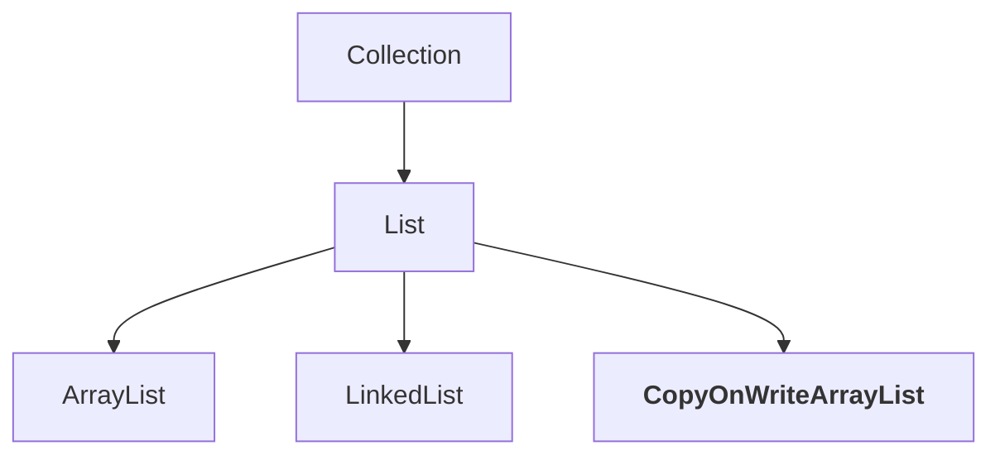
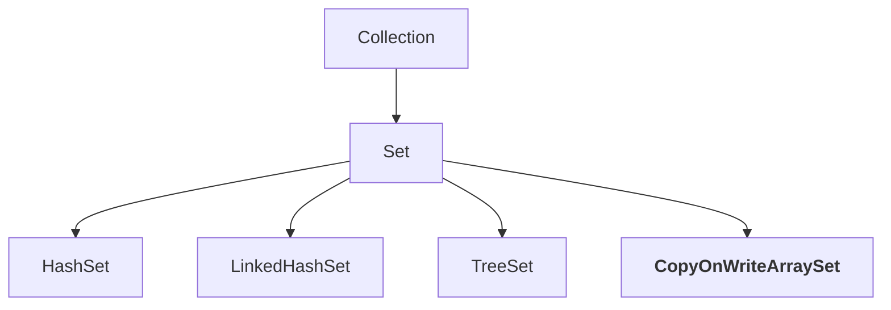
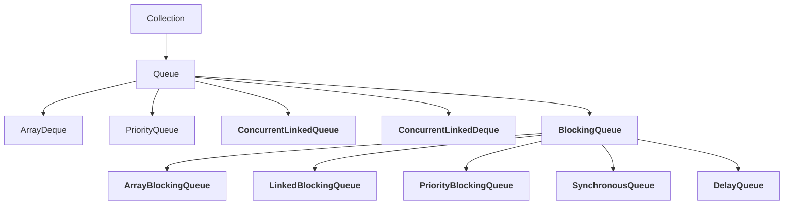
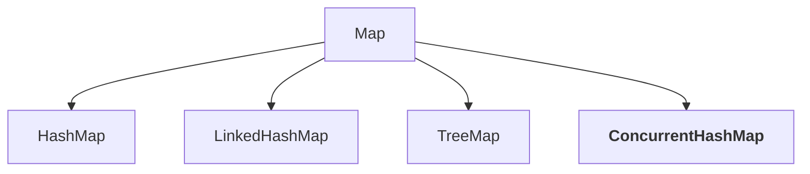

>Java 集合，也叫作容器，主要是由两大接口派生而来：一个是 `Collection`接口，主要用于存放单一元素；另一个是 `Map` 接口，主要用于存放键值对。对于`Collection` 接口，下面又有三个主要的子接口：`List` `Set` `Queue`。

List



Set



Queue



Map




# List

## ArrayList

| ArrayList              | 抛出异常            | 返回特殊值 |
| ---------------------- | ------------------- | ---------- |
| 添加尾元素             | add(E e)            |            |
| 添加头元素             | addFirst(E e)       |            |
| 添加尾元素             | addList(E e)        |            |
| 获取元素               | get(int)            |            |
| 获取头元素             | getFirst()          |            |
| 获取尾元素             | getLast()           |            |
| 修改元素               | set(int, E)         |            |
| 删除元素               | remove(int)         |            |
| 删除头元素             | removeFirst()       |            |
| 删除尾元素             | removeLast()        |            |
| 是否包含元素           | contains(Object)    |            |
| 获取正向第一个元素坐标 | indexOf(Object)     |            |
| 获取反向               | lastIndexOf(Object) |            |

### 创建ArrayList

```java
ArrayList<String> list = new ArrayList<>();            // 默认初始容量为10
ArrayList<Integer> listWithCapacity = new ArrayList<>(20);  // 指定初始容量
ArrayList<String> listFromOther = new ArrayList<>(otherList); // 复制其他集合
```

### 添加元素

```java
list.add("apple");                // 添加到末尾
list.add(1, "banana");            // 插入指定位置
list.addFirst("orange");          // 添加到头部
list.addAll(otherList);          // 添加另一个集合中的所有元素
list.addAll(2, otherList);       // 插入到指定位置
```

### 获取元素

```java
String fruit = list.get(0);      // 根据索引获取元素
boolean hasApple = list.contains("apple"); // 是否包含某元素
int index = list.indexOf("banana");       // 第一次出现的索引
int lastIndex = list.lastIndexOf("banana"); // 最后一次出现的索引
int size = list.size();          // 获取元素个数
boolean isEmpty = list.isEmpty(); // 判断是否为空
```

### 修改元素

```java
list.set(1, "orange");           // 替换指定位置的元素
```

### 删除元素

```java
list.remove("apple");            // 删除第一次出现的元素（按值）
list.remove(0);                  // 删除指定索引位置的元素
list.removeAll(otherList);      // 删除与另一个集合中相同的元素
list.clear();                   // 清空所有元素
```

### 与数组之间的切换

```java
List<String> sub = list.subList(1, 3);   // 获取子列表（包含头，不包含尾）
Object[] array = list.toArray();         // 转换为 Object 数组
String[] arr = list.toArray(new String[0]); // 转换为指定类型数组

int[] arr = list.Stream().mapToInt(Integer::intValue).toArray(); // List<Intger> 转换为 int[]
```

### 遍历方法

```java
// 普通 for 循环
for (int i = 0; i < list.size(); i++) {
    System.out.println(list.get(i));
}

// 增强 for 循环
for (String s : list) {
    System.out.println(s);
}

// Lambda 表达式
list.forEach(item -> System.out.println(item));

// 迭代器
Iterator<String> it = list.iterator();
while (it.hasNext()) {
    System.out.println(it.next());
}

```

### 排序与替换

```java
Collections.sort(list);               // 升序排序
Collections.sort(list, Collections.reverseOrder()); // 降序排序
Collections.reverse(list);            // 反转列表
Collections.shuffle(list);            // 随机打乱顺序
Collections.fill(list, "x");          // 所有元素设为 x
```

### 线程安全处理

```java
List<String> syncList = Collections.synchronizedList(new ArrayList<>());
```

## LinkedList

### 创建 LinkedList

```java
LinkedList<String> list = new LinkedList<>();
LinkedList<String> list2 = new LinkedList<>(otherCollection);
```

### 添加元素

```java
list.add("apple");               // 添加到末尾（等同 addLast）
list.add(0, "banana");          // 插入指定位置
list.addFirst("first");         // 添加到开头
list.addLast("last");           // 添加到末尾
list.offer("offer");            // 队列尾部插入元素（返回 boolean）
list.offerFirst("offerFirst");  // 队列头部插入
list.offerLast("offerLast");    // 队列尾部插入
```

### 访问元素

```java
String first = list.get(0);       // 获取指定位置元素
String first2 = list.getFirst();  // 获取第一个元素
String last = list.getLast();     // 获取最后一个元素
String peek = list.peek();        // 查看队列头（不删除）
String peekFirst = list.peekFirst(); // 查看头元素
String peekLast = list.peekLast();   // 查看尾元素
```

### 修改元素

```java
list.set(1, "orange");           // 替换指定位置元素
```

### 删除元素

```java
list.remove();                  // 删除第一个元素（抛异常）
list.remove(0);                 // 删除指定索引
list.remove("apple");           // 删除第一个匹配元素
list.removeFirst();             // 删除第一个元素
list.removeLast();              // 删除最后一个元素
list.poll();                    // 删除队列头（返回null而不是抛异常）
list.pollFirst();               // 删除并返回第一个元素
list.pollLast();                // 删除并返回最后一个元素
list.clear();                   // 清空所有元素
```

### 查找元素

```java
boolean has = list.contains("apple");  // 是否包含
int index = list.indexOf("apple");     // 第一次出现位置
int lastIndex = list.lastIndexOf("apple"); // 最后一次出现位置
```

### 遍历方法

```java
for (String s : list) {
    System.out.println(s);
}

list.forEach(System.out::println);

Iterator<String> it = list.iterator();
while (it.hasNext()) {
    System.out.println(it.next());
}

```

### 与数组的转换

```java
Object[] array = list.toArray();
String[] arr = list.toArray(new String[0]);
List<String> sub = list.subList(1, 3); // 包含索引1，不包含索引3
```

### 线程安全

```java
List<String> syncList = Collections.synchronizedList(new LinkedList<>());
```

# Queue/Deque

Queue只允许队尾插入，队头删除。

| `Queue` 接口 | 抛出异常  | 返回特殊值 |
| ------------ | --------- | ---------- |
| 插入队尾     | add(E e)  | offer(E e) |
| 删除队首     | remove()  | poll()     |
| 查询队首元素 | element() | peek()     |

Deque允许队头插入，队尾插入；队头删除，队尾删除。

| `Deque` 接口 | 抛出异常                | 返回特殊值      |
| ------------ | ----------------------- | --------------- |
| 插入队首     | addFirst(E e)           | offerFirst(E e) |
| 插入队尾     | addLast(E e)            | offerLast(E e)  |
| 删除队首     | removeFirst()           | pollFirst()     |
| 删除队尾     | removeLast()            | pollLast()      |
| 查询队首元素 | getFirst()              | peekFirst()     |
| 查询队尾元素 | getLast()               | peekLast()      |
| 栈插入       | push(E e)=addFirst(E e) |                 |
| 栈删除       | pop()=removeFirst()     |                 |

队列使用`Queue`接口，栈使用`Deque`。

这两个接口的实现为`ArrayDeque`和`LinkedList`:

* `ArrayDeque` 是基于可变长的数组和双指针来实现，而 `LinkedList` 则通过链表来实现。
* `ArrayDeque` 不支持存储 `NULL` 数据，但 `LinkedList` 支持。
* `ArrayDeque` 是在 JDK1.6 才被引入的，而`LinkedList` 早在 JDK1.2 时就已经存在。
* `ArrayDeque` 插入时可能存在扩容过程, 不过均摊后的插入操作依然为 O(1)。虽然 `LinkedList` 不需要扩容，但是每次插入数据时均需要申请新的堆空间，均摊性能相比更慢。

Java中推荐使用`ArrayDeque`作为队列和栈的实现类。

>**`ArrayDeque` is likely to be faster than `Stack` when used as a stack, and faster than `LinkedList` when used as a `queue`.**
>—— 来自 `ArrayDeque` 的官方 Javadoc

## ArrayDeque

| 类型   | 方法                            | 说明                 |
| ------ | ------------------------------- | -------------------- |
| 添加   | `addFirst(E e)`                 | 从队头插入           |
| 添加   | `addLast(E e)` / `add(E e)`     | 从队尾插入           |
| 移除   | `removeFirst()` / `pollFirst()` | 移除并返回队头元素   |
| 移除   | `removeLast()` / `pollLast()`   | 移除并返回队尾元素   |
| 访问   | `getFirst()` / `peekFirst()`    | 查看队头元素但不移除 |
| 访问   | `getLast()` / `peekLast()`      | 查看队尾元素但不移除 |
| 栈操作 | `push(E e)`                     | 相当于 `addFirst`    |
| 栈操作 | `pop()`                         | 相当于 `removeFirst` |
| 栈操作 | `peek()`                        | 相当于 `peekFirst`   |

### 作为栈（LIFO）

```java
Deque<String> stack = new ArrayDeque<>();

stack.push("A");
stack.push("B");
stack.push("C");

System.out.println(stack.pop());  // C
System.out.println(stack.peek()); // B
```

### 作为队列（FIFO）

```java
Deque<String> queue = new ArrayDeque<>();

queue.offer("A");
queue.offer("B");
queue.offer("C");

System.out.println(queue.poll()); // A
System.out.println(queue.peek()); // B
```

## PriorityQueue

### 创建

```java
PriorityQueue<>();                      // 默认初始容量11，使用自然顺序排序（元素必须实现Comparable）
PriorityQueue<>(int initialCapacity);  // 指定初始容量，使用自然顺序
PriorityQueue<>(Comparator comparator); // 自定义排序规则
PriorityQueue<>(Collection c);          // 根据已有集合创建（必须可以排序）
```

| 方法                         | 描述                                                       |
| ---------------------------- | ---------------------------------------------------------- |
| `boolean add(E e)`           | 添加元素，若超出容量自动扩容，抛出异常（推荐用 `offer()`） |
| `boolean offer(E e)`         | 添加元素，返回 `true` 或 `false`                           |
| `E poll()`                   | 取出并移除队首元素（最小或最大），为空返回 `null`          |
| `E peek()`                   | 获取队首元素但不移除，队列为空返回 `null`                  |
| `E remove()`                 | 移除并返回队首元素，若为空则抛出异常                       |
| `boolean remove(Object o)`   | 删除队列中指定元素，成功返回 `true`                        |
| `boolean contains(Object o)` | 判断队列是否包含某个元素                                   |
| `int size()`                 | 获取队列中元素数量                                         |
| `void clear()`               | 清空队列                                                   |
| `boolean isEmpty()`          | 判断队列是否为空                                           |
| `Object[] toArray()`         | 转为数组（无排序保证）                                     |
| `<T> T[] toArray(T[] a)`     | 转为指定类型的数组                                         |

## ArrayBlockingQueue \ LinkedBlockingQueue


# Map

## HashMap / LinkedHashMap

| 基本方法                              | 描述                                           |
| ------------------------------------- | ---------------------------------------------- |
| `V put(K key, V value)`               | 添加键值对，若 key 已存在，则更新并返回旧值    |
| `V get(Object key)`                   | 获取指定 key 对应的 value，若不存在则返回 null |
| `V remove(Object key)`                | 移除指定 key 的键值对，并返回被删除的 value    |
| `boolean containsKey(Object key)`     | 是否包含指定的 key                             |
| `boolean containsValue(Object value)` | 是否包含指定的 value                           |
| `int size()`                          | 返回映射中键值对的数量                         |
| `boolean isEmpty()`                   | 是否为空                                       |
| `void clear()`                        | 清空所有键值对                                 |

| 遍历方法                          | 描述                                               |
| --------------------------------- | -------------------------------------------------- |
| `Set<K> keySet()`                 | 返回所有键组成的 `Set` 视图                        |
| `Collection<V> values()`          | 返回所有值组成的 `Collection` 视图                 |
| `Set<Map.Entry<K, V>> entrySet()` | 返回所有键值对的集合（每个元素是一个 `Map.Entry`） |

| 方法                                             | 描述                                           |
| ------------------------------------------------ | ---------------------------------------------- |
| `V getOrDefault(Object key, V defaultValue)`     | 获取指定 key 的 value，如果不存在返回默认值    |
| `V putIfAbsent(K key, V value)`                  | 如果 key 不存在才放入                          |
| `boolean replace(K key, V oldValue, V newValue)` | 替换指定 key 的 value，要求当前值等于 oldValue |
| `V replace(K key, V value)`                      | 替换 key 对应的 value，不判断旧值              |
| `void forEach(BiConsumer<K,V> action)`           | 对每个键值对执行操作（lambda）                 |
| `void compute(K key, BiFunction...)`             | 根据 key 和旧值计算新值放入                    |
| `void merge(K key, V value, BiFunction...)`      | 如果 key 存在合并，不存在则添加                |
| `void computeIfAbsent(K key, Function...)`       | key 不存在时，计算一个值并放入                 |
| `void computeIfPresent(K key, BiFunction...)`    | key 存在时，根据旧值计算新值放入               |

# Set

Set 是 Java 集合框架中用于**存储不重复元素**的集合。

* 元素唯一（不能重复）

* 允许一个 `null`

* 无索引，不支持根据位置访问

Set接口的方法

```java
boolean add(E e)
boolean remove(Object o)
boolean contains(Object o)
int size()
boolean isEmpty()
void clear()
Iterator<E> iterator()
Object[] toArray()
```

| 实现                  | 底层结构             | 有序     | 排序 | 线程安全 | null |
| --------------------- | -------------------- | -------- | ---- | -------- | ---- |
| HashSet               | HashMap              | ❌        | ❌    | ❌        | 1个  |
| LinkedHashSet         | LinkedHashMap        | 插入顺序 | ❌    | ❌        | 1个  |
| TreeSet               | 红黑树(TreeMap)      | ✅        | ✅    | ❌        | ❌    |
| EnumSet               | 位图(BitSet)         | 枚举顺序 | ✅    | ❌        | ❌    |
| CopyOnWriteArraySet   | CopyOnWriteArrayList | 插入顺序 | ❌    | ✅        | 允许 |
| ConcurrentSkipListSet | SkipList             | ✅        | ✅    | ✅        | ❌    |

```
HashSet               → 快速去重
LinkedHashSet         → 保序去重
TreeSet               → 排序去重
EnumSet               → 枚举专用
CopyOnWriteArraySet   → 读多写少并发
ConcurrentSkipListSet → 排序并发
```

## HashSet

基本用法

```java
// ========== HashSet：最常用，无序，允许1个null ==========
Set<String> hashSet = new HashSet<>();

// add: 返回true表示新增成功，false表示已存在
hashSet.add("Apple");   // true
hashSet.add("Banana");  // true
hashSet.add("Apple");   // false ← 重复元素
hashSet.add(null);                          // 允许null

// contains & size
hashSet.contains("Apple"); // true
hashSet.size();            // 3 (Apple, Banana, null)

// remove
hashSet.remove("Banana");

// clear
hashSet.clear();

// isEmpty
hashSet.isEmpty();
```

遍历方法

```java
HashSet<String> set = new HashSet<>(Arrays.asList("A", "B", "C"));

// ① 增强 for 循环（最常用）
for (String s : set) {
    System.out.println(s);
}

// ② Lambda / forEach
set.forEach(s -> System.out.println(s));

// ③ Iterator（支持遍历时安全删除）
Iterator<String> it = set.iterator();
while (it.hasNext()) {
    String s = it.next();
    if ("B".equals(s)) it.remove(); // ✅ 安全删除
}

// Stream（适合过滤/转换场景）
set.stream().filter(s -> !"A".equals(s)).forEach(System.out::println);
```

## LinkedHashSet

`LinkedHashSet` 相比 `HashSet`，**唯一的区别就是在迭代（遍历）时保证元素的插入顺序**。

## TreeSet

| 分类     | 方法                                             | 返回值       | 说明                                    |
| -------- | ------------------------------------------------ | ------------ | --------------------------------------- |
| 基础     | `add(E)` / `remove(Object)` / `contains(Object)` | boolean      | O(log n)，按排序规则查找/插入           |
| 极值     | `first()` / `last()`                             | E            | 返回最小/最大元素，空集抛异常           |
| 极值安全 | `pollFirst()` / `pollLast()`                     | E            | 取出并移除最小/最大元素，空集返回 null  |
| 邻近查找 | `lower(E)` / `higher(E)`                         | E            | 严格小于/大于 e 的最大/最小元素         |
| 邻近查找 | `floor(E)` / `ceiling(E)`                        | E            | ≤e 的最大元素 / ≥e 的最小元素           |
| 子集视图 | `subSet(from, to)`                               | NavigableSet | [from, to) 半开区间视图                 |
| 子集视图 | `headSet(to)` / `tailSet(from)`                  | NavigableSet | <to / ≥from 的视图                      |
| 反转     | `descendingSet()`                                | NavigableSet | 返回逆序视图                            |
| 比较器   | `comparator()`                                   | Comparator   | 返回当前使用的比较器，自然排序返回 null |

```java
// ========== 1. 基本使用 + 自动排序 ==========
TreeSet<Integer> set = new TreeSet<>();
set.addAll(List.of(30, 10, 50, 20, 40));

System.out.println("自动排序: " + set);       // [10, 20, 30, 40, 50]
System.out.println("最小: " + set.first());   // 10
System.out.println("最大: " + set.last());    // 50

// ========== 2. 导航方法（核心优势）==========
System.out.println("--- 导航查找 ---");
System.out.println("lower(30): " + set.lower(30));     // 20 (严格<30)
System.out.println("higher(30): " + set.higher(30));   // 40 (严格>30)
System.out.println("floor(25): " + set.floor(25));     // 20 (≤25)
System.out.println("ceiling(25): " + set.ceiling(25)); // 30 (≥25)
System.out.println("floor(30): " + set.floor(30));     // 30 (=30也包含)

// ========== 3. 子集视图（注意：是视图，修改会反映到原集合）==========
System.out.println("--- 子集视图 ---");
NavigableSet<Integer> sub = set.subSet(20, true, 40, true); // [20,40]闭区间
System.out.println("subSet[20,40]: " + sub);  // [20, 30, 40]

sub.remove(30);                                // 通过视图删除
System.out.println("原集合变为: " + set);      // [10, 20, 40, 50] ✅ 同步生效

System.out.println("headSet(<30): " + set.headSet(30));  // [10, 20]
System.out.println("tailSet(≥40): " + set.tailSet(40));  // [40, 50]

// ========== 4. 逆序遍历 ==========
System.out.println("逆序: " + set.descendingSet());     // [50, 40, 20, 10]
System.out.println("pollFirst: " + set.pollFirst());    // 10 (取出并移除)
System.out.println("剩余: " + set);                     // [20, 40, 50]

// ========== 5. 自定义对象 + 自定义比较器 ==========
record Student(String name, int score) {}

// 按成绩降序，成绩相同按姓名升序
TreeSet<Student> students = new TreeSet<>(
    Comparator.comparingInt(Student::score).reversed()
              .thenComparing(Student::name)
);

students.add(new Student("Alice", 90));
students.add(new Student("Bob", 85));
students.add(new Student("Charlie", 90));

System.out.println("\n学生排名: " + students);
// [Student[name=Alice,score=90], Student[name=Charlie,score=90], Student[name=Bob,score=85]]

// 查找成绩≥88的第一个学生
Student top = students.ceiling(new Student("", 88));
System.out.println("≥88分最高排名: " + top);
// Student[name=Charlie,score=90] ← 注意：取决于比较器定义
}
```

## EnumSet


## CopyOnWriteArraySet

具体方法与HashSet相同。

`CopyOnWriteArraySet` 是一个**高度特化**的并发容器，只在"读多写极少 + 需要多线程安全"的场景下才有优势。在大多数并发场景中，`ConcurrentHashMap.newKeySet()` 才是更通用的选择。

## ConcurrentSkipListSet
