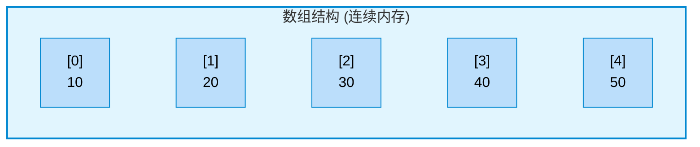
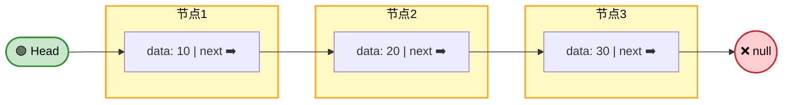

> 常用的数据结构:
>
> * 数组（Array，List）：`ArrayList` `LinkedList` / `std::vector` `std::list`
> * 集合（Set）: `HashSet` `TreeSet` `LinkedHashSet`
> * 字典（Map，Directory）: `HashMap` `TreeMap` `LinkedHashMap`
> * 栈（Stack): `ArrayDeque` `ArrayList` `LinkedList`
> * 队列（Queue）: `ArrayDeque` `LinkedList`
> * 堆（Heap）: `PriorityQueue`
> * 树（Tree）
> * 图（Graph）

在计算机数据结构中，核心的底层数据结构是**数组**和**链表**，无论是哈希表，堆，栈，树结构，邻接表等等高级数据结构，底层的实现都是数组和链表。

## 数组

数组是内存中连续的一块空间，可通过下标对数组元素快速索引。内存中每个字节都有自己的地址，通过地址可快速获取对应的值。所以数组开辟出一块连续的空间，也可通过下标快速获取对应的值。



### CPP

CPP原生数组大小必须是编译期常量，且不支持直接作为模板参数传递，所以**CPP不能直接使用 `T[]` 作为模板数组类型**。创建模板类型数组，需使用`std::array`或`std::vector`。

栈上数组

```cpp
int a[5] = {1, 2, 3, 4, 5};     // 显式初始化
int b[5] = {};                  // 全部零初始化
int c[] = {1, 2, 3};            // 自动推导大小为3
int d[5];                       // 未初始化
```

堆上数组

```cpp
int* p = new int[10];           // 分配
delete[] p;                     // 必须手动释放

// 智能指针
auto p2 = std::make_unique<int[]>(10);  // C++14，自动释放
```

`std::array`

```cpp
#include <array>

std::array<int, 5> a = {1, 2, 3, 4, 5};         // 栈上分配
std::array<double, 100> b{};                    // 零初始化
std::array<std::string, 3> c{"a", "b", "c"};    // C++17 起可省略 =

// 堆上分配（智能指针）
auto p = std::make_unique<std::array<int, 1000>>();
(*p)[0] = 42
// 自动释放，无需手动 delete
    
// 堆上分配（普通指针）
auto* p = new std::array<int, 1000>();
delete p;  // 必须手动释放，容易泄漏
```

`std::vector`（推荐）

```cpp
#include <vector>

// std::vector 堆上分配，自动管理内存
std::vector<int> v1;                // 空
std::vector<int> v2(10);            // 10个元素，值初始化为0
std::vector<int> v3(10, 42);        // 10个元素，全部为42
std::vector<int> v4{1,2,3,4,5};     // 初始化列表
std::vector<int> v5(v4);            // 拷贝构造
std::vector<int> v6(1000);          // 运行时决定大小
```

### Java

Java的数组是在堆上的，（虽然可将数组通过逃逸开辟到栈上，但并不常用）由JVM统一管理。

```java
// 语法：类型[] 变量名 = new 类型[长度];
int[] numbers = new int[5];        // 创建长度为5的int数组，默认值为0
String[] names = new String[3];    // 创建长度为3的String数组，默认值为null
boolean[] flags = new boolean[4];  // 默认值为false

// 初始化
int[] nums = new int[]{1, 2, 3, 4, 5};
int[] nums = {1, 2, 3, 4, 5};
String[] fruits = {"Apple", "Banana", "Cherry"};

// 多维数组
int[][] matrix = new int[3][4];
```

Collection中`ArrayList`

```java
ArrayList<String> list = new ArrayList<>();            // 默认初始容量为10
ArrayList<Integer> listWithCapacity = new ArrayList<>(20);  // 指定初始容量
ArrayList<String> listFromOther = new ArrayList<>(otherList); // 复制其他集合
```

## 链表

链表：链表节点中包含下一个链表节点的地址。



链表节点的地址在**CPP中使用指针表示，在Java中使用引用表示**。

注：CPP 的引用（`T&`）与 Java 的引用有本质区别

| 特性            | Java 引用 | C++ 引用 (`T&`)            | C++ 指针 (`T*`) |
| --------------- | --------- | -------------------------- | --------------- |
| 可否为 null     | ✅ 可以    | ❌ 不可以                   | ✅ 可以          |
| 可否重新绑定    | ✅ 可以    | ❌ 不可以（初始化后不可变） | ✅ 可以          |
| 默认值          | null      | 无（必须初始化）           | nullptr         |
| 适合做链表 next | ✅         | ❌                          | ✅               |

### CPP

`std::list`

```cpp
std::list<int> lst = {1, 2, 3, 4, 5};
```

自定义

```cpp
struct ListNode {
    int val;
    ListNode* next;
    ListNode(int x) : val(x), next(nullptr) {}
};

ListNode* createList(const std::vector<int>& nums) {
    ListNode dummy(0);
    ListNode* tail = &dummy;
    for (int n : nums) {
        tail->next = new ListNode(n);
        tail = tail->next;
    }
    return dummy.next;
}
```

### Java

`LinkedList`

```java
LinkedList<String> list = new LinkedList<>();
LinkedList<String> list2 = new LinkedList<>(otherCollection);
```

自定义

```java
class ListNode {
    int val;
    ListNode next;

    ListNode(int val) {
        this.val = val;
        this.next = null;
    }
}
```


## 最小（大）堆

最小堆的主要操作：

* 将已有数组进行堆化
* 向最小堆中的添加，删除操作
* 将最小堆的数组排序化

### 堆化已有数组

> 从最后一个非叶子节点开始向下调整。

向下调整：

* 选择左右儿子中值更大且大于本节点值的节点，与本节点交换位置（本节点值大于左右儿子时不需要操作）
* 交换后，将交换后的儿子节点继续执行向下调整

向上调整：

* 将儿子元素与父亲比较，如果儿子元素大于父亲元素，则与父亲元素交换
* 交换后，堆交换后的父亲节点继续执行向上调整

在一个完全二叉树中，最后一个非叶子节点是 $n/2-1$，对所有的非叶子节点执行向下调整。完成后数组elements即成为最小（大）堆。

添加元素：将元素添加到数组最后（完全二叉树最后一个叶子节点）然后对该元素执行向上调整

删除元素：删除根节点元素（数组第一个元素），将最后一个元素赋值给根节点并对根节点执行向下调整

```java
import java.util.Arrays;

public class minHeap<T extends Comparable<T>> {
    private T[] elements;

    public minHeap(T[] arr) {
        elements = Arrays.copyOf(arr, arr.length);        
        // 对所有非叶子节点执行向下调整
        for (int i = arr.length / 2 - 1; i >= 0; i--) {
            downMove(elements, i, elements.length - 1);
        }
    }
	//向下调整
    public void downMove(T[] elements, int start, int end) {
        int parent = start;
        for (int i = start * 2 + 1; i <= end; i = i * 2 + 1) {
            //选择左右儿子中较大的
            if (i < end && elements[i].compareTo(elements[i + 1]) < 0) {
                i++;
            }
            //如果较大的儿子比父亲值还大，需要交换位置，并对儿子节点继续向下调整，否则退出循环
            if (elements[i].compareTo(elements[parent]) > 0) {
                T tmp = elements[parent];
                elements[parent] = elements[i];
                elements[i] = tmp;
                parent = i;
            } else {
                break;
            }
        }
    }

}

```

```java
package ds;

import java.util.Arrays;

public class minHeap<T extends Comparable<T>> {
    private T[] elements;
    private int size;

    public minHeap(T[] arr, int size) {
        size = arr.length;
        elements = Arrays.copyOf(arr, Math.max(arr.length, size));
        // 对所有非叶子节点执行向下调整
        for (int i = arr.length / 2 - 1; i >= 0; i--) {
            downMove(elements, i, elements.length - 1);
        }
    }

    // 向下调整
    private void downMove(T[] elements, int start, int end) {
        int parent = start;
        for (int i = start * 2 + 1; i <= end; i = i * 2 + 1) {
            // 选择左右儿子中较大的
            if (i < end && elements[i].compareTo(elements[i + 1]) < 0) {
                i++;
            }
            // 如果较大的儿子比父亲值还大，需要交换位置，并对儿子节点继续向下调整，否则退出循环
            if (elements[i].compareTo(elements[parent]) > 0) {
                T tmp = elements[parent];
                elements[parent] = elements[i];
                elements[i] = tmp;
                parent = i;
            } else {
                break;
            }
        }
    }

    private void upMove(T[] elements, int start) {
        int child = start;
        for (int i = (start - 1) / 2; i > 0; i = (i - 1) / 2) {
            if (elements[child].compareTo(elements[i]) > 0) {
                T tmp = elements[child];
                elements[child] = elements[i];
                elements[i] = tmp;
                child = i;
            }
        }
    }

    // 添加元素至最后一个位置并向上调整
    public void add(T element) {
        elements[size] = element;
        upMove(elements, size);
        size++;
    }

    // 最后一个元素覆盖第一个元素并向下调整
    public void remove() {
        elements[0] = elements[size - 1];
        size--;
        downMove(elements, 0, size);
    }

    public T[] heapSort() {
        sortArrayFromHeap(elements);
        return elements;
    }

    private void sortArrayFromHeap(T[] elements) {
        for (int i = elements.length - 1; i > 0; i--) {
            T tmp = elements[0];
            elements[0] = elements[i];
            elements[i] = tmp;
            downMove(elements, 0, i - 1);
        }
    }

    public static void main(String[] args) {
        int[] arr = { -4, 0, 7, 4, 9, -5, -1, 0, -7, -1 };
        Integer[] arrInteger = Arrays.stream(arr).boxed().toArray(Integer[]::new);
        minHeap<Integer> m = new minHeap<>(arrInteger, arrInteger.length + 10);
        m.add(10);
        int[] res = Arrays.stream(m.elements).mapToInt(Integer::intValue).toArray();
        System.out.println(Arrays.toString(res));
    }
}

```

