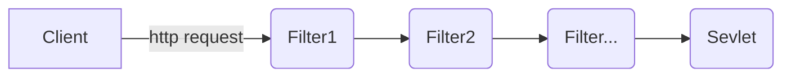

# Java Servlet

Spring接受请求使用的是Java Servlet的过滤器（Filter）。


向Servlet中加入Filter有两种方式：

* 直接添加在`web.xml`里面
* 使用Java注解`WebFilter()`添加

```java
@WebFilter("/*")
public class MyFilter  implements Filter {
    @Override
    public void init(FilterConfig filterConfig) throws ServletException {
        System.out.println("----初始化---");
        System.out.println(filterConfig.getFilterName());
    }
    @Override
    public void doFilter(ServletRequest request, ServletResponse response, FilterChain chain) throws IOException, ServletException {
        HttpServletRequest req = (HttpServletRequest) request;
        HttpServletResponse resp = (HttpServletResponse) response;
        //设置字符编码
        request.setCharacterEncoding("utf-8");
        response.setCharacterEncoding("utf-8");
        
        System.out.println("--------放行前--------");
        chain.doFilter(request,response); //放行
        System.out.println("--------放行后--------");

    }
}
```

# Spring Security


SpringBoot会将`DelegatingFilterProxy`注册到FilterChain里，请求在进入Servlet之前会通过`DelegatingFilterProxy`这个Filter，`DelegatingFilterProxy`在初始化的时候会通过`WebApplicationContext`加载名称为`springSecurityFilterChain`的bean，该bean类中doFilterDelegate中包含了`FilterChainProxy`。


通过将`DelegatingFilterProxy`加入到Servlet的Filter中，并且`DelegatingFilterProxy`中通过调用`WebApplicationContext`创建`FilterChainProxy`，二者将Servlet和Spring框架结合起来。

```javascript
const generateSecureRandomString = (length: number): string => {
    const charset = "abcdefghijklmnopqrstuvwxyzABCDEFGHIJKLMNOPQRSTUVWXYZ0123456789";
    const crypto = window.crypto
    const randomValues = new Uint32Array(length);
    crypto.getRandomValues(randomValues);
    let randomString = "";
    for (let i = 0; i < length; i++) {
        const randomIndex = randomValues[i] % charset.length;
        randomString += charset.charAt(randomIndex);
    }
    return randomString;
}

const login = () => {
    const CLIENT_ID = 'Ov23lisFyLM8ev2mgeX1'

    const authorize_uri = 'https://github.com/login/oauth/authorize';
    const redirect_uri = 'http://localhost:8080/login/oauth2/code/github';
    const state: string = generateSecureRandomString(10);
    window.location.href = `${authorize_uri}?client_id=${CLIENT_ID}&scope=user:email&redirect_uri=${redirect_uri}&state=${state}`;
}
```

